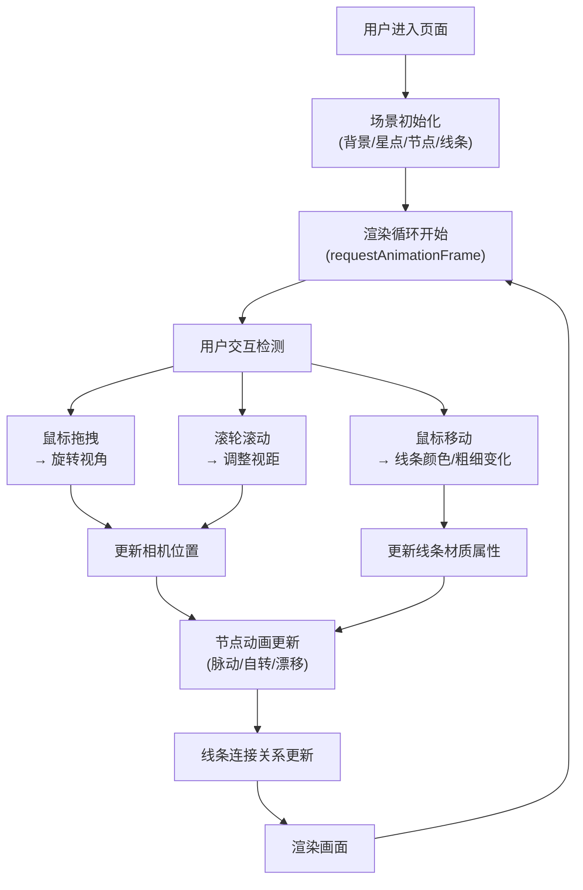

## 1. 产品概述

「星墟·幻境回响」是一款沉浸式3D交互可视化应用，用户通过鼠标操控在深空场景中探索由数百个发光节点和彩色线条构成的动态神经网络。该应用融合科技感与艺术美学，为用户提供冥想式的视觉探索体验。

- **核心价值**：创造一个富有未来感的沉浸式3D视觉体验空间，让用户在探索动态网络结构的过程中获得视觉愉悦和灵感启发
- **目标用户**：设计爱好者、科技爱好者、艺术创作者、冥想放松人群

## 2. 核心功能

### 2.2 功能模块

1. **3D场景渲染模块**：深空背景、星点闪烁、节点网络、动态连线
2. **节点系统模块**：400个发光节点的生成、脉动动画、自转与漂移运动
3. **线条网络模块**：基于距离的动态连线、颜色渐变、粗细变化、流动动画
4. **交互控制模块**：鼠标拖拽旋转视角、滚轮缩放、鼠标移动响应

### 2.3 页面详情

| 页面名称 | 模块名称 | 功能描述 |
|-----------|-------------|---------------------|
| 主场景 | 背景氛围 | 深紫到暗蓝的辐射渐变背景，200颗静态闪烁星点 |
| 主场景 | 节点系统 | 400个发光节点均匀分布在半径5单位球壳内，呼吸式脉动，缓慢自转漂移 |
| 主场景 | 线条网络 | 基于距离阈值2单位动态连线，随鼠标交互改变颜色粗细，3秒周期流动动画 |
| 主场景 | 交互控制 | 拖拽旋转、滚轮缩放（3-15单位）、鼠标移动实时响应 |

## 3. 核心流程

## 4. 用户界面设计

### 4.1 设计风格
- **主色调**：深紫(#1a0f2e) → 暗蓝(#0d0b1a) 辐射渐变背景
- **节点调色板**：#ff6b6b（珊瑚红）、#48dbfb（冰晶蓝）、#feca57（琥珀黄）、#ff9ff3（樱花粉）、#a29bfe（薰衣草紫）、#7bed9f（薄荷绿）
- **线条渐变**：#a29bfe（紫）→ #7bed9f（绿）径向渐变
- **视觉风格**：科技感、未来感、发光网络、极简无UI
- **动画风格**：平滑缓动、呼吸韵律、流动感

### 4.2 页面设计概述

| 页面名称 | 模块名称 | UI元素 |
|-----------|-------------|-------------|
| 主场景 | 背景氛围 | 径向渐变、200颗闪烁星点（1-3px随机大小，1-5秒闪烁间隔） |
| 主场景 | 节点系统 | 400个发光球体（0.08-0.2单位半径）、光晕效果、透明度0.6-0.9、1.5秒脉动周期 |
| 主场景 | 线条网络 | 白色半透明（初始）→ 紫绿渐变（交互后）、0.02→0.08单位粗细、3秒流动动画 |
| 主场景 | 交互控制 | 无可见UI，全鼠标隐式交互 |

### 4.3 响应式
- **桌面端优先**：全屏WebGL渲染，适配任意窗口尺寸
- **窗口自适应**：监听resize事件，实时更新相机和渲染器尺寸
- **性能适配**：根据设备性能动态调整粒子数量（400-600节点）

### 4.4 3D场景指导

- **环境氛围**：深空背景，使用CanvasTexture实现径向渐变，无外部HDRI依赖
- **光照设置**：自发光材质为主，辅以弱环境光增强节点层次感，不使用阴影
- **相机设置**：PerspectiveCamera（视场角75°），初始位置(0, 0, 8)，OrbitControls控制，距离范围3-15单位
- **构图焦点**：节点网络居中，视觉重心在场景原点，通过节点颜色和线条流动引导视线
- **交互动画**：
  - 节点：1.5秒正弦脉动，15秒自转周期，随机漂移运动
  - 线条：3秒周期流动动画，鼠标响应使用gsap缓动（duration 0.5s）
  - 星点：1-5秒随机间隔闪烁，透明度0.2-1.0变化
- **后期效果**：节点使用AdditiveBlending实现发光效果，线条使用LineBasicMaterial配合透明度
- **性能预算**：FPS稳定60，节点≤600，线条≤5000，使用BufferGeometry优化

## 5. 非功能需求

- **性能要求**：FPS稳定60，WebGL2优先，降级到WebGL1
- **内存管理**：每帧最少更新，避免内存泄漏，BufferGeometry复用
- **交互流畅**：gsap缓动动画，无卡顿跳变，响应延迟<16ms
