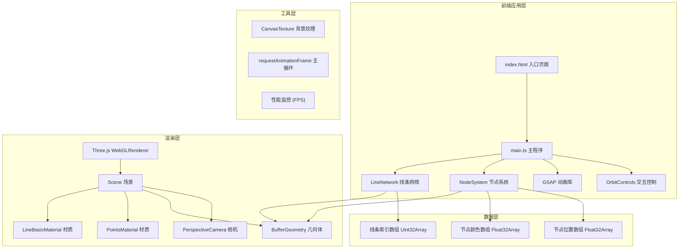

## 1. 架构设计



## 2. 技术描述

- **前端框架**：TypeScript 5.x + Three.js 0.160.0 + Vite 5.x
- **初始化工具**：Vite原生构建
- **动画库**：GSAP 3.x（用于平滑缓动动画）
- **后端**：无后端，纯前端静态应用
- **数据库**：无

### 核心依赖说明
| 依赖包 | 版本 | 用途 |
|--------|------|------|
| three | 0.160.0 | 3D渲染引擎 |
| @types/three | ^0.160.0 | Three.js TypeScript类型定义 |
| typescript | ^5.3.0 | TypeScript编译器 |
| vite | ^5.0.0 | 构建工具和开发服务器 |
| gsap | ^3.12.0 | 高性能动画库 |

## 3. 文件结构

```
星墟·幻境回响/
├── package.json              # 项目依赖和脚本配置
├── vite.config.js            # Vite构建配置
├── tsconfig.json             # TypeScript编译配置
├── index.html                # 入口HTML页面
└── src/
    ├── main.ts               # 主程序入口，场景初始化和渲染循环
    ├── NodeSystem.ts         # 节点系统模块（400个发光节点）
    └── LineNetwork.ts        # 线条网络模块（动态连线）
```

## 4. 核心类与接口定义

### 4.1 NodeSystem 节点系统

```typescript
interface NodeData {
  position: THREE.Vector3;
  baseRadius: number;
  color: THREE.Color;
  opacity: number;
  rotationSpeed: number;
  driftOffset: THREE.Vector3;
  driftSpeed: number;
  pulsePhase: number;
}

class NodeSystem {
  constructor(scene: THREE.Scene, count: number = 400);
  public update(time: number): void;
  public getPositions(): Float32Array;
  public getNodeCount(): number;
  public dispose(): void;
}
```

### 4.2 LineNetwork 线条网络

```typescript
interface LineOptions {
  distanceThreshold: number;  // 2单位
  baseLinewidth: number;      // 0.02单位
  maxLinewidth: number;       // 0.08单位
  flowDuration: number;       // 3秒
}

class LineNetwork {
  constructor(scene: THREE.Scene, nodeSystem: NodeSystem, options: LineOptions);
  public update(time: number, mouseInfluence: number, mousePosition: THREE.Vector2): void;
  public updateConnections(): void;
  public dispose(): void;
}
```

### 4.3 main.ts 主程序

```typescript
class App {
  private scene: THREE.Scene;
  private camera: THREE.PerspectiveCamera;
  private renderer: THREE.WebGLRenderer;
  private controls: THREE.OrbitControls;
  private nodeSystem: NodeSystem;
  private lineNetwork: LineNetwork;
  private stars: THREE.Points;
  private clock: THREE.Clock;
  private mousePosition: THREE.Vector2;
  private mouseInfluence: { value: number };

  constructor();
  private initScene(): void;
  private initBackground(): void;
  private initStars(): void;
  private initEvents(): void;
  private animate(): void;
  private onWindowResize(): void;
  private onMouseMove(event: MouseEvent): void;
  public dispose(): void;
}
```

## 5. 关键技术实现

### 5.1 性能优化策略
- **BufferGeometry**：使用BufferGeometry存储节点和线条数据，减少draw call
- **实例化渲染**：节点使用THREE.Points批量渲染，线条使用THREE.LineSegments
- **距离检测优化**：使用空间网格或kd-tree进行节点邻近查询（可选优化）
- **帧率控制**：requestAnimationFrame配合THREE.Clock实现时间差动画
- **内存管理**：dispose方法清理所有几何体和材质，避免内存泄漏

### 5.2 WebGL版本检测
```typescript
const canvas = document.createElement('canvas');
const gl2 = canvas.getContext('webgl2');
const gl1 = canvas.getContext('webgl') || canvas.getContext('experimental-webgl');
// 优先使用WebGL2，降级到WebGL1
```

### 5.3 背景渐变实现
使用Canvas绘制径向渐变，创建CanvasTexture作为场景背景：
```javascript
const canvas = document.createElement('canvas');
canvas.width = 2;
canvas.height = 512;
const ctx = canvas.getContext('2d')!;
const gradient = ctx.createRadialGradient(1, 256, 0, 1, 256, 256);
gradient.addColorStop(0, '#1a0f2e');
gradient.addColorStop(1, '#0d0b1a');
ctx.fillStyle = gradient;
ctx.fillRect(0, 0, 2, 512);
const texture = new THREE.CanvasTexture(canvas);
scene.background = texture;
```

## 6. 构建与部署

### 构建命令
- 开发：`npm run dev`（Vite开发服务器，热更新）
- 构建：`npm run build`（TypeScript编译 + Vite生产构建）
- 预览：`npm run preview`（预览生产构建结果）

### 构建输出
- 输出目录：`dist/`
- 资源优化：Vite自动进行tree-shaking、代码分割、压缩
- 静态资源：可直接部署到任何静态文件服务器

## 7. 性能指标监控

- **FPS监控**：通过console.time/timeEnd或自定义FPS计数器
- **内存监控**：Chrome DevTools Memory面板
- **WebGL调试**：Chrome DevTools WebGL Inspector
- **目标性能**：
  - FPS：稳定60
  - 节点数：400-600
  - 线条数：≤5000
  - Draw call：≤10
