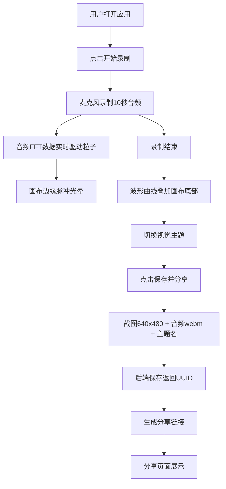

## 1. 产品概述

声纹·光画是一个声音驱动的实时动态光影画布全栈Web应用，解决用户在网页上缺乏将音频输入（麦克风录音或上传音频文件）与抽象几何图形动画结合、生成可保存分享的个人化视听作品的创作体验问题。

- 目标用户：创意爱好者、音乐可视化爱好者、社交媒体内容创作者
- 核心价值：将声音转化为独特的视觉艺术，提供即时的视听创作与分享体验

## 2. 核心功能

### 2.1 功能模块

1. **创作页面**：音频录制/上传、粒子画布渲染、视觉主题切换、保存分享
2. **分享页面**：画布截图展示、音频回放、3D粒子动画缩略图、主题标签

### 2.2 页面详情

| 页面名称 | 模块名称 | 功能描述 |
|----------|----------|----------|
| 创作页面 | 录音控制 | 点击"开始录制"按钮录制10秒音频，录制时画布边缘出现脉冲光晕 |
| 创作页面 | 粒子画布 | 200+圆形粒子做布朗运动，受音频频段驱动改变位置/大小/颜色 |
| 创作页面 | 主题切换 | 4个预设视觉主题（极光/熔岩/星云/幻彩），1秒渐变过渡 |
| 创作页面 | 波形叠加 | 录制结束后音频波形以发光曲线叠加在画布底部 |
| 创作页面 | 保存分享 | 截图+音频+主题名发送后端，返回UUID分享链接 |
| 分享页面 | 截图展示 | 全宽显示保存的画布截图，2px发光边框 |
| 分享页面 | 音频播放 | 50px圆形播放按钮，点击收缩-放大动画 |
| 分享页面 | 3D粒子 | Three.js生成80个粒子绕Y轴旋转，30FPS |
| 分享页面 | 主题标签 | 30x15px圆角胶囊，背景与主题色一致 |

## 3. 核心流程

用户打开应用 → 点击"开始录制"录制10秒音频 → 音频实时驱动画布粒子动画 → 切换视觉主题 → 点击"保存并分享" → 后端返回UUID → 生成分享链接 → 分享页面展示截图+音频+3D粒子动画

## 4. 用户界面设计

### 4.1 设计风格

- 主色调：深色主题，背景从#0b0e14到#141829径向渐变
- 画布背景：纯黑#000000突出发光粒子
- 按钮风格：统一圆角12-22px，毛玻璃效果backdrop-filter:blur(6px)
- 字体：中文使用系统默认，英文使用有辨识度的字体
- 布局：画布居中75%宽度，控件在画布下方

### 4.2 页面设计概览

| 页面名称 | 模块名称 | UI元素 |
|----------|----------|--------|
| 创作页面 | 画布区域 | 75%宽度居中，纯黑背景，边缘脉冲光晕4-20px |
| 创作页面 | 录音按钮 | 120x40px，圆角20px，#667eea→#764ba2渐变，悬停亮度+10%外扩2px阴影 |
| 创作页面 | 主题按钮 | 80x40px，圆角12px，毛玻璃效果，0.3秒过渡 |
| 创作页面 | 保存按钮 | 160x45px，圆角22px，#f093fb→#f5576c渐变，悬停阴影加深上移2px |
| 分享页面 | 导航栏 | 高60px，半透明rgba(255,255,255,0.05)，毛玻璃模糊 |
| 分享页面 | 播放按钮 | 直径50px圆形，#48dbfb径向渐变，0.2秒收缩-放大 |
| 分享页面 | 3D粒子 | Three.js 80粒子绕Y轴旋转，30FPS |

### 4.3 响应式

- 桌面优先，适配1366x768及以上分辨率
- 1920x1080下内容居中且有合理留白
- 画布区域75%宽度自适应

### 4.4 3D场景指引

- 环境：深色空间，无HDRI，纯黑背景
- 灯光：环境光+点光源匹配主题色
- 相机：固定位置俯视80个粒子
- 构图：粒子绕Y轴旋转形成环形
- 交互：自动旋转，无用户交互
- 性能：30FPS限制，80个粒子
