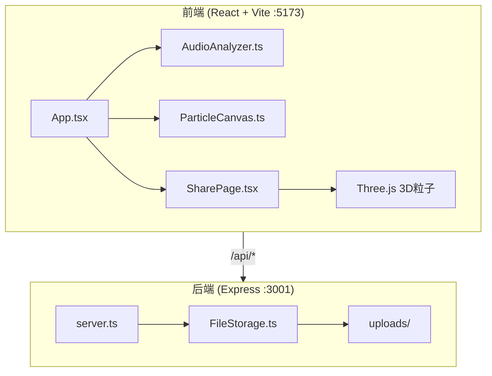
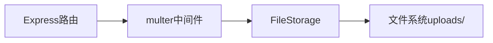
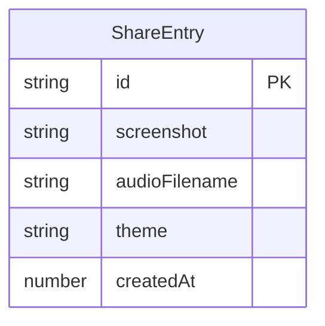

## 1. 架构设计



## 2. 技术说明

- 前端：React@18 + TypeScript + Vite + Three.js
- 后端：Express@4 + TypeScript + multer + uuid
- 构建：Vite代理/api到后端3001端口
- 数据存储：文件系统（uploads/目录），无数据库

## 3. 路由定义

| 路由 | 用途 |
|------|------|
| / | 创作页面，画布+录音+主题切换+保存分享 |
| /share/:id | 分享页面，展示截图+音频播放+3D粒子动画 |

## 4. API定义

### POST /api/share

请求：
```typescript
interface ShareRequest {
  screenshot: string; // base64编码的640x480 PNG截图
  audio: File;        // webm音频文件，限制10秒
  theme: string;      // 主题名称：极光|熔岩|星云|幻彩
}
```

响应：
```typescript
interface ShareResponse {
  id: string;         // UUID
  shareUrl: string;   // http://localhost:3000/share/{uuid}
}
```

### GET /api/share/:id

响应：
```typescript
interface ShareData {
  id: string;
  screenshot: string;  // base64截图数据
  audioUrl: string;    // 音频文件路径 /uploads/{uuid}.webm
  theme: string;       // 主题名称
}
```

## 5. 服务器架构



## 6. 数据模型

### 6.1 数据模型定义



### 6.2 数据定义

使用JSON文件 `uploads/meta.json` 存储元数据：

```typescript
interface ShareEntry {
  id: string;
  screenshot: string;
  audioFilename: string;
  theme: string;
  createdAt: number;
}
```
