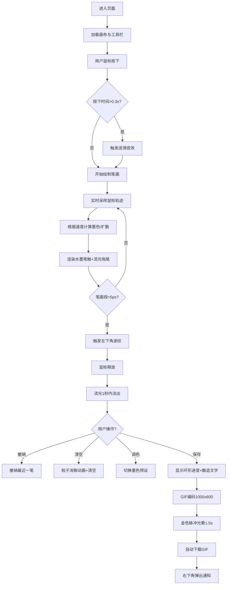

# 「墨境·光韵书道」产品需求文档（PRD）

## 1. 产品概述

「墨境·光韵书道」是一款基于浏览器的交互式书法创作应用，为用户提供通过鼠标拖拽实时生成带有动态水墨扩散与光影流动效果的汉字笔画的沉浸式创作体验，并支持将作品导出为可分享的GIF动图。

- 解决的核心问题：用户在网页上缺乏一种结合传统水墨质感与现代光影效果的即时书法创作工具
- 目标用户：书法爱好者、设计从业者、国风文化爱好者
- 产品价值：将传统宣纸水墨艺术与现代数字光影技术融合，带来低门槛、高审美的在线书写体验

## 2. 核心功能

### 2.1 功能模块

1. **主画布区**：水墨笔触渲染、流光拖尾、涟漪波纹动画
2. **工具栏**：撤销、清空、保存为GIF、调色盘
3. **音效系统**：涟漪触发音效、书写反馈
4. **导出系统**：GIF编码、进度指示、自动下载
5. **通知系统**：操作反馈、状态提示

### 2.2 页面详情

| 页面名称 | 模块名称 | 功能描述 |
|-----------|-------------|---------------------|
| 主页（单页应用） | 画布区域 | 80%宽度居中，宣纸渐变背景，纤维纹理，深棕边框与投影，支持鼠标拖拽书写，笔触随速度变化墨色浓淡与扩散强度，跟随流光拖尾，释放鼠标1秒内拖尾淡出 |
| 主页 | 工具栏 | 60px高度，毛玻璃背景，4个图标按钮（撤销旋转悬停、清空粒子消散动画、GIF导出金色脉冲、调色盘5色选择带发光环），下方分隔线 |
| 主页 | 音效反馈 | 鼠标按下超0.3秒触发涟漪音效（800Hz→200Hz，0.5秒，音量0.15），每5px笔画段触发左下角发光波纹 |
| 主页 | GIF导出 | 1000x800px输出，中心环形进度指示器（渐变旋转+酿造文字），自动下载带时间戳文件，右下角3秒通知弹出 |

## 3. 核心流程

## 4. 用户界面设计

### 4.1 设计风格
- **整体风格**：古风纸墨与现代光影融合，东方美学与科技感碰撞
- **主色调**：宣纸米 #f5e6d0、深棕 #8b6914、墨黑 #1a1a1a、黛青 #2b4a6f、朱砂 #c0392b、金泥 #d4af37、藤黄 #f39c12
- **流光渐变**：浅蓝 #a8d8ea → 粉紫 #ff9ff3
- **按钮风格**：线性图标，默认深棕 #4a3728，悬停金色 #d4af37，撤销按钮悬停顺时针旋转90°（0.3s过渡）
- **字体**：标题使用「Ma Shan Zheng」或「Noto Serif SC」书法风格字体，正文使用衬线字体
- **布局风格**：居中对称，画布主体突出，工具栏悬浮上方，毛玻璃质感
- **视觉层次**：宣纸渐变背景 → 纤维纹理 → 水墨笔触 → 流光拖尾 → 波纹/粒子特效

### 4.2 页面设计概述

| 模块名称 | UI元素 | 设计细节 |
|-----------|-------------|-------------|
| 页面背景 | 麻布纹理 | #f5e6d0到#e8d5b5线性渐变，叠加细微麻布噪点纹理 |
| 画布容器 | 边框+投影 | 1px深棕边框#8b6914，box-shadow: 2px 2px 8px rgba(0,0,0,0.15) |
| 画布背景 | 宣纸渐变 | radial-gradient从中心#f5e6d0到边缘#d9c6a7，叠加纤维纹理SVG |
| 工具栏 | 毛玻璃 | 高度60px，rgba(245,230,208,0.85)，backdrop-filter:blur(6px) |
| 工具栏分隔线 | 金色细线 | 1px实线#c4a96a |
| 调色盘选项 | 圆形色点 | 直径32px圆形，选中状态2px白色发光环box-shadow |
| 进度指示器 | 环形渐变 | 直径100px，SVG环形stroke-dasharray随进度填充旋转 |
| 通知弹窗 | 半透明卡片 | rgba(245,230,208,0.9)，圆角12px，fade-in/fade-out动画 |

### 4.3 响应式设计
- **桌面端**：画布宽度80%，工具栏图标48x48px
- **移动端（<768px）**：画布宽度100%，工具栏图标缩小至32x32px，整体padding减小
- **触摸优化**：支持touchstart/touchmove/touchend事件，触摸半径适配

### 4.4 动画与动效
- **粒子消散**：清空画布时，从中心向外扩散的径向粒子波，持续0.8s
- **金色脉冲**：导出GIF时，画布中心外扩的金色光晕，1.5s，透明度0→0.6→0
- **波纹扩散**：左下角发光圆环，0→80px，0.5→0透明度，0.4s
- **流光拖尾**：50px长度线性渐变，透明度0.4，释放后1s线性淡出
- **进度旋转**：环形进度指示器逆时针/顺时针旋转渐变填充
