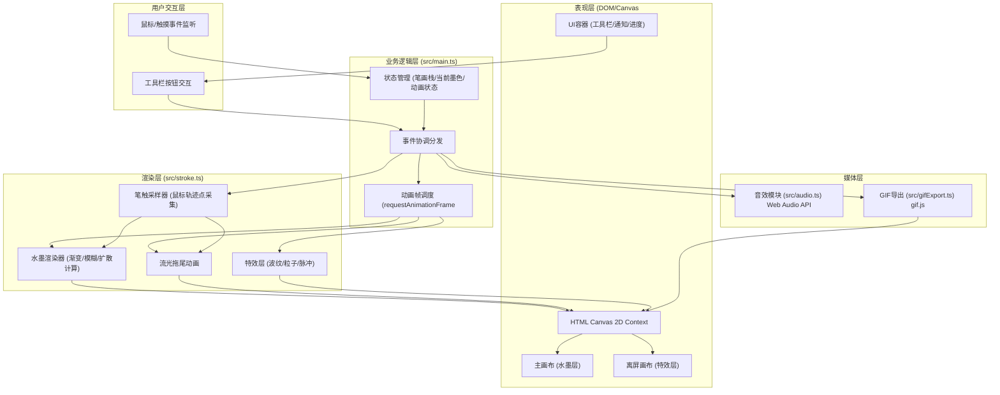

# 「墨境·光韵书道」技术架构文档

## 1. 架构设计



## 2. 技术描述

- **构建工具**：Vite 5.x
- **开发语言**：TypeScript 5.x（严格模式，ES模块目标）
- **前端框架**：无框架，原生TypeScript + DOM/Canvas API
- **GIF编码库**：gif.js（纯前端GIF编码，Worker线程）
- **音效引擎**：Web Audio API（原生浏览器API生成涟漪音效
- **样式方案**：原生CSS（嵌入<style> + CSS动画

## 3. 文件结构与职责定义

| 文件路径 | 职责定义 | 核心导出 |
|-----------|----------|----------|
| package.json | 项目依赖与脚本配置（typescript、vite、gif.js） | - |
| index.html | 入口页面：全屏布局容器（画布/工具栏/通知/进度区域 | - |
| vite.config.js | Vite构建配置，启用TypeScript支持 | - |
| tsconfig.json | TypeScript严格模式配置 | - |
| src/main.ts | 主逻辑入口：初始化画布、绑定事件、管理笔画栈、协调各模块 | `initApp()` |
| src/stroke.ts | 笔画渲染模块：轨迹采样、水墨扩散、模糊笔触、流光拖尾 | `StrokeRenderer`类 |
| src/audio.ts | 音效模块：Web Audio API封装，涟漪音效生成 | `AudioManager`类 |
| src/gifExport.ts | GIF导出：gif.js封装，进度回调，下载触发 | `GifExporter`类 |

## 4. 核心数据模型

### 4.1 笔画数据结构

```typescript
// 单个轨迹点
interface StrokePoint {
  x: number;              // 画布坐标X
  y: number;              // 画布坐标Y
  timestamp: number;        // 采样时间戳
  pressure?: number;       // 模拟压力(速度倒数)
  speed: number;         // 瞬时速度(px/ms)
}

// 单个笔画
interface Stroke {
  id: string;
  points: StrokePoint[];
  color: string;            // 基础墨色HEX
  createdAt: number;
}

// 应用状态
interface AppState {
  strokes: Stroke[];       // 已完成笔画栈
  currentStroke: Stroke | null;  // 当前正在绘制的笔画
  selectedColor: string;   // 当前选中的墨色
  isDrawing: boolean;
  trailPoints: TrailPoint[]; // 流光拖尾点
}
```

### 4.2 调色盘预设

```typescript
const INK_PRESETS = [
  { name: '浓墨', value: '#1a1a1a' },
  { name: '黛青', value: '#2b4a6f' },
  { name: '朱砂', value: '#c0392b' },
  { name: '金泥', value: '#d4af37' },
  { name: '藤黄', value: '#f39c12' },
];
```

## 5. 关键算法

### 5.1 水墨笔触渲染算法
1. **速度-墨色映射**：
   - 速度 `v < 0.1px/ms` → 纯浓墨色，扩散半径6px，alpha=1.0
   - 速度 `v > 1.0px/ms` → 稀释墨色，扩散半径2px，alpha=0.6
   - 中间值线性插值

2. **笔触渐变计算**：
   - 每个采样点绘制多层圆形叠加
   - 外层：rgba(墨色, 0.15) + blur(扩散半径)
   - 中层：rgba(墨色, 0.5) + blur(扩散半径/2)
   - 内层：rgba(墨色, 0.9) + 无模糊

3. **速度计算公式**：
```
speed = distance(p1, p2) / (t2 - t1)
```

### 5.2 流光拖尾动画
- 维护最多N个最近轨迹点环形缓冲
- 每个点绘制线性渐变从#a8d8ea→#ff9ff3
- 点大小线性衰减从尾到头
- 释放鼠标后1秒内整体透明度线性衰减至0

### 5.3 波纹特效
- 左下角固定位置(40px, canvasHeight-40px)
- requestAnimationFrame驱动：
  - radius = 80 * (t/duration)
  - opacity = 0.5 * (1 - t/duration)

## 6. 性能优化策略

| 优化点 | 方案 | 目标指标 |
|--------|------|-----------|
| 书写响应延迟 | 双缓冲离屏渲染+ RAF调度 | <50ms |
| GIF导出速度 | gif.js worker线程，笔画≤30时预编码帧 | <3s |
| 首次加载 | 总包体 < 150KB，无图片资源 | <2s |
| 动画流畅度 | 60fps requestAnimationFrame | 稳定58+fps |
| 内存占用 | 笔画点数据抽稀（距离阈值0.8px） | 单字<500点 |

## 7. 音效算法（涟漪音效）

使用 Web Audio API：
```
OscillatorNode (sine)
  ├─ frequency: 800Hz → 200Hz (linearRampToValueAtTime)
  ├─ connect → GainNode (0 → 0.15 → 0 envelope)
  └─ connect → AudioContext.destination
持续时间：500ms
```
