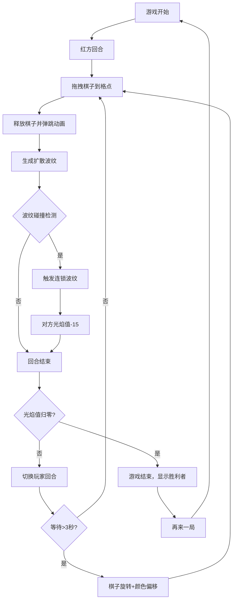

## 1. 产品概述

「波煜·光符棋」是一款基于 Canvas 2D 的双人本地实时对战游戏，玩家轮流在发光棋盘上放置光符棋子，通过波纹连锁反应消耗对方光焰值，最终以光波覆盖面积与光焰值决定胜负。

- 面向独立游戏爱好者和休闲玩家，提供具有视觉冲击力的策略对战体验
- 核心玩法融合棋类策略与物理波纹效果，兼具深度与观赏性

## 2. 核心功能

### 2.1 用户角色

| 角色 | 参与方式 | 核心权限 |
|------|----------|----------|
| 红方玩家 | 本地双人对战 | 放置红色棋子、观察光焰值 |
| 蓝方玩家 | 本地双人对战 | 放置蓝色棋子、观察光焰值 |

### 2.2 功能模块

1. **游戏主界面**：8x8 发光棋盘、星光背景、玩家光焰柱、计分显示
2. **棋子交互系统**：拖拽放置、弹跳动画、粒子爆散特效
3. **波纹物理系统**：扩散脉冲、连锁反应、碰撞检测
4. **回合与计分系统**：回合切换、光焰值计算、胜负判定
5. **游戏结束界面**：胜利弹窗、再来一局重置

### 2.3 页面详情

| 页面名称 | 模块名称 | 功能描述 |
|----------|----------|----------|
| 游戏主界面 | 棋盘区域 | 8x8 发光网格，格点悬停高亮，居中显示占屏幕70% |
| 游戏主界面 | 玩家光柱 | 左右两侧竖条光柱，实时反映光焰值比例，顶部光点跳动 |
| 游戏主界面 | 计分显示 | 发光数字显示双方光焰值，实时更新 |
| 游戏主界面 | 星光背景 | 40颗随机闪烁星点，深空径向渐变背景 |
| 游戏主界面 | 规则提示 | 顶部居中简短规则说明，悬停高亮 |
| 棋子交互 | 拖拽放置 | 鼠标点击拖拽棋子，吸附到最近格点释放 |
| 棋子交互 | 弹跳动画 | 落子时从落点弹起30px再落回，0.5s动画 |
| 棋子交互 | 粒子特效 | 落子产生8个粒子爆散，0.8s寿命 |
| 波纹系统 | 扩散脉冲 | 落子生成同色波纹，20px→200px放大，1.2s持续 |
| 波纹系统 | 连锁反应 | 波纹触碰相邻棋子触发次级波纹，强度减半 |
| 波纹系统 | 光焰增幅 | 连锁累计棋子光焰增幅，增强波纹效果 |
| 回合系统 | 回合切换 | 双方轮流落子，每落子消耗10点光焰值 |
| 计分系统 | 伤害计算 | 连锁或覆盖对方棋子减少对方15点光焰值 |
| 计分系统 | 胜负判定 | 光焰值归零的玩家失败 |
| 等待动画 | 旋转偏移 | 3秒无落子时棋子缓慢旋转，颜色冷暖偏移 |
| 结束界面 | 胜利弹窗 | 毛玻璃背景，平滑缩放弹出，显示胜利者 |
| 结束界面 | 再来一局 | 点击按钮重置棋盘和光焰值，重新开始 |

## 3. 核心流程

玩家进入游戏后，红方先手，点击并拖拽棋子到棋盘格点上释放。落子后产生波纹扩散，若波纹触碰到其他棋子则触发连锁反应，造成对方光焰值减少。双方轮流落子，直到一方光焰值归零，游戏结束显示胜利者，可选择再来一局。

## 4. 用户界面设计

### 4.1 设计风格

- **主色调**：深空背景 (#0a0a1a → #1a112e 径向渐变)，红方 #ff4757，蓝方 #3742fa
- **辅助色**：银白网格 #c0c0c0 (透明度0.3)，暖色偏移 #ff6348，冷色偏移 #5352ed
- **视觉风格**：深色宇宙风，发光元素，毛玻璃弹窗，粒子特效
- **字体**：现代无衬线字体，发光数字带文字阴影
- **动效风格**：平滑过渡 (0.3s easeInOut)，弹跳落子，波纹扩散

### 4.2 页面设计概览

| 页面名称 | 模块名称 | UI元素 |
|----------|----------|--------|
| 游戏主界面 | 棋盘区域 | 8x8发光网格、格点圆点、悬停高亮、居中70%屏幕 |
| 游戏主界面 | 左侧光柱 | 红色渐变竖条、高度反映光焰值、顶部跳动光点 |
| 游戏主界面 | 右侧光柱 | 蓝色渐变竖条、高度反映光焰值、顶部跳动光点 |
| 游戏主界面 | 计分数字 | 发光效果、26px字号、文字阴影0.8px |
| 游戏主界面 | 星光背景 | 40颗星点、随机闪烁、直径2-4px |
| 游戏主界面 | 规则提示 | 顶部居中、14px、#a0a0a0、悬停变白 |
| 结束弹窗 | 毛玻璃背景 | 全屏覆盖、backdrop-blur |
| 结束弹窗 | 胜利窗口 | 平滑缩放动画、再来一局按钮 |

### 4.3 响应式设计

- 桌面端优先，棋盘等比例缩放始终居中
- 自适应不同窗口大小，保持棋盘比例
- 触摸设备支持触摸拖拽操作
- 最小可用尺寸 600x600px

### 4.4 性能指标

- 稳定 60FPS 帧率
- 同时最多 40 个棋子 (每方 20 个上限)
- 波纹动画渲染延迟低于 10ms
