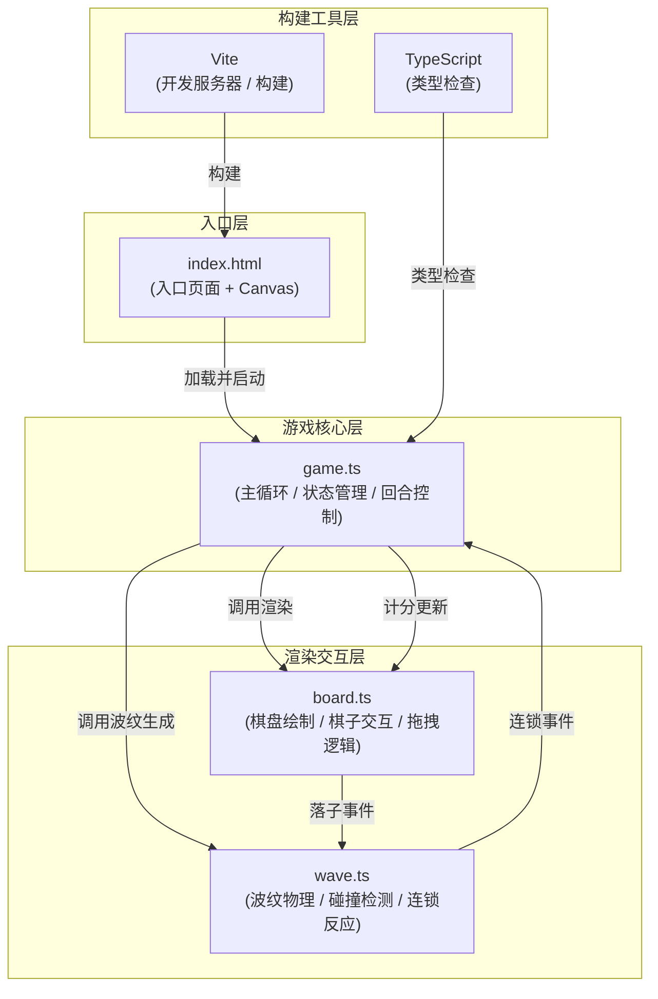

## 1. 架构设计



## 2. 技术描述

- **前端框架**：TypeScript + Canvas 2D API + Vite
- **构建工具**：Vite (v5.x)
- **语言**：TypeScript (严格模式)
- **动画库**：GSAP (用于弹跳动画等复杂缓动)
- **无后端**：纯前端本地双人对战

### 依赖说明

| 依赖 | 版本 | 用途 |
|------|------|------|
| typescript | ^5.x | 类型系统 |
| vite | ^5.x | 构建与开发服务器 |
| gsap | ^3.x | 弹跳动画、缓动效果 |

## 3. 文件结构与调用关系

```
project-root/
├── index.html              # 入口页面，嵌入 Canvas，加载主脚本
├── package.json            # 项目依赖与脚本
├── vite.config.js          # Vite 构建配置
├── tsconfig.json           # TypeScript 配置 (严格模式)
└── src/
    ├── game.ts             # 游戏主入口，主循环，状态机
    ├── board.ts            # 棋盘渲染，棋子管理，拖拽交互
    └── wave.ts             # 波纹物理模拟，碰撞检测，连锁反应
```

### 调用关系

| 文件 | 被谁调用 | 调用谁 | 数据流向 |
|------|----------|--------|----------|
| `index.html` | - | 引入 `src/game.ts` | 画布尺寸 → game.ts |
| `src/game.ts` | index.html | board.ts, wave.ts | 游戏状态 → board.ts / wave.ts |
| `src/board.ts` | game.ts | wave.ts | 落子坐标/颜色 → wave.ts |
| `src/wave.ts` | game.ts, board.ts | game.ts (回调) | 连锁事件/伤害 → game.ts |

## 4. 数据模型

### 4.1 核心类型定义

```typescript
// 玩家类型
type Player = 'red' | 'blue';

// 格点坐标
interface GridPoint {
  x: number;  // 0-7 列索引
  y: number;  // 0-7 行索引
}

// 棋子
interface Piece {
  id: number;
  player: Player;
  gridX: number;
  gridY: number;
  pixelX: number;
  pixelY: number;
  glowIntensity: number;  // 光焰增幅
  rotation: number;       // 旋转角度
  colorShift: number;     // 颜色偏移量 (-1~1)
  bounceProgress: number; // 弹跳动画进度 0~1
}

// 波纹
interface Wave {
  id: number;
  x: number;
  y: number;
  color: string;
  startRadius: number;
  endRadius: number;
  currentRadius: number;
  opacity: number;
  duration: number;
  elapsed: number;
  strength: number;       // 强度 1.0 或 0.5
  triggered: Set<number>; // 已触发连锁的棋子ID
}

// 粒子
interface Particle {
  id: number;
  x: number;
  y: number;
  vx: number;
  vy: number;
  size: number;
  color: string;
  life: number;
  maxLife: number;
}

// 星星
interface Star {
  x: number;
  y: number;
  size: number;
  baseOpacity: number;
  phase: number;
  speed: number;
}

// 游戏状态
interface GameState {
  currentPlayer: Player;
  redFlame: number;       // 红方光焰值 0-100
  blueFlame: number;      // 蓝方光焰值 0-100
  pieces: Piece[];
  waves: Wave[];
  particles: Particle[];
  stars: Star[];
  isGameOver: boolean;
  winner: Player | null;
  lastMoveTime: number;
  idleAnimationActive: boolean;
  dragging: {
    active: boolean;
    player: Player;
    x: number;
    y: number;
  };
  hoveredGrid: GridPoint | null;
}
```

### 4.2 常量配置

```typescript
const CONFIG = {
  GRID_SIZE: 8,
  PIECE_RADIUS: 18,       // 棋子半径 (直径36px)
  GLOW_SIZE: 3,           // 光晕大小
  DOT_RADIUS: 6,          // 格点圆点半径 (直径12px)
  WAVE_START_RADIUS: 10,
  WAVE_END_RADIUS: 100,
  WAVE_DURATION: 1200,    // ms
  CHAIN_DISTANCE: 90,     // 连锁触发距离 (px)
  CHAIN_STRENGTH_RATIO: 0.5,
  INITIAL_FLAME: 100,
  MOVE_COST: 10,
  CHAIN_DAMAGE: 15,
  IDLE_THRESHOLD: 3000,   // 3秒无操作进入闲置动画
  ROTATION_SPEED: 5,      // 每秒旋转度数
  MAX_PIECES_PER_PLAYER: 20,
  BOARD_SCREEN_RATIO: 0.7,
  COLORS: {
    RED: '#ff4757',
    BLUE: '#3742fa',
    WARM: '#ff6348',
    COOL: '#5352ed',
    GRID: '#c0c0c0',
    BG_START: '#0a0a1a',
    BG_END: '#1a112e',
  }
};
```

## 5. 核心算法

### 5.1 波纹碰撞检测

- 遍历所有活跃波纹与所有棋子
- 计算波纹圆心到棋子的距离
- 当距离在波纹半径 ± 棋子半径范围内时判定为碰撞
- 每个波纹对每个棋子只触发一次连锁

### 5.2 格点吸附

- 将鼠标像素坐标转换为棋盘坐标系
- 四舍五入到最近的整数格点索引
- 限制在 0~7 范围内
- 检查该格点是否已有棋子

### 5.3 颜色混合

- 闲置动画时，棋子颜色在基础色与暖/冷色之间插值
- 使用正弦函数驱动颜色偏移量，形成呼吸效果
- 红光偏暖，蓝光偏冷

## 6. 性能优化策略

- 使用 requestAnimationFrame 驱动主循环，确保 60FPS
- 波纹使用径向渐变一次性绘制，避免多层叠加
- 粒子数量控制，及时回收已死亡粒子
- 棋子上限 40 个，避免性能退化
- 离屏计算与渲染分离，减少 Canvas 状态切换
- 使用对象池管理波纹和粒子（可选优化）
