## 1. 产品概述

「音轨·流光协奏」是一款基于浏览器的在线协作编曲平台，支持多位用户实时同步编辑同一首乐曲的节奏、和弦与旋律，通过动态可视化界面让每个音符以发光粒子形式在五线谱上跳动，实现沉浸式音乐共创体验。

- 目标用户：音乐制作人、编曲爱好者、音乐教育工作者
- 核心价值：打破地理限制，让多人实时协作编曲变得直观且充满视觉美感

## 2. 核心功能

### 2.1 用户角色

| 角色 | 注册方式 | 核心权限 |
|------|----------|----------|
| 协作者 | 自动分配随机用户名 | 添加/删除/移动音符、调整BPM、播放、撤销/重做、私聊 |

### 2.2 功能模块

1. **五线谱编辑器页面**：五线谱画布、音符编辑、播放控制、BPM调节、用户列表、私聊

### 2.3 页面详情

| 页面名称 | 模块名称 | 功能描述 |
|----------|----------|----------|
| 五线谱编辑器 | 五线谱画布 | 绘制高音谱号五线谱，支持鼠标点击添加/删除/拖动音符，音符为发光圆点，颜色随音高渐变 |
| 五线谱编辑器 | 播放控制 | 播放按钮从当前位置按BPM顺序高亮音符，触发光晕脉冲，显示播放位置（小节：节拍） |
| 五线谱编辑器 | BPM调节 | 底部滑块实时调整BPM（60-200），同步所有用户，节拍线移动速度随之变化 |
| 五线谱编辑器 | 用户列表 | 顶部显示在线用户列表，随机颜色边框，点击可私聊，私聊气泡显示在右下角 |
| 五线谱编辑器 | 撤销/重做 | Ctrl+Z撤销、Ctrl+Y重做（最多20步），同步所有用户，全屏闪烁提示 |

## 3. 核心流程

用户打开页面 → 自动分配随机用户名和会话ID → 连接Socket.IO → 加载当前乐曲状态 → 在五线谱上点击添加音符/点击已有音符删除/拖动调整音高和时值 → 操作通过Socket.IO广播给所有在线用户 → 所有用户编辑器实时同步更新（带动画）→ 点击播放按钮 → 所有用户五线谱按BPM顺序高亮音符 → 调整BPM滑块 → 所有用户BPM同步更新

```mermaid
flowchart TD
    A["用户打开页面"] --> B["自动分配用户名和会话ID"]
    B --> C["连接Socket.IO服务器"]
    C --> D["加载当前乐曲状态"]
    D --> E["五线谱编辑器就绪"]
    E --> F{"用户操作"}
    F --> G["点击添加音符"]
    F --> H["点击删除音符"]
    F --> I["拖动调整音符"]
    F --> J["调整BPM"]
    F --> K["点击播放"]
    F --> L["Ctrl+Z/Y 撤销/重做"]
    G --> M["Socket.IO广播"]
    H --> M
    I --> M
    J --> M
    L --> M
    M --> N["所有用户实时同步更新"]
    K --> O["所有用户同步播放高亮"]
```

## 4. 用户界面设计

### 4.1 设计风格

- 主色调：深色渐变背景（#0a0a1a → #1a0f2e），强调色 #667eea / #764ba2
- 按钮样式：圆角8px，背景#667eea，悬停亮度提升10%，过渡300ms ease
- 字体：等宽风格显示字体 + 清晰的正文字体
- 布局：全屏深色背景，编辑器居中占75%宽度，上下结构
- 图标：lucide-react图标库

### 4.2 页面设计概述

| 页面名称 | 模块名称 | UI元素 |
|----------|----------|--------|
| 五线谱编辑器 | 整体布局 | 深色渐变背景，毛玻璃编辑器区域，顶部工具栏，底部BPM滑块，右侧用户列表 |
| 五线谱编辑器 | 五线谱画布 | 5条半透明白色线条，发光音符圆点，节拍线，播放指针 |
| 五线谱编辑器 | 工具栏 | 白色半透明背景，圆角12px，播放/撤销/重做按钮36x36px |
| 五线谱编辑器 | BPM滑块 | 毛玻璃背景，渐变轨道#667eea→#764ba2，轨道宽4px |
| 五线谱编辑器 | 音符 | 发光圆点半径15px，颜色#ff6b6b→#48dbfb渐变，4px白色光晕，2px发光边框 |
| 五线谱编辑器 | 用户列表 | 毛玻璃容器，1px随机颜色发光边框 |
| 五线谱编辑器 | 私聊气泡 | 右下角气泡形式显示 |

### 4.3 响应式设计

- 桌面优先设计，编辑器占75%宽度
- 全屏视口高度，无滚动条
- 最小支持1280px宽度

### 4.4 动画规范

- 音符添加：缩放动画（0→1，300ms，ease-out）
- 音符删除：淡出动画（500ms）
- 音符移动：平移动画（300ms，ease-in-out）
- 音符播放：放大1.2倍变白100ms + 光晕脉冲40px/200ms
- 撤销/重做：全屏白色闪烁（透明度0.1，100ms）
- 所有交互元素悬停过渡：300ms ease
