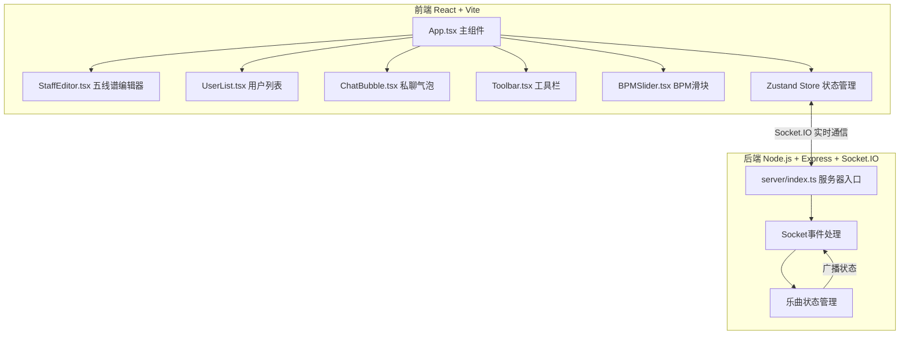
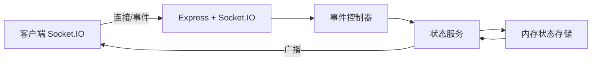
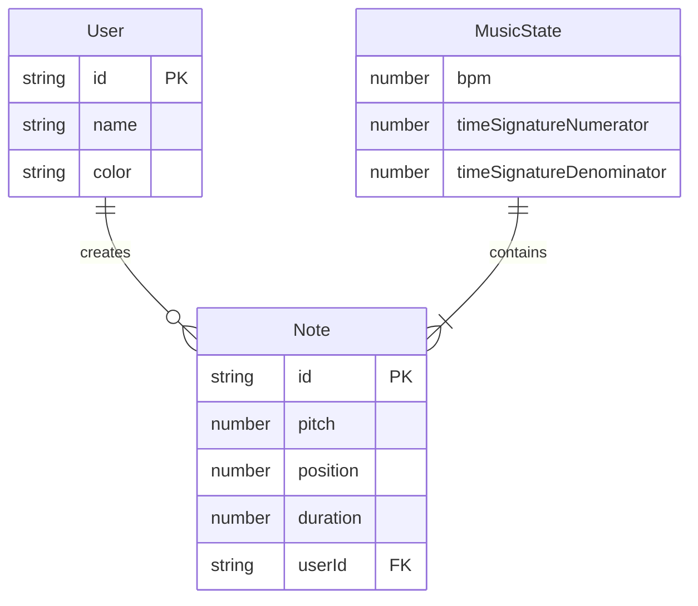

## 1. 架构设计



## 2. 技术说明

- 前端：React@18 + TypeScript + Vite + Tailwind CSS + Zustand
- 初始化工具：vite-init（react-express-ts模板）
- 后端：Express@4 + Socket.IO + TypeScript
- 数据库：无（内存状态管理，适合实时协作场景）
- 实时通信：Socket.IO（WebSocket协议，自动降级）

## 3. 路由定义

| 路由 | 用途 |
|------|------|
| / | 主页面，包含五线谱编辑器和所有功能模块 |

## 4. API定义

### 4.1 Socket.IO 事件定义

```typescript
interface ServerToClientEvents {
  "state-sync": (state: MusicState) => void;
  "user-joined": (user: User) => void;
  "user-left": (userId: string) => void;
  "note-added": (note: Note) => void;
  "note-removed": (noteId: string) => void;
  "note-moved": (note: Note) => void;
  "tempo-change": (bpm: number) => void;
  "play-start": () => void;
  "play-stop": () => void;
  "undo": (state: MusicState) => void;
  "redo": (state: MusicState) => void;
  "private-message": (message: PrivateMessage) => void;
}

interface ClientToServerEvents {
  "note-on": (note: Note) => void;
  "note-off": (noteId: string) => void;
  "note-move": (note: Note) => void;
  "tempo-change": (bpm: number) => void;
  "play": () => void;
  "stop": () => void;
  "undo": () => void;
  "redo": () => void;
  "private-message": (message: PrivateMessage) => void;
}

interface Note {
  id: string;
  pitch: number;
  position: number;
  duration: number;
  userId: string;
}

interface User {
  id: string;
  name: string;
  color: string;
}

interface MusicState {
  notes: Note[];
  bpm: number;
  timeSignature: [number, number];
  history: MusicState[];
  historyIndex: number;
}

interface PrivateMessage {
  from: string;
  to: string;
  content: string;
  timestamp: number;
}
```

## 5. 服务器架构图



## 6. 数据模型

### 6.1 数据模型定义



### 6.2 数据存储

- 所有状态存储在服务器内存中，通过Socket.IO同步到所有客户端
- 撤销/重做历史栈保存在服务器端（最多20步）
- 客户端使用Zustand管理本地状态副本
