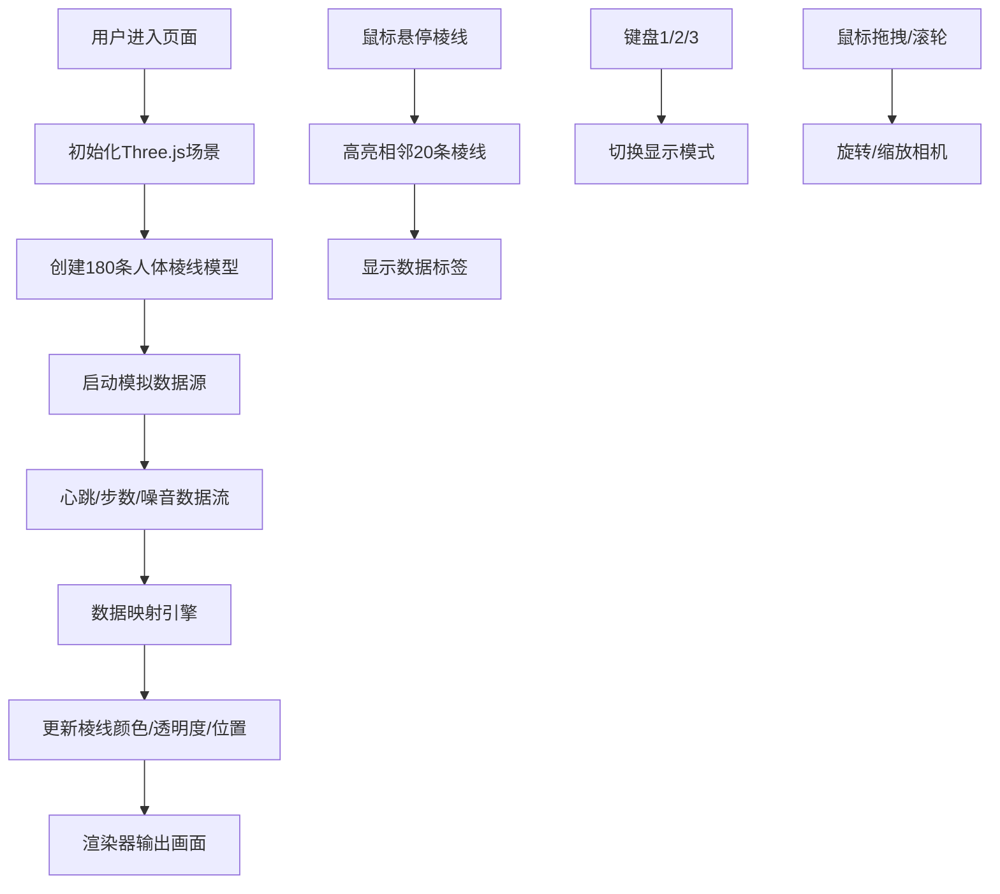

## 1. 产品概述

「光棱·数据之诗」是一件交互式可穿戴艺术装置，让用户在浏览器中通过3D可视化体验身体数据之美。数据艺术家和观众可以观察来自假想传感器的实时数据如何让发光棱线组成的人体轮廓产生颜色、亮度和振动的变化，形成一首可视化的身体数据诗篇。

- 核心价值：将抽象的身体生理数据转化为具有艺术感染力的视觉体验
- 目标用户：数据艺术家、新媒体艺术爱好者、交互设计从业者
- 市场定位：先锋数字艺术体验、沉浸式数据可视化作品

## 2. 核心特性

### 2.1 功能模块

1. **3D人体棱线可视化模块**：180条发光棱线构成标准人体轮廓，双臂展开站立姿态
2. **多源数据流模拟模块**：心跳、步数、环境噪音三条独立模拟数据流
3. **数据映射引擎**：将数值实时映射为视觉属性（颜色、透明度、位置抖动）
4. **交互控制模块**：鼠标悬停高亮、拖拽旋转、滚轮缩放、键盘模式切换
5. **数据仪表盘模块**：实时数值显示、迷你心跳趋势折线图

### 2.2 页面详情

| 页面名称 | 模块名称 | 功能描述 |
|----------|----------|----------|
| 主场景 | 3D人体棱线可视化 | 180条LineSegments构成人体轮廓，每条棱线独立响应数据变化 |
| 主场景 | 数据映射引擎 | 心跳→颜色(40-200bpm映射#4a90d9→#ff6b6b)、步数→透明度(0-100步/分钟映射0.3→1.0)、噪音→垂直抖动(30-100分贝映射1-10px) |
| 主场景 | 交互控制 | 鼠标悬停棱线高亮相邻20条为金色#ffd700，显示数据标签；键盘1/2/3切换显示模式 |
| 主场景 | 数据仪表盘 | 左上角毛玻璃面板，实时显示三数据值和10秒心跳趋势图 |
| 主场景 | 背景环境 | 径向渐变深色背景，随机星点闪烁动画 |

### 2.3 显示模式

| 模式 | 触发键 | 效果描述 |
|------|--------|----------|
| 混合模式 | 1 | 三条数据流同时驱动棱线的颜色、透明度和位置抖动 |
| 心跳模式 | 2 | 仅显示心跳驱动的颜色变化，屏蔽其他数据流效果 |
| 呼吸模式 | 3 | 所有棱线按呼吸蓝渐变(#4a90d9→#48dbfb)缓慢脉动，提供视觉休息 |

## 3. 核心流程

## 4. 用户界面设计

### 4.1 设计风格

- **主色调**：深空渐变背景(#0a0a1a→#1a0f2e)，棱线冷白(#e0e0ff)，心跳蓝(#4a90d9)，预警红(#ff6b6b)，高亮金(#ffd700)，呼吸蓝(#48dbfb)
- **材质质感**：半透明发光棱线，毛玻璃数据面板，Bloom发光效果
- **字体**：现代无衬线字体，数据值14px，标签12px
- **布局**：人体轮廓居中占视口70%高度，仪表盘固定左上角20px
- **动效**：所有交互平滑过渡0.3s ease，星点缓慢闪烁，呼吸模式脉动动画

### 4.2 3D场景指南

- **环境**：径向渐变深色背景，无HDRI，营造深空氛围
- **光照**：环境光+方向光，确保棱线发光效果清晰可见
- **相机**：PerspectiveCamera，初始距离可完整观察人体，支持OrbitControls拖拽旋转和滚轮缩放
- **构图**：人体轮廓居中，双臂展开站立姿态，符合标准人体比例
- **交互**：棱线Raycaster检测悬停，高亮效果持续2秒后平滑恢复
- **后处理**：UnrealBloomPass强度0.3，产生1px发光光晕效果
- **性能**：180条LineSegments，每帧更新，帧率55FPS+，延迟<16ms

### 4.3 响应式设计

- 桌面优先设计，最小支持宽度1024px
- 宽度<1024px时，棱线数量自动减少至120条并调整间距
- 人体轮廓始终保持视口高度70%，水平居中
- 仪表盘大小随屏幕宽度适度调整

### 4.4 页面设计概览

| 页面名称 | 模块名称 | UI元素 |
|----------|----------|--------|
| 主场景 | 3D人体棱线 | 180条半透明发光线，2px线宽，冷白初始色，Bloom光晕 |
| 主场景 | 数据仪表盘 | 毛玻璃面板(backdrop-filter:blur(8px), rgba(10,10,30,0.7), 圆角12px, 边框rgba(255,255,255,0.2))，三数据值(#48dbfb 14px)，迷你折线图(120×40px) |
| 主场景 | 悬停标签 | 半透明背景，白色12px字体，显示"心跳：72bpm"格式 |
| 主场景 | 星空背景 | 1-2px随机星点，透明度0.1-0.3，缓慢闪烁 |
