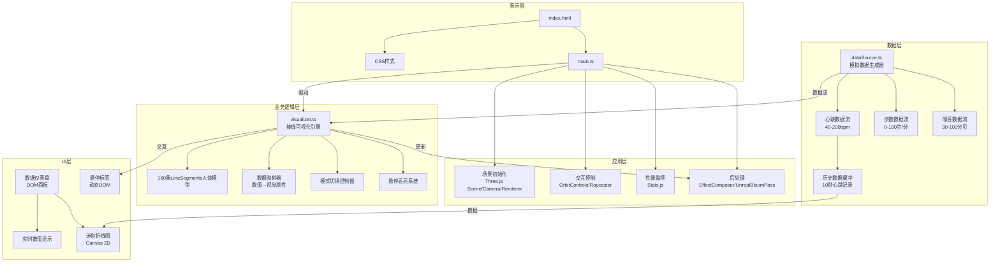

## 1. 架构设计



**文件调用关系和数据流向**：
- `main.ts` → `dataSource.ts`：启动数据源，订阅数据流
- `dataSource.ts` → `visualizer.ts`：推送心跳、步数、噪音数据
- `visualizer.ts` → 渲染器：更新棱线的颜色、透明度、位置
- `main.ts` → 后处理管线 → 屏幕输出
- 数据流向：`main.ts` → `dataSource.ts` → `visualizer.ts` → `EffectComposer` → 渲染器

## 2. 技术描述

- **前端框架**：原生TypeScript + Three.js 0.160，无React/Vue依赖，追求极致性能
- **构建工具**：Vite 5.x，ES模块热更新
- **语言**：TypeScript 5.x，严格模式
- **动画库**：GSAP 3.x，用于平滑过渡动画
- **3D渲染**：
  - Three.js 0.160 核心库
  - LineSegments 构建棱线模型
  - EffectComposer + UnrealBloomPass 后处理
  - OrbitControls 相机控制
  - Raycaster 射线检测交互
- **数据可视化**：Canvas 2D 绘制迷你折线图
- **性能监控**：Stats.js 帧率监控

## 3. 项目文件结构

| 文件路径 | 职责描述 |
|----------|----------|
| `package.json` | 项目依赖：three@0.160、@types/three、typescript、vite、gsap |
| `vite.config.js` | Vite构建配置，指向index.html |
| `tsconfig.json` | TypeScript配置，严格模式，ESNext目标 |
| `index.html` | 入口HTML，全屏深色背景，加载CSS和JS |
| `src/style.css` | 全局样式，径向渐变背景，星空效果，仪表盘样式 |
| `src/main.ts` | 应用主入口：初始化场景、相机、渲染器、后处理、性能监控，协调数据流 |
| `src/dataSource.ts` | 模拟数据源：生成心跳、步数、噪音三条独立数据流，提供历史数据缓冲 |
| `src/visualizer.ts` | 可视化引擎：创建人体棱线模型，数据映射，模式切换，交互高亮 |
| `src/types.ts` | TypeScript类型定义 |

## 4. 核心数据模型

### 4.1 类型定义

```typescript
// 数据流类型
interface SensorData {
  heartRate: number;      // 心跳 40-200 bpm
  steps: number;          // 步数 0-100 步/分钟
  noise: number;          // 环境噪音 30-100 分贝
  timestamp: number;
}

// 显示模式枚举
enum DisplayMode {
  MIXED = 1,      // 混合模式
  HEART_ONLY = 2, // 仅心跳模式
  BREATHING = 3   // 呼吸模式
}

// 棱线数据
interface PrismLine {
  id: number;
  startPoint: THREE.Vector3;
  endPoint: THREE.Vector3;
  basePosition: THREE.Vector3[];
  line: THREE.LineSegments;
  material: THREE.LineBasicMaterial;
  bodyRegion: 'head' | 'torso' | 'armLeft' | 'armRight' | 'legLeft' | 'legRight';
}

// 悬停状态
interface HoverState {
  lineId: number | null;
  highlightUntil: number;
  adjacentLines: number[];
}
```

### 4.2 人体棱线坐标生成算法

基于标准人体比例（总高=8头身），双臂展开站立姿态：
- 头部：0-1头高，30条棱线构成头部轮廓
- 躯干：1-4头高，50条棱线构成胸廓和腰部
- 左臂：4-5.5头高（向外水平展开），25条棱线
- 右臂：4-5.5头高（向外水平展开），25条棱线
- 左腿：4-8头高，25条棱线
- 右腿：4-8头高，25条棱线

共计：30 + 50 + 25 + 25 + 25 + 25 = 180条棱线

## 5. 数据映射算法

### 5.1 心跳→颜色映射

```
输入：heartRate (40-200 bpm)
归一化：t = (heartRate - 40) / 160 → [0, 1]
颜色插值：Color.lerpColors(#4a90d9, #ff6b6b, t)
```

### 5.2 步数→透明度映射

```
输入：steps (0-100 步/分钟)
归一化：t = steps / 100 → [0, 1]
透明度：opacity = 0.3 + t * 0.7 → [0.3, 1.0]
```

### 5.3 噪音→位置偏移映射

```
输入：noise (30-100 分贝)
归一化：t = (noise - 30) / 70 → [0, 1]
抖动幅度：amplitude = 1 + t * 9 → [1, 10] px
每帧应用：yOffset = sin(time * frequency + randomSeed) * amplitude
```

## 6. 性能优化策略

| 优化点 | 方案 |
|--------|------|
| 棱线更新性能 | 预计算所有棱线基点，每帧仅更新position属性数组，避免重建几何体 |
| 射线检测优化 | 使用BVH加速，限制检测频率（每2帧检测一次） |
| 材质复用 | 所有棱线共享材质模板，仅修改color和opacity属性 |
| 后处理优化 | BloomPass使用较低分辨率，限制强度0.3 |
| 垃圾回收 | 对象池管理，避免每帧创建新Vector3/Color对象 |
| 响应式降级 | 屏幕宽度<1024px时自动减少棱线至120条 |

## 7. 构建与部署

- **开发启动**：`npm run dev` → Vite开发服务器
- **生产构建**：`npm run build` → 输出至dist目录
- **依赖安装**：`npm install`
