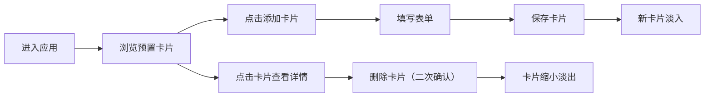

## 1. 产品概述

「光笺·灵感星图」是一款视觉化灵感管理全栈Web应用，帮助用户以星云状视觉卡片形式记录、组织和管理创意灵感。每张卡片根据用户输入的标签和描述自动生成独特的动态渐变与粒子浮动效果，将抽象灵感转化为可感知的视觉艺术。

- 主要用途：创意工作者、设计师、开发者用于记录和管理项目灵感
- 核心价值：通过视觉化方式激发创造力，让灵感管理本身成为一种艺术体验

## 2. 核心功能

### 2.1 用户角色

| 角色 | 注册方式 | 核心权限 |
|------|----------|----------|
| 普通用户 | 无需注册，本地使用 | 创建、查看、编辑、删除灵感卡片 |

### 2.2 功能模块

1. **首页（卡片网格）**：4列grid布局展示所有灵感卡片，支持点击查看详情
2. **卡片创建/编辑**：模态框表单，支持标题、多标签、描述输入
3. **卡片详情**：大尺寸星云预览，完整描述展示，删除功能
4. **后端API**：RESTful接口，支持卡片的增删改查

### 2.3 页面详情

| 页面名称 | 模块名称 | 功能描述 |
|----------|----------|----------|
| 首页 | 导航栏 | 顶部固定导航，渐变Logo文字，添加卡片按钮 |
| 首页 | 卡片网格 | 响应式grid布局，4/2/1列自适应，卡片悬停动效 |
| 首页 | 灵感卡片 | 星云光晕背景，动态粒子效果，标题标签展示 |
| 模态框 | 表单组件 | 添加/编辑卡片，标题、标签（逗号分隔）、描述输入 |
| 模态框 | 详情展示 | 大尺寸星云预览，完整描述，删除按钮 |
| 模态框 | 删除确认 | 二次确认弹窗，防止误删 |

## 3. 核心流程

用户进入应用 → 浏览预置的3张灵感卡片 → 点击「添加卡片」→ 填写表单（标题、标签、描述）→ 保存后新卡片淡入展示 → 点击任意卡片查看详情 → 可删除卡片（需二次确认）

## 4. 用户界面设计

### 4.1 设计风格

- **主色调**：深色宇宙主题，主背景 `#0f0e17`，次要背景 `#1a1a3e`
- **渐变色彩**：`#ff6b6b`（玫红）→ `#48dbfb`（天蓝）→ `#feca57`（金黄）星云光晕随机组合
- **按钮风格**：圆角20px，渐变填充，悬停时扩展阴影并微亮
- **字体**：无衬线字体，标题使用渐变文字效果，正文白色半透明
- **布局风格**：卡片式网格布局，充足留白，桌面端左右留白200px
- **视觉元素**：星云光晕、浮动粒子、发光边框、模糊毛玻璃效果

### 4.2 页面设计概述

| 页面名称 | 模块名称 | UI元素 |
|----------|----------|----------|
| 首页 | 导航栏 | 高度60px，半透明背景+毛玻璃，渐变Logo文字，发光分隔线 |
| 首页 | 卡片网格 | 4列grid，卡片尺寸280x400px，圆角16px，发光边框，悬停脉动效果 |
| 首页 | 灵感卡片 | 深色渐变背景，三到四层径向渐变星云，动态粒子，标题文字阴影，标签圆角矩形 |
| 模态框 | 表单 | 毛玻璃背景，圆角输入框，焦点亮蓝边框，渐变按钮 |
| 模态框 | 详情 | 大尺寸星云预览（50个粒子，30px飘动范围），完整描述文本 |

### 4.3 响应式

- 桌面端（≥900px）：4列grid布局
- 平板端（<900px）：2列grid布局
- 移动端（<500px）：1列grid布局
- 所有交互过渡时间统一0.3s ease
- 触摸操作优化，确保点击区域足够大

### 4.4 动画与动效

- 星云光晕：鼠标悬停时3秒周期脉动，缩放幅度1.02倍
- 卡片悬停：边框亮度增强，上移4px，0.3s过渡
- 新卡片添加：opacity从0到1，0.5s淡入
- 卡片删除：scale从1到0，opacity从1到0，0.3s缩小淡出
- 粒子效果：requestAnimationFrame循环，60fps流畅动画
