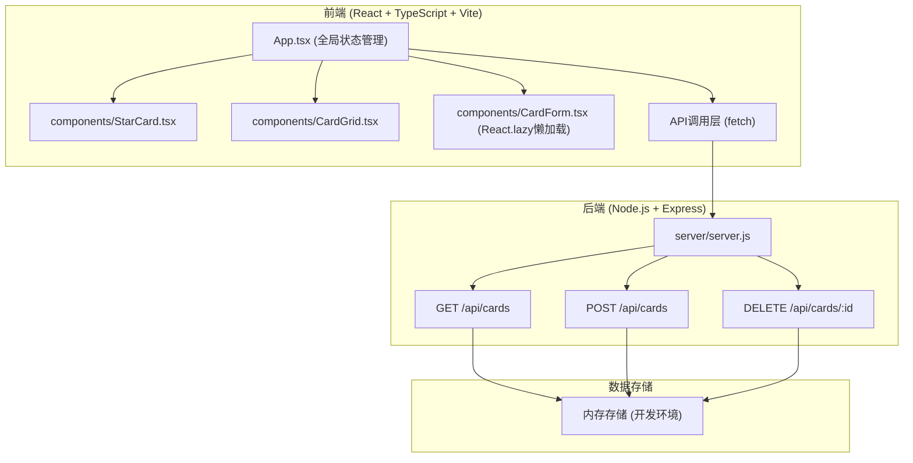
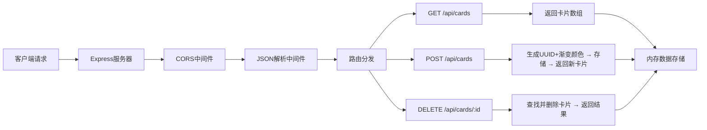
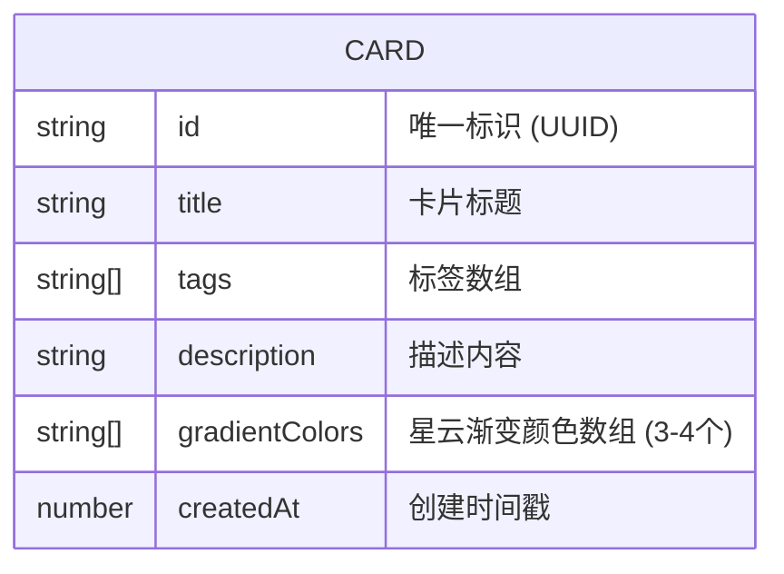

## 1. 架构设计



## 2. 技术描述

- **前端框架**：React 18 + TypeScript 5 + Vite 5
- **前端插件**：@vitejs/plugin-react
- **状态管理**：React useState/useEffect（轻量级，无需Redux）
- **后端框架**：Express 4 + CORS中间件
- **数据存储**：内存数组存储（开发环境），uuid生成唯一ID
- **样式方案**：原生CSS + CSS变量 + CSS动画
- **构建工具**：Vite，热更新，快速构建

### 依赖包清单
```
react, react-dom
express, cors, uuid
typescript, vite, @vitejs/plugin-react, tslib
@types/react, @types/react-dom, @types/express, @types/cors, @types/uuid
```

## 3. 路由定义

| 路由 | 用途 |
|------|------|
| / | 首页（卡片网格展示） |
| GET /api/cards | 获取所有卡片列表 |
| POST /api/cards | 新增一张卡片 |
| DELETE /api/cards/:id | 删除指定ID的卡片 |

## 4. API定义

### 数据类型定义
```typescript
interface Card {
  id: string;
  title: string;
  tags: string[];
  description: string;
  gradientColors: string[];
  createdAt: number;
}

interface CardInput {
  title: string;
  tags: string;
  description: string;
}
```

### API响应格式
```typescript
// GET /api/cards 响应
interface GetCardsResponse {
  success: boolean;
  data: Card[];
}

// POST /api/cards 请求体
interface PostCardRequest {
  title: string;
  tags: string[];
  description: string;
  gradientColors: string[];
}

// POST /api/cards 响应
interface PostCardResponse {
  success: boolean;
  data: Card;
}

// DELETE /api/cards/:id 响应
interface DeleteCardResponse {
  success: boolean;
  message: string;
}
```

## 5. 服务器架构图



## 6. 数据模型

### 6.1 数据模型定义



### 6.2 预置数据

应用启动时预置3张卡片：
```javascript
const initialCards = [
  {
    id: uuid(),
    title: '星辰之海',
    tags: ['宇宙', '探索', '深邃'],
    description: '在无尽的星海中，每一颗星星都是一个故事。我们在黑暗中寻找光明，在寂静中聆听回响。',
    gradientColors: ['#ff6b6b', '#48dbfb', '#feca57'],
    createdAt: Date.now() - 86400000
  },
  {
    id: uuid(),
    title: '光轨密码',
    tags: ['科技', '未来', '数据'],
    description: '光在光纤中穿梭，携带着文明的密码。每一个脉冲都是一次对话，每一次折射都是一次思考。',
    gradientColors: ['#48dbfb', '#feca57', '#ff6b6b'],
    createdAt: Date.now() - 43200000
  },
  {
    id: uuid(),
    title: '声波森林',
    tags: ['自然', '音乐', '和谐'],
    description: '风吹过树叶的沙沙声，溪水流动的叮咚声，鸟儿歌唱的啾啾声——大自然正在演奏最动人的交响乐。',
    gradientColors: ['#feca57', '#ff6b6b', '#48dbfb'],
    createdAt: Date.now()
  }
];
```

### 6.3 性能优化策略

1. **组件懒加载**：CardForm组件使用React.lazy动态导入，减少首屏bundle体积
2. **动画优化**：粒子效果使用requestAnimationFrame，避免布局抖动
3. **状态更新**：API调用后直接更新本地状态，避免不必要的重渲染
4. **CSS优化**：使用transform和opacity属性实现动画，触发GPU加速
5. **响应式**：使用CSS Grid + media query实现自适应布局
