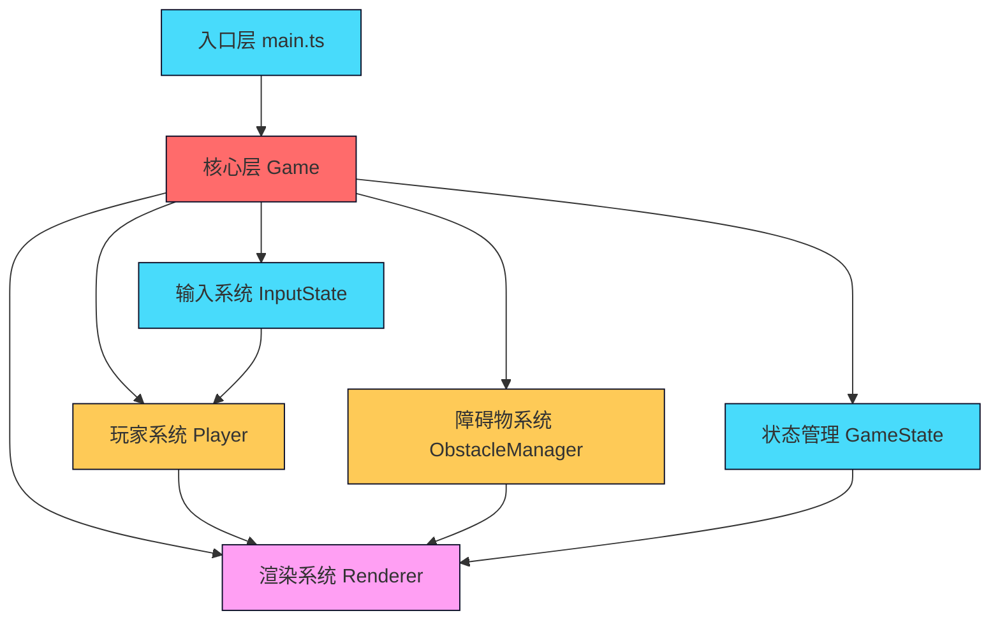

## 1. 架构设计



## 2. 技术描述

- **前端框架**：TypeScript + Vite（无React/Vue，纯Canvas 2D实现）
- **构建工具**：Vite 5.x
- **语言**：TypeScript 5.x，严格模式，ES模块
- **渲染引擎**：原生Canvas 2D API
- **状态管理**：类实例内部状态管理，无第三方状态库
- **无后端、无数据库**，纯前端游戏

### 目录结构
```
src/
├── main.ts              # 游戏入口，初始化画布，启动游戏循环
├── game.ts              # 核心游戏循环、状态管理、碰撞检测
├── player.ts            # 玩家灵兽类（粒子、跳跃、滑铲、拖尾）
├── obstacle.ts          # 障碍物管理（暗影石块、裂隙光墙）
├── renderer.ts          # Canvas渲染（背景、轨道、角色、特效）
└── types.ts             # 类型定义（核心数据结构）
```

### 数据流向
```
main.ts → Game → update(inputState)
                    ↓
           update Player, Obstacles, Collectibles
                    ↓
           check Collisions → update GameState
                    ↓
           render(state) → Renderer draws all elements
```

## 3. 文件调用关系

| 调用方 | 被调用方 | 数据传递 |
|--------|----------|----------|
| main.ts | Game.constructor | canvas, context, config |
| main.ts | game.start() | 无 |
| main.ts | game.handleInput() | input events |
| Game | Player.update() | inputState, deltaTime |
| Game | Player.getRenderData() | 无 → playerRenderData |
| Game | ObstacleManager.update() | speed, deltaTime |
| Game | ObstacleManager.spawn() | position |
| Game | ObstacleManager.getObstacles() | 无 → obstacles[] |
| Game | Renderer.render() | gameState, playerData, obstacles, orbs |
| Player | Renderer | 通过Game间接传递粒子数据 |

## 4. 核心类型定义

```typescript
// 游戏状态
type GameStatus = 'ready' | 'playing' | 'paused' | 'gameover';

// 输入状态
interface InputState {
  jump: boolean;
  slide: boolean;
  pause: boolean;
}

// 玩家状态
interface PlayerState {
  x: number;
  y: number;
  baseY: number;
  velocityY: number;
  isJumping: boolean;
  isSliding: boolean;
  jumpProgress: number;
  slideProgress: number;
  bobOffset: number;
  lives: number;
  isInvincible: boolean;
  invincibleTimer: number;
  isDashing: boolean;
  dashTimer: number;
}

// 粒子数据
interface Particle {
  x: number;
  y: number;
  size: number;
  color: string;
  opacity: number;
  velocityX?: number;
  velocityY?: number;
  life?: number;
  maxLife?: number;
}

// 障碍物类型
type ObstacleType = 'stone' | 'wall';

interface Obstacle {
  id: number;
  type: ObstacleType;
  x: number;
  y: number;
  width: number;
  height: number;
  color: string;
  glowColor: string;
  breathPhase: number;
  breathSpeed: number;
}

// 能量光球
interface Orb {
  id: number;
  x: number;
  y: number;
  radius: number;
  collected: boolean;
  breathPhase: number;
}

// 爆炸特效
interface Explosion {
  id: number;
  x: number;
  y: number;
  particles: Particle[];
  life: number;
  maxLife: number;
}

// 游戏状态
interface GameState {
  status: GameStatus;
  score: number;
  distance: number;
  speed: number;
  baseSpeed: number;
  orbProgress: number;
  orbsCollected: number;
  obstacleSpacing: number;
  gameTime: number;
  lastObstacleX: number;
  lastOrbX: number;
  screenFlash: number;
}
```

## 5. 性能约束

- **帧率目标**：稳定60FPS，最低30FPS
- **对象数量控制**：障碍物≤100，光球≤100
- **粒子总数**：拖尾+爆炸特效≤500
- **内存管理**：及时清理屏幕外对象，对象池复用粒子

## 6. 配置参数

| 参数 | 初始值 | 变化规则 | 最小值/最大值 |
|------|--------|----------|---------------|
| 轨道滚动速度 | 2px/帧 | 每5秒+0.5px/帧 | - |
| 障碍物移动速度 | 1px/帧 | 每30秒+0.1px/帧 | 3px/帧 |
| 障碍物间距 | 200px | 每收集5个光球-10px | 80px |
| 跳跃高度 | 150px | 每30秒-5px | 100px |
| 光球间隔 | 250px | 逐渐增加到350px | 350px |
| 生命值 | 3 | - | 0 |
| 冲刺触发 | 10个光球 | - | - |
| 冲刺时长 | 2秒 | - | - |
| 无敌时长 | 1秒 | - | - |
