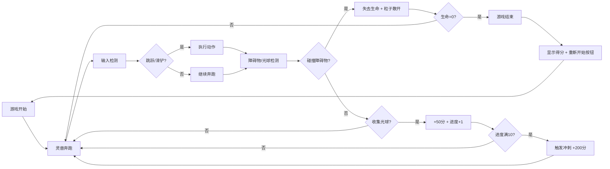

## 1. 产品概述

「光脉·奔流永动」是一款浏览器端跑酷游戏，玩家操控由发光粒子构成的灵兽在色彩渐变的光脉轨道上奔跑，通过跳跃和滑铲躲避障碍物并收集能量光球，触发加速冲刺特效。游戏面向休闲游戏玩家，提供沉浸式的视觉体验和流畅的操作手感。

- 核心玩法：跑酷躲避 + 能量收集 + 冲刺连击
- 目标市场：独立游戏爱好者、休闲游戏玩家

## 2. 核心功能

### 2.1 用户角色
| 角色 | 注册方式 | 核心权限 |
|------|----------|----------|
| 玩家 | 无需注册，直接游玩 | 完整游戏体验，分数记录 |

### 2.2 功能模块
1. **游戏主界面**：Canvas游戏画布、得分显示、生命值、光球收集进度条
2. **玩家控制系统**：跳跃（空格/上箭头）、滑铲（下箭头）、暂停（P键）
3. **轨道系统**：动态渐变光脉轨道、无限滚动效果、速度递增机制
4. **障碍物系统**：暗影石块、裂隙光墙、难度渐进机制
5. **光球系统**：能量光球生成、收集特效、进度条、冲刺触发
6. **粒子特效系统**：灵兽粒子拖尾、爆炸特效、冲刺火焰效果
7. **游戏状态管理**：开始、运行、暂停、结束、重新开始

### 2.3 页面详情
| 页面名称 | 模块名称 | 功能描述 |
|----------|----------|----------|
| 游戏主界面 | Canvas渲染层 | 全屏游戏画面，包含轨道、玩家、障碍物、光球、特效 |
| 游戏主界面 | UI信息层 | 左上角得分和进度条、顶部生命值、暂停/结束覆盖层 |
| 游戏主界面 | 控制层 | 键盘事件监听、游戏循环控制 |
| 结束界面 | 结束覆盖层 | 显示最终得分、重新开始按钮、动画效果 |

## 3. 核心流程

玩家打开页面 → 游戏自动开始 → 灵兽在轨道上奔跑 → 玩家通过跳跃/滑铲躲避障碍物 → 收集光球填充进度条 → 满10个触发冲刺 → 碰撞障碍物失去生命 → 生命耗尽游戏结束 → 点击重新开始。

## 4. 用户界面设计

### 4.1 设计风格
- **设计方向**：深色科幻风格，赛博朋克光效美学
- **主色调**：深蓝#0b0e27、深紫#1a1042
- **强调色**：亮蓝#48dbfb、暖橙#ff6b6b、金色#feca57、粉色#ff9ff3
- **按钮风格**：渐变背景、圆角8px、悬停翻转并放大10%
- **字体**：现代无衬线字体，文字带发光阴影效果
- **UI元素**：半透明毛玻璃效果（backdrop-filter: blur(8px)）、边框发光
- **动画风格**：呼吸式缩放、流光拖尾、粒子爆炸、平滑过渡

### 4.2 页面设计概述
| 页面名称 | 模块名称 | UI元素 |
|----------|----------|--------|
| 游戏主界面 | 背景层 | 径向渐变（深蓝到深紫）、动态光脉轨道（180px宽，三色渐变） |
| 游戏主界面 | 玩家角色 | 20个发光粒子构成的灵兽，15个粒子拖尾，上下浮动 |
| 游戏主界面 | 障碍物 | 暗影石块（带暗紫色光晕）、裂隙光墙（垂直线条渐变） |
| 游戏主界面 | 能量光球 | 半径8px，发光效果shadowBlur=12px，呼吸式缩放 |
| 游戏主界面 | 信息面板 | 左上角得分（24px，发光效果）、三颗星形生命图标、光球进度条 |
| 游戏主界面 | 特效层 | 收集爆炸粒子（20个，随机颜色，扩散半径80px）、冲刺火焰效果 |
| 暂停界面 | 覆盖层 | 画面模糊（blur 3px）、中央"暂停"文字（48px，发光） |
| 结束界面 | 覆盖层 | "游戏结束"文字（64px，渐变，缩放动画）、最终得分、重新开始按钮 |

### 4.3 响应式
- 桌面优先，移动端自适应
- Canvas画布自动调整尺寸，保持内容居中
- 触摸操作支持（上滑跳跃、下滑滑铲、点击暂停/继续）
- 游戏元素根据屏幕尺寸等比例缩放

### 4.4 视觉特效
- **环境氛围**：轨道持续10秒周期冷暖色循环，障碍物和光球±5%呼吸缩放
- **玩家状态**：奔跑时6px上下浮动（1次/秒），跳跃抛物线轨迹，滑铲时扁平拖尾
- **冲刺状态**：粒子增大到8-12px，火焰渐变色，拖尾30个粒子，速度翻倍
- **受伤效果**：粒子散开1秒后重新聚合
- **结束动画**：文字从0.5→1.2→1倍缩放，周期3秒循环
