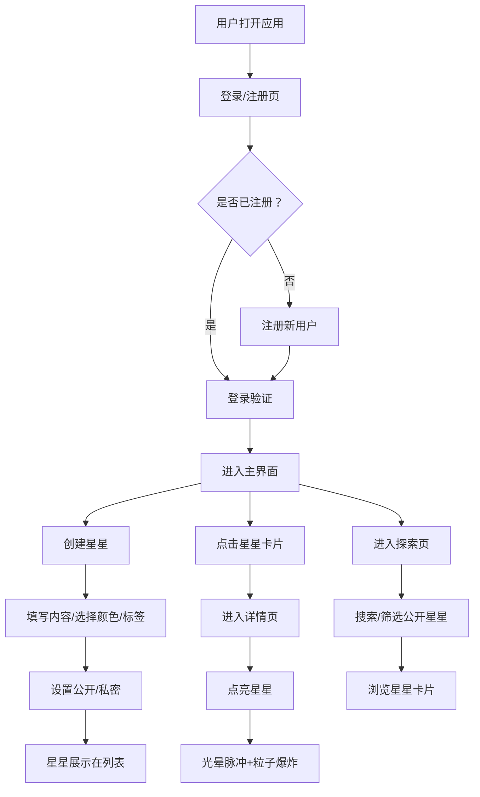

## 1. 产品概述

"光语·心愿星"是一个让用户在特殊节日（生日、纪念日等）通过定制化发光星星传递个性化祝福与心愿的互动平台。用户可以创建带有独特颜色、标签和内容的心愿星星，点亮他人的星星，探索公开的心愿，在深邃的星空背景下感受温暖的情感传递。

- 目标用户：希望用独特方式表达祝福、记录心愿的所有用户
- 市场价值：弥补传统祝福方式缺乏仪式感和互动性的空白，提供沉浸式的情感表达体验

## 2. 核心功能

### 2.1 用户角色

| 角色 | 注册方式 | 核心权限 |
|------|----------|----------|
| 普通用户 | 用户名+密码注册 | 创建星星、点亮星星、浏览公开星星、管理个人星星 |

### 2.2 功能模块

1. **登录注册页**：用户注册/登录表单，前端验证，后端JWT鉴权
2. **主界面**：渐变导航栏、星空背景星星创建区、已创建星星列表
3. **星星详情页**：展示星星完整内容、创建时间、所属用户
4. **探索页面**：所有公开星星展示、标签/颜色筛选、内容模糊搜索

### 2.3 页面详情

| 页面名称 | 模块名称 | 功能描述 |
|----------|----------|----------|
| 登录注册页 | 表单模块 | 用户名/密码输入、表单验证、登录/注册切换、错误提示 |
| 主界面 | 导航栏 | 渐变背景（#0f0c29→#302b63）、用户信息、探索入口、退出登录 |
| 主界面 | 创建区 | 心愿内容输入（≤200字）、12色调色板、标签选择、私密/公开开关、创建按钮 |
| 主界面 | 星星列表 | 响应式网格布局、按标签/颜色筛选、毛玻璃卡片展示、悬浮动画 |
| 星星详情页 | 详情展示 | 深色渐变背景、星星色文字带光晕、创建时间和用户信息 |
| 星星详情页 | 点亮模块 | 点亮按钮、点亮次数、点亮光晕脉冲动画、粒子爆炸特效 |
| 探索页面 | 搜索筛选 | 搜索框（模糊搜索内容）、标签筛选、颜色筛选、按时间排序 |
| 探索页面 | 星星网格 | 所有公开星星卡片、最近创建排序 |

## 3. 核心流程

用户打开应用后，首先进入登录注册页面，通过注册或登录进入主界面。在主界面可以创建心愿星星（填写内容、选择颜色和标签、设置公开/私密），创建成功后星星出现在列表中。点击星星卡片展开详情，可以为星星点亮，点亮时触发光晕脉冲动画和粒子爆炸特效。用户也可以进入探索页面浏览所有公开的星星，通过搜索框和筛选器查找特定的心愿。

## 4. 用户界面设计

### 4.1 设计风格

- **主色调**：深色星空主题，主背景#0e0b1f，辅助背景#1a1536
- **渐变色**：导航栏从#0f0c29（左）到#302b63（右）
- **星星颜色**：12色调色板（#ff6b6b暖红、#feca57金橙、#48dbfb电光蓝、#a29bfe淡紫、#00b894翠绿等）
- **按钮样式**：圆角按钮，悬停时背景变亮并产生微弱光晕扩散
- **字体**：优雅的无衬线字体，标题使用带星光质感的展示字体
- **布局风格**：卡片式布局，毛玻璃效果（backdrop-filter: blur(10px)，背景rgba(255,255,255,0.06)）
- **发光效果**：卡片外围15px大小、20px模糊半径的颜色光晕，1px发光边框（透明度0.4）

### 4.2 页面设计概览

| 页面名称 | 模块名称 | UI元素 |
|----------|----------|--------|
| 登录注册页 | 表单区域 | 深色背景、星光点缀、毛玻璃表单卡片、发光输入框 |
| 主界面 | 导航栏 | 渐变背景、发光文字按钮、悬停光晕 |
| 主界面 | 创建区 | 星空背景、闪烁星星动画、发光输入框、调色板、标签按钮 |
| 主界面 | 星星列表 | 响应式网格、毛玻璃卡片、发光边框、悬浮上移动画 |
| 星星详情页 | 详情内容 | 深色渐变背景、星星色文字（text-shadow: 0 0 8px）、柔和过渡动画 |
| 探索页面 | 搜索筛选 | 发光搜索框、筛选标签按钮、平滑过渡动画 |

### 4.3 响应式布局

- 桌面端：星星列表每行4列
- 平板端：星星列表每行3列
- 手机端：星星列表每行2列
- 卡片固定尺寸：宽200px，高280px
- 所有交互元素支持触摸操作

### 4.4 动画与特效

- **卡片展开/折叠**：滑动+透明度变化，持续0.4秒
- **点亮脉冲**：光晕缩放至1.2倍再恢复，持续0.3秒（CSS关键帧）
- **粒子爆炸**：20个粒子（4-8px），颜色从星星色到白色过渡，requestAnimationFrame驱动，持续1秒
- **按钮悬停**：背景变亮+微弱光晕扩散
- **星空背景**：缓慢闪烁的星星粒子动画
