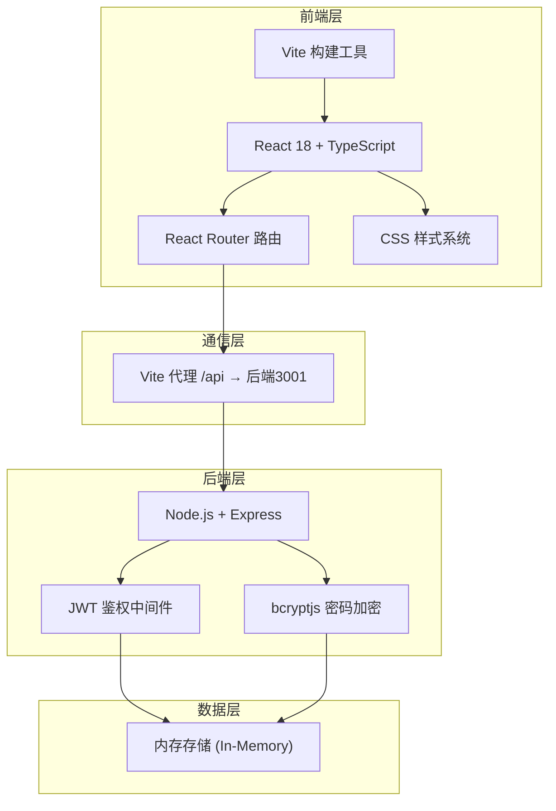
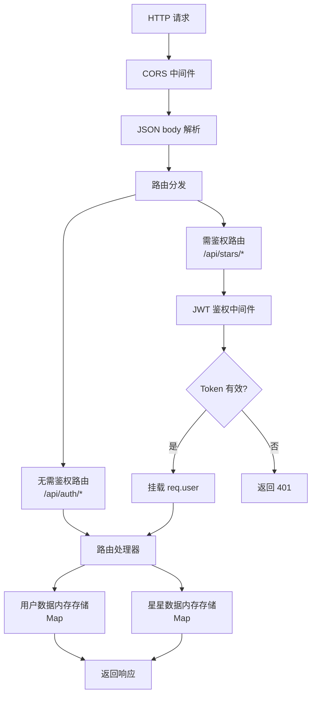
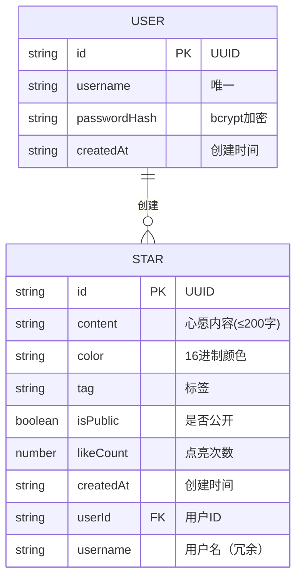

## 1. 架构设计



## 2. 技术栈描述

- **前端框架**: React 18 + TypeScript（严格模式）
- **构建工具**: Vite（配置代理转发 /api 请求到后端 3001 端口）
- **路由管理**: React Router（HashRouter 或 BrowserRouter）
- **状态管理**: React useState + useContext（轻量级，无需全局状态库）
- **样式方案**: 原生 CSS（全局样式 + 组件内样式），含 CSS 关键帧动画
- **后端框架**: Node.js + Express 4
- **身份认证**: JWT (jsonwebtoken) + bcryptjs 密码加密
- **数据存储**: 内存存储（Map 结构存储用户和星星数据，开发演示用）
- **ID 生成**: uuid

## 3. 路由定义

| 前端路由 | 页面 | 用途 |
|----------|------|------|
| /login | 登录注册页 | 用户注册与登录 |
| / | 主界面 | 星星创建区 + 个人星星列表 |
| /star/:id | 星星详情页 | 展示星星详情与点亮功能 |
| /explore | 探索页面 | 浏览所有公开星星 |

## 4. API 接口定义

### 4.1 用户接口

```typescript
// 用户注册 POST /api/auth/register
interface RegisterRequest {
  username: string;
  password: string;
}
interface RegisterResponse {
  token: string;
  user: { id: string; username: string };
}

// 用户登录 POST /api/auth/login
interface LoginRequest {
  username: string;
  password: string;
}
interface LoginResponse {
  token: string;
  user: { id: string; username: string };
}
```

### 4.2 星星接口

```typescript
// 创建星星 POST /api/stars
interface CreateStarRequest {
  content: string;      // 最多200字
  color: string;        // 16进制颜色值
  tag: string;          // 标签
  isPublic: boolean;    // 是否公开
}
interface CreateStarResponse {
  id: string;
  content: string;
  color: string;
  tag: string;
  isPublic: boolean;
  likeCount: number;
  createdAt: string;
  userId: string;
  username: string;
}

// 获取个人星星列表 GET /api/stars/my
// Query 参数：tag?, color?
// 返回：Star[]

// 获取星星详情 GET /api/stars/:id
// 返回：Star

// 点亮星星 POST /api/stars/:id/like
// 返回：{ likeCount: number }

// 获取公开星星列表 GET /api/stars/public
// Query 参数：tag?, color?, search?, sortBy=createdAt
// 返回：Star[]
```

### 4.3 鉴权中间件

- 除注册/登录外，所有 API 请求需在 Header 携带 `Authorization: Bearer <token>`
- 中间件验证 JWT token，解析用户信息并挂载到 req.user

## 5. 服务端架构图



## 6. 数据模型

### 6.1 数据模型定义



### 6.2 数据类型定义

```typescript
interface User {
  id: string;
  username: string;
  passwordHash: string;
  createdAt: string;
}

interface Star {
  id: string;
  content: string;
  color: string;
  tag: string;
  isPublic: boolean;
  likeCount: number;
  createdAt: string;
  userId: string;
  username: string;
}

// 预设颜色
const STAR_COLORS = [
  '#ff6b6b', '#feca57', '#48dbfb', '#a29bfe', '#00b894',
  '#fd79a8', '#e17055', '#0984e3', '#6c5ce7', '#00cec9',
  '#e84393', '#d63031'
];

// 预设标签
const STAR_TAGS = ['生日', '鼓励', '祝福', '思念', '梦想', '感谢', '告白', '纪念'];
```

### 6.3 项目文件结构

```
├── package.json          # 项目依赖与脚本
├── vite.config.js        # Vite 构建配置（含代理）
├── tsconfig.json         # TypeScript 配置（严格模式）
├── index.html            # 入口 HTML
├── server.js             # Express 后端服务
└── src/
    ├── App.tsx           # React 主组件 + 路由
    ├── styles.css        # 全局样式
    └── components/
        ├── StarCard.tsx       # 星星卡片组件
        └── ParticleEffect.tsx # 粒子特效组件
```
