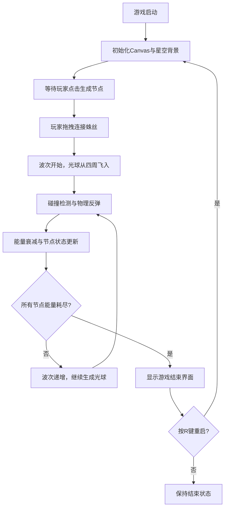

## 1. 产品概述

「光织·幻弦之巢」是一款运行于浏览器的交互式策略游戏，玩家在深色抽象空间中通过拖拽连接发光粒子节点构建动态蜘蛛网结构，抵御从四周涌来的变形光球冲击。

- 核心玩法：节点生成、蛛丝连接、物理反弹、能量管理、波次防守
- 目标用户：休闲游戏玩家、视觉交互爱好者
- 产品价值：提供兼具策略深度与视觉美感的沉浸式游戏体验

## 2. 核心功能

### 2.1 用户角色
无需用户注册，单玩家游戏模式。

### 2.2 功能模块
1. **游戏主画布**：全屏Canvas渲染，节点生成、蛛丝连接、光球运动、粒子特效
2. **物理引擎**：蛛丝弹性振动、光球反弹碰撞、粒子运动模拟
3. **能量系统**：节点能量衰减、碰撞能量损失、低能量视觉反馈
4. **波次系统**：光球生成节奏、速度递增、波次计数
5. **UI面板**：实时状态显示（波次、节点数、总能量）、游戏结束界面
6. **控制系统**：点击生成节点、拖拽连接蛛丝、键盘重启

### 2.3 页面详情

| 页面名称 | 模块名称 | 功能描述 |
|----------|----------|----------|
| 游戏主界面 | Canvas渲染层 | 背景星空、节点、蛛丝、光球、粒子特效的实时绘制 |
| 游戏主界面 | UI信息面板 | 右上角毛玻璃面板，显示波次数、剩余节点数、总能量值 |
| 游戏主界面 | 交互控制层 | 监听鼠标点击/拖拽、键盘事件，处理节点生成与蛛丝连接 |
| 游戏结束界面 | 结算面板 | 显示最终波次数、粒子爆炸特效，支持R键重启 |

## 3. 核心流程

## 4. 用户界面设计

### 4.1 设计风格
- **主色调**：深紫#1a0f2e到墨黑#0a0a0a的中心放射渐变背景
- **交互高亮色**：电光蓝#48dbfb（节点）、金橙#feca57（UI高亮）
- **光球颜色**：#ff6b6b到#ff9ff3随机渐变
- **低能量节点色**：#a29bfe
- **字体**：16px大小，文字颜色#e0e0e0，带text-shadow发光效果
- **面板样式**：半透明毛玻璃（backdrop-filter: blur(10px)，背景rgba(255,255,255,0.06)，边框1px rgba(255,255,255,0.1)）
- **过渡动画**：所有元素transition: all 0.3s ease-out

### 4.2 页面设计概述

| 页面名称 | 模块名称 | UI元素 |
|----------|----------|----------|
| 游戏主界面 | 星空背景 | 60个随机星点，大小1-2px，透明度0.2-0.5，闪烁周期3-7秒 |
| 游戏主界面 | 节点 | 半径12px，#48dbfb，边缘4px柔光，生成时从0放大动画 |
| 游戏主界面 | 蛛丝 | 宽度2px，两端节点颜色混合渐变，粒子200px/s流动 |
| 游戏主界面 | 光球 | 半径15px，渐变颜色，反弹时3px径向模糊拖尾0.2秒 |
| 游戏主界面 | UI面板 | 右上角，波次/节点数/总能量，发光文字 |
| 游戏结束界面 | 结算文字 | #feca57显示最终波次，粒子爆炸特效2秒 |

### 4.3 响应式设计
- 桌面优先设计，支持视口宽度1024px到2560px
- Canvas始终按比例全屏缩放（100vw x 100vh）
- UI面板使用固定像素尺寸，在宽屏下保持合适比例

### 4.4 视觉特效
- **节点爆裂**：8个彩色粒子渐变透明，0.5秒消散
- **蛛丝振动**：3-5周期阻尼振动，弹性系数0.6，阻尼0.92
- **光球拖尾**：反弹时径向模糊3px，持续0.2秒
- **爆炸特效**：游戏结束时粒子爆炸，持续2秒
- **发光效果**：节点边缘柔光、文字发光、蛛丝粒子流动

## 5. 性能约束
- 帧率：≥55 FPS，单帧渲染≤16ms
- 节点上限：100个
- 蛛丝上限：300条
- 光球上限：20个（超出销毁最早的）
- 粒子上限：每帧500个（超出延迟到下一帧）
