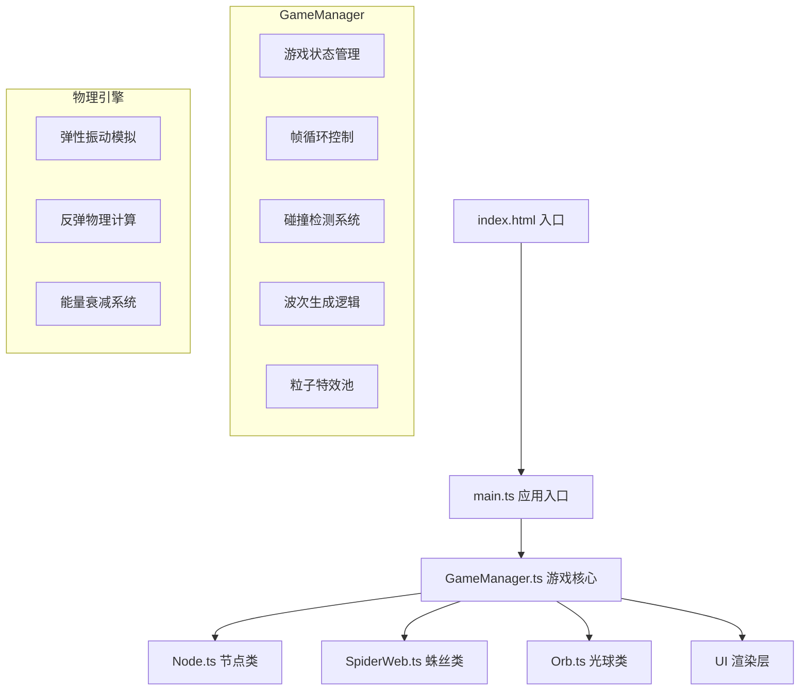

## 1. 架构设计



## 2. 技术栈说明

- **前端框架**：TypeScript 5.x + Vite 5.x
- **渲染引擎**：Canvas 2D API
- **包管理器**：npm
- **模块系统**：ES2020 模块
- **类型检查**：TypeScript 严格模式

### 核心依赖
| 依赖 | 版本 | 用途 |
|------|------|------|
| typescript | ^5.4.0 | TypeScript 编译器 |
| vite | ^5.2.0 | 构建工具与开发服务器 |

## 3. 文件结构

```
auto301/
├── package.json          # 项目配置与依赖
├── vite.config.js        # Vite 构建配置
├── tsconfig.json         # TypeScript 配置
├── index.html            # 入口HTML
└── src/
    ├── main.ts           # 应用入口，Canvas初始化，游戏循环
    ├── GameManager.ts    # 游戏核心管理器
    ├── Node.ts           # 节点类
    ├── SpiderWeb.ts      # 蛛丝类
    └── Orb.ts            # 光球类
```

## 4. 模块职责定义

### 4.1 main.ts
- 创建全屏Canvas元素，设置100vw x 100vh尺寸
- 监听窗口resize事件，动态调整Canvas大小
- 初始化GameManager
- 启动requestAnimationFrame游戏循环
- 监听鼠标事件（点击、拖拽）和键盘事件（R键重启）

### 4.2 GameManager.ts
- 管理游戏状态（playing, gameOver）
- 维护节点集合、蛛丝集合、光球集合、粒子池
- 波次系统：每5-8秒生成光球，速度递增
- 碰撞检测：光球与蛛丝的碰撞响应
- 帧更新调度：调用各实体的update方法
- UI数据更新：波次数、节点数、总能量计算
- 对象池管理：控制实体数量上限

### 4.3 Node.ts
- 属性：位置(x,y)、能量值、连接列表、颜色、生成动画进度
- 能量衰减：每秒1点自然衰减
- 连接管理：最多6条蛛丝连接
- 绘制方法：发光节点渲染，低能量视觉反馈
- 爆裂特效：能量耗尽时生成8个彩色粒子

### 4.4 SpiderWeb.ts
- 属性：两端节点索引、弹性振动参数、粒子流动偏移
- 物理模拟：阻尼振动计算（弹性系数0.6，阻尼0.92，3-5周期）
- 粒子流动：200px/s沿丝线循环流动
- 碰撞检测：线段与圆的碰撞检测
- 绘制方法：渐变颜色、流动粒子、振动变形

### 4.5 Orb.ts
- 属性：位置、速度、半径、颜色渐变、拖尾状态
- 运动更新：每帧更新位置
- 反弹物理：法线方向反弹，速度0.8倍衰减
- 拖尾特效：反弹时3px径向模糊，持续0.2秒
- 绘制方法：渐变填充、拖尾渲染

## 5. 关键算法与数据结构

### 5.1 线段-圆碰撞检测
```typescript
// 计算点到线段的最短距离，小于等于半径则碰撞
function segmentCircleCollision(p1: Point, p2: Point, circle: Circle): boolean
```

### 5.2 阻尼振动模拟
```typescript
// 简谐运动公式：x(t) = A * e^(-δt) * cos(ωt + φ)
// 弹性系数k=0.6, 阻尼系数d=0.92
class DampedOscillation {
    amplitude: number
    damping: number
    frequency: number
    offset: number
    update(dt: number): number
}
```

### 5.3 对象池管理
```typescript
interface ObjectPool<T> {
    items: T[]
    maxCount: number
    add(item: T): void
    remove(index: number): void
    cleanup(): void
}
```

## 6. 性能优化策略

1. **对象复用**：粒子使用对象池，避免频繁GC
2. **批量绘制**：同类型元素批量路径绘制，减少Canvas状态切换
3. **脏矩形**：仅更新变化区域（必要时）
4. **帧率控制**：requestAnimationFrame确保刷新率同步
5. **数量限制**：严格执行各实体数量上限
6. **粒子延迟**：超出500个粒子时分帧渲染

## 7. 输入输出定义

### 7.1 输入事件
| 事件 | 响应 |
|------|------|
| mousedown | 检测是否点击节点，开始拖拽连接 |
| mousemove | 更新拖拽预览线 |
| mouseup | 释放在节点上则创建蛛丝 |
| click（空白处） | 在点击位置生成新节点（≤100个） |
| keydown 'R' | 重置游戏状态 |

### 7.2 UI输出
| 指标 | 位置 | 格式 |
|------|------|------|
| 波次数 | 右上角面板 | `波次: {n}` |
| 剩余节点数 | 右上角面板 | `节点: {n}` |
| 总能量 | 右上角面板 | `能量: {sum}` |
| 最终波次 | 游戏结束居中 | `防守波次: {n}` |

## 8. 构建与运行

- **开发命令**：`npm run dev`
- **构建命令**：`npm run build`
- **入口文件**：`index.html` → 引入 `src/main.ts`
- **输出目录**：`dist/`
