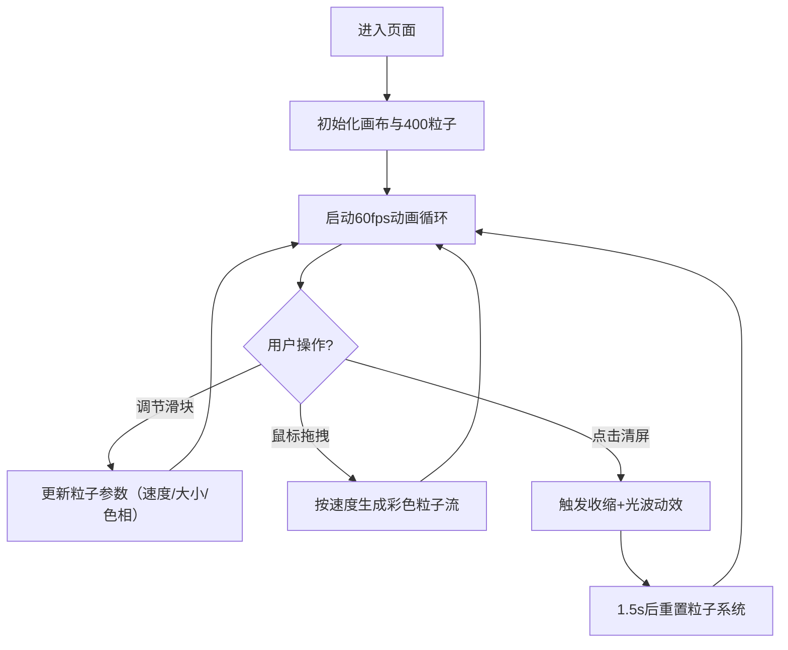

## 1. 产品概述

光羽·流云画布是一款基于浏览器的交互式数字艺术画布，通过实时渲染数百个发光粒子创造动态流动的光羽效果。用户可通过鼠标拖拽和点击与画布互动，产生独特的彩色粒子流，形成不断变幻的艺术图案。

- **核心价值**：提供沉浸式、直觉式的数字艺术创作体验，让用户无需专业技能即可创造美丽的动态视觉效果
- **目标用户**：数字艺术爱好者、视觉设计师、休闲娱乐用户

## 2. 核心特性

### 2.1 功能模块

1. **主画布区域**：全屏粒子渲染画布，实时动态粒子系统，粒子间连线效果
2. **控制面板**：左上角半透明毛玻璃面板，包含粒子参数调节控件
3. **鼠标交互系统**：拖拽生成彩色粒子流，速度影响粒子颜色与大小
4. **清屏动效系统**：粒子收缩消失 + 光波扩散特效

### 2.2 页面详情

| 页面名称 | 模块名称 | 功能描述 |
|-----------|-------------|---------------------|
| 主画布页 | 渐变背景 | 从#0b0e27到#1a1042的垂直渐变，占满视口 |
| 主画布页 | 粒子系统 | 400个默认粒子，随机漂移，方向微变，60px内连线 |
| 主画布页 | 控制面板 | 毛玻璃面板，3个滑块+1个按钮，参数实时生效 |
| 主画布页 | 拖拽交互 | 每帧20个新粒子，速度决定色温和大小，30帧惯性 |
| 主画布页 | 清屏动效 | 1.5秒粒子收缩+2秒400px半径光波扩散 |

## 3. 核心流程

用户进入页面 → 画布自动渲染400个流动粒子 → 用户调节滑块实时观察效果变化 → 用户拖拽鼠标产生彩色光轨 → 用户点击清屏触发消失动效 → 画布回归初始状态继续流动

## 4. 用户界面设计

### 4.1 设计风格
- **主色调**：深邃科幻暗色调，背景垂直渐变 #0b0e27 → #1a1042
- **粒子色板**：6种高饱和主色（#ff6b6b、#ff9ff3、#48dbfb、#feca57、#a29bfe、#00b894）
- **控件风格**：毛玻璃质感 backdrop-filter: blur(8px)，背景 rgba(255,255,255,0.06)，边框 1px rgba(255,255,255,0.15)
- **发光效果**：所有粒子和连线带有 canvas 发光阴影，交互元素微弱发光
- **字体**：现代无衬线字体，白色半透明文字

### 4.2 页面设计概览

| 页面名称 | 模块名称 | UI元素 |
|-----------|-------------|-------------|
| 主画布页 | 控制面板 | 固定左上角、圆角8px、内边距16px、间距12px |
| 主画布页 | 滑块控件 | 自定义轨道样式、发光滑块按钮、数值标签 |
| 主画布页 | 清屏按钮 | 圆角6px、悬停微亮、点击光波中心在按钮位置 |
| 主画布页 | 粒子渲染 | Canvas 2D、发光阴影、加色混合模式 |

### 4.3 响应式设计
- 桌面优先设计，画布占满整个浏览器视口
- 控制面板固定定位，不随滚动变化
- 支持窗口 resize 自动调整画布尺寸
