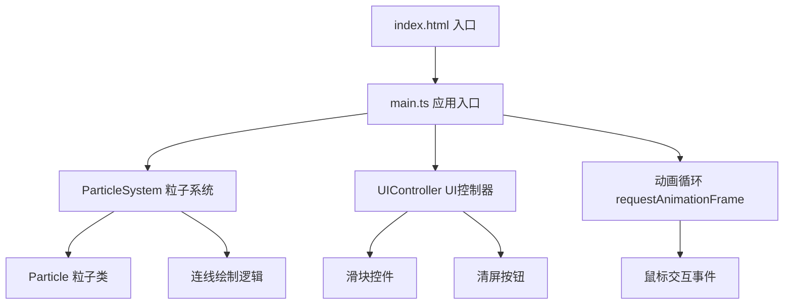

## 1. 架构设计



## 2. 技术选型说明

- **前端框架**：原生 TypeScript + Canvas 2D（无需 React/Vue，追求极致渲染性能）
- **构建工具**：Vite 5.x（ES模块热更新，极速开发体验）
- **语言版本**：TypeScript 5.x 严格模式，target ES2020
- **渲染技术**：HTML5 Canvas 2D Context + shadowBlur 发光效果 + globalCompositeOperation 加色混合
- **无后端、无数据库、无外部依赖**

## 3. 文件结构

```
auto302/
├── package.json          # 项目依赖与脚本
├── vite.config.js        # Vite构建配置
├── tsconfig.json         # TypeScript配置（严格模式）
├── index.html            # 入口页面
└── src/
    ├── main.ts           # 应用入口：初始化、动画循环、事件绑定
    ├── particle.ts       # 粒子类：Particle类、连线逻辑、光波类
    └── ui.ts             # UI控制器：控制面板、滑块、按钮
```

## 4. 模块定义

### 4.1 Particle (src/particle.ts)
```typescript
interface Particle {
  x: number; y: number;           // 位置
  vx: number; vy: number;         // 速度
  size: number;                   // 当前大小
  baseSize: number;               // 基础大小
  hue: number;                    // 色相值
  color: string;                  // 颜色字符串
  life: number;                   // 已存在帧数
  mouseInherited: number;         // 鼠标惯性剩余帧数(0-30)
  shrinking: boolean;             // 是否正在收缩消失
  shrinkStart: number;            // 收缩开始时间
  update(speedMul: number): void; // 更新位置状态
  draw(ctx: CanvasRenderingContext2D): void;
}

class LightWave {
  x: number; y: number;
  radius: number;
  opacity: number;
  startFrame: number;
  update(): boolean; // 返回是否存活
  draw(ctx: CanvasRenderingContext2D): void;
}

// 连线函数
function drawConnections(ctx: CanvasRenderingContext2D, particles: Particle[]): void
```

### 4.2 UIController (src/ui.ts)
```typescript
interface UIParams {
  speed: number;      // 1-10
  size: number;       // 2-8
  hueOffset: number;  // 0-360
}

class UIController {
  private container: HTMLElement;
  private params: UIParams;
  private clearCallback: (x: number, y: number) => void;
  
  constructor(clearCallback: (x: number, y: number) => void);
  getParams(): UIParams;
  private createSlider(...): HTMLInputElement;
  private bindEvents(): void;
}
```

### 4.3 Main (src/main.ts)
- 初始化 Canvas（全屏、DPR适配、渐变背景）
- 初始化 UIController 和 ParticleSystem
- 初始化 400 个默认粒子
- requestAnimationFrame 动画循环（更新→清屏→连线→粒子→光波）
- 鼠标事件（mousedown/mousemove/mouseup/click，计算速度矢量）
- 窗口 resize 处理

## 5. 性能优化策略

1. **空间分区**：连线检测使用网格分区，避免 O(n²) 全量检测（可选，800+粒子时启用）
2. **DPR 限制**：设备像素比最大限制为 2，避免高 DPI 屏幕性能损耗
3. **批量绘制**：同一颜色粒子尽量批量绘制，减少状态切换
4. **粒子上限**：软上限 1200 个，超出后最老粒子优先淘汰
5. **连线距离**：严格 60px 阈值，距离越远透明度越低
