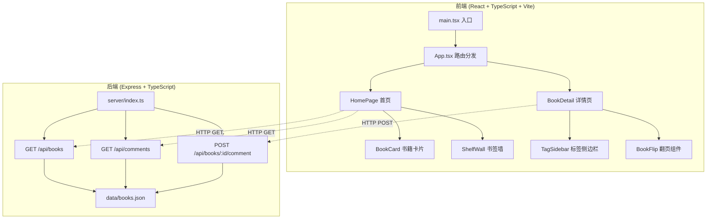
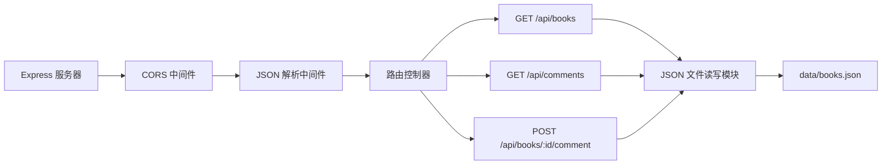
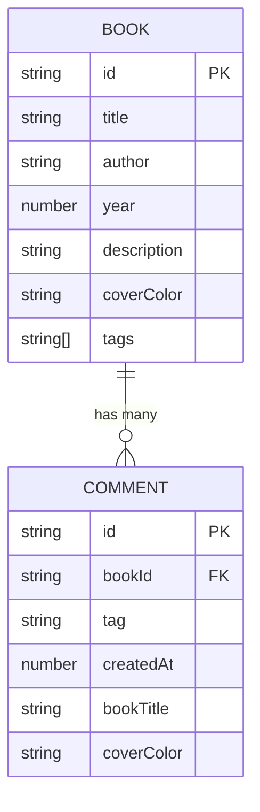

## 1. 架构设计



## 2. 技术说明

- **前端**：React 18 + TypeScript + Vite + React Router DOM
- **构建工具**：Vite（配置代理转发 /api 至后端 Express 服务器）
- **后端**：Express 4 + TypeScript + ts-node
- **数据存储**：JSON文件持久化（data/books.json）
- **依赖包**：react、react-dom、express、cors、uuid、typescript、vite、@vitejs/plugin-react、tslib及各类型定义包

## 3. 路由定义

| 路由 | 用途 |
|------|------|
| / | 首页：虚拟书架 + 书签墙展示 |
| /book/:id | 书籍详情页：3D翻页 + 标签拖拽 |

## 4. API 定义

### 类型定义

```typescript
interface EmotionTag {
  name: string;
  color: string;
  key: 'warm' | 'sad' | 'wisdom' | 'romance' | 'mystery' | 'healing';
}

interface Book {
  id: string;
  title: string;
  author: string;
  year: number;
  description: string;
  coverColor: string;
  tags: EmotionTag['key'][];
}

interface Comment {
  id: string;
  bookId: string;
  tag: EmotionTag['key'];
  createdAt: number;
  bookTitle: string;
  coverColor: string;
}
```

### GET /api/books
- **响应**：`Book[]` - 返回所有书籍列表

### GET /api/comments
- **响应**：`Comment[]` - 返回所有书评列表

### POST /api/books/:id/comment
- **请求体**：`{ tag: EmotionTag['key'] }`
- **响应**：`{ success: boolean; comment: Comment; book: Book }` - 返回新增书评和更新后的书籍信息

## 5. 服务器架构



## 6. 数据模型

### 6.1 数据结构



### 6.2 初始数据

应用启动时自动初始化 `data/books.json`，包含6本示例书籍，每本书预分配随机情感标签，初始书评列表为空。

预设情感标签：
- 温暖 (warm): #ff6b6b
- 忧伤 (sad): #74b9ff
- 智慧 (wisdom): #48dbfb
- 浪漫 (romance): #fd79a8
- 神秘 (mystery): #a29bfe
- 治愈 (healing): #00b894
