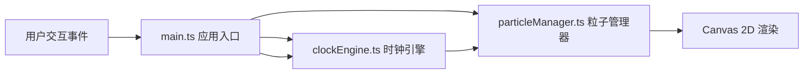

## 1. 架构设计



## 2. 技术选型说明

- **前端**：TypeScript + Vite + Canvas 2D API
- **构建工具**：Vite（轻量级快速开发服务器）
- **类型系统**：TypeScript 严格模式
- **渲染方案**：纯 Canvas 2D，避免频繁 DOM 操作，保证 60FPS

## 3. 文件结构

```
.
├── package.json          # 项目依赖和脚本
├── vite.config.js        # Vite 构建配置
├── tsconfig.json         # TypeScript 配置（严格模式）
├── index.html            # 入口页面，全屏深色渐变背景
└── src/
    ├── main.ts           # 应用入口：Canvas初始化、事件绑定、动画循环
    ├── particleManager.ts # 粒子管理：创建、更新、渲染粒子
    └── clockEngine.ts    # 时钟引擎：时间计算、模式切换、颜色方案
```

## 4. 模块职责

### 4.1 clockEngine.ts

| 函数/类 | 职责 |
|---------|------|
| `getTimeDigits()` | 获取当前时间的时分秒数字数组 |
| `getColorScheme()` | 根据当前时段返回渐变色方案 |
| `switchMode()` | 切换显示模式（standard/minimal/breathing） |
| `getDayProgress()` | 计算当前为一天中的进度百分比 |
| `getParticleSpeedMultiplier()` | 根据模式返回粒子速度倍率 |

### 4.2 particleManager.ts

| 函数/类 | 职责 |
|---------|------|
| `Particle` 接口 | 定义粒子属性（位置、速度、颜色、亮度等） |
| `createDigitParticles()` | 为指定数字生成目标粒子位置数组 |
| `updateParticles()` | 逐帧更新粒子位置、颜色、流动动画 |
| `renderParticles()` | 渲染所有粒子（含光晕效果） |
| `applyHoverEffect()` | 对悬停位置应用加速增亮效果 |
| `renderSeparator()` | 渲染时分分隔符（垂直发光短线+浮动动画） |
| `renderProgressRing()` | 渲染底部环形进度条+流动光点 |
| `renderStars()` | 渲染背景闪烁星点 |

### 4.3 main.ts

| 函数/职责 | 说明 |
|-----------|------|
| 初始化 | 创建 Canvas、设置 DPR、初始化管理器实例 |
| 事件绑定 | resize、click（模式切换）、mousemove（悬停反馈） |
| 动画循环 | requestAnimationFrame 驱动的主循环，协调引擎和渲染 |
| 渲染协调 | 按顺序绘制：背景 → 星点 → 进度条 → 分隔符 → 粒子数字 |

## 5. 性能约束

- 总粒子数 ≤ 1200（6位数字 × 200 = 1200）
- 目标帧率：60FPS
- 使用 TypedArray 或紧凑对象存储粒子数据以减少 GC
- 避免在动画循环中创建新对象（对象池/复用模式）
- Canvas 尺寸按 DPR（Device Pixel Ratio）缩放，保证高清显示
