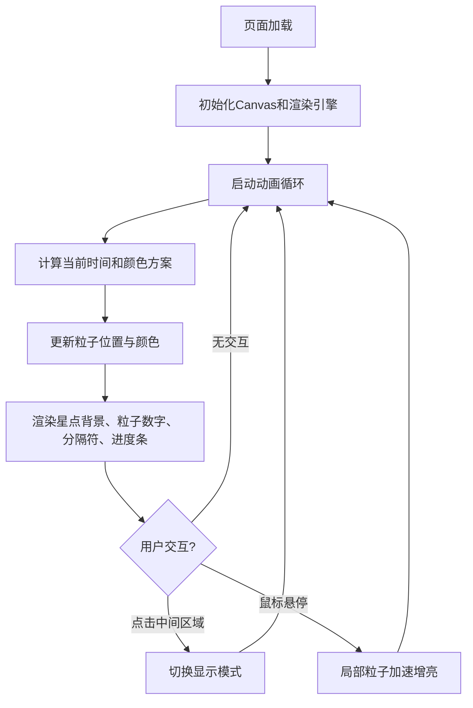

## 1. 产品概述

「光脉·影迹时钟」是一款基于 Canvas 2D 渲染的动态光影时钟应用，将时间的流逝以流动的发光粒子轨迹呈现，打破传统数字时钟的静态单调感。

- 核心价值：将时间可视化，通过粒子流光效果赋予时钟独特的视觉趣味和交互体验
- 目标用户：追求视觉美感、喜欢动态桌面/网页装饰的用户

## 2. 核心功能

### 2.1 功能模块

1. **数字粒子时钟**：时、分、秒由动态发光粒子流构成，粒子持续流动形成连续流光轨迹
2. **三色渐变系统**：根据时段自动切换颜色方案（清晨暖橙→午后蓝紫→夜晚深白银白）
3. **三种显示模式**：标准模式（时分秒）、简约模式（时分+慢速粒子）、呼吸模式（缩放+心跳闪烁）
4. **环形进度条**：底部环绕式进度条表示一天的时间进度，同步渐变配色并带流动光点
5. **悬停交互**：鼠标悬停位置的粒子加速增亮，形成触摸反馈效果

### 2.2 页面详情

| 页面名称 | 模块名称 | 功能描述 |
|---------|---------|---------|
| 时钟主页 | 粒子数字显示 | 时/分/秒数字由150-200个粒子构成，持续流动形成流光轨迹 |
| 时钟主页 | 模式切换 | 点击时钟中间区域在三种模式间循环切换 |
| 时钟主页 | 环形进度条 | 底部半圆环显示一天进度，粒子光点沿环流动 |
| 时钟主页 | 悬停反馈 | 鼠标悬停处粒子加速30%、增亮30%，持续0.5秒 |
| 时钟主页 | 星点背景 | 80个微弱闪烁星点，随机大小、透明度、闪烁周期 |

## 3. 核心流程

## 4. 用户界面设计

### 4.1 设计风格

- **主色调**：墨黑 #0a0a0a → 深紫 #1a0f2e 径向渐变背景
- **配色方案**：
  - 清晨(6:00-12:00)：暖橙 → 淡黄渐变
  - 午后(12:00-18:00)：天蓝 → 淡紫渐变
  - 夜晚(18:00-6:00)：深蓝 → 银白渐变
- **字体/数字**：粒子模拟数字形状，无实际字体
- **布局风格**：居中对称，时钟直径为页面最短边60%
- **视觉效果**：所有元素发光柔和（shadowBlur=6），粒子带光晕

### 4.2 页面设计概览

| 页面名称 | 模块名称 | UI元素 |
|---------|---------|--------|
| 时钟主页 | 星点背景 | 80个1-2px星点，透明度0.2-0.5，闪烁周期3-7秒随机 |
| 时钟主页 | 粒子数字 | 2-4px粒子，带shadowBlur=6光晕，持续流动 |
| 时钟主页 | 时分分隔符 | 两根垂直发光短线，浮动幅度2px、周期1秒 |
| 时钟主页 | 环形进度条 | 底部半圆环，同步渐变配色，旋转粒子光点流动 |
| 时钟主页 | 整体 | 极简深色主题，发光柔和，视觉层次分明 |

### 4.3 响应式设计

- 以页面最短边为基准计算时钟尺寸（60%）
- Canvas 自动适配窗口大小变化
- 粒子数量和位置按比例缩放
