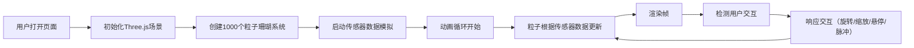
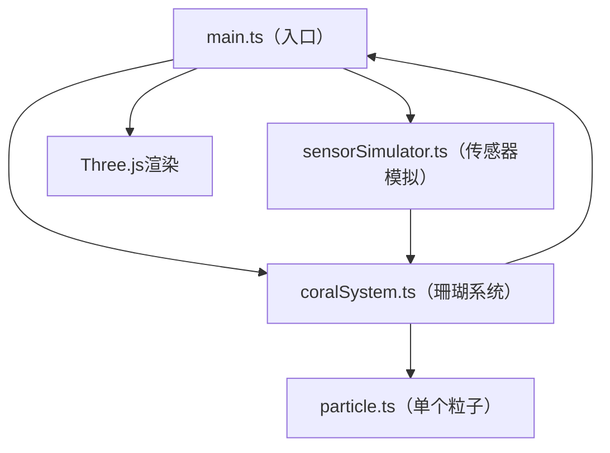

## 1. 产品概述

「光脉·数据珊瑚」是一件基于浏览器的3D交互数据可视化艺术作品，通过模拟上千个发光粒子构成的动态珊瑚礁，将虚拟的海洋环境传感器数据转化为可感知的视觉体验。

- 核心价值：为数字艺术家提供一个实时数据驱动的动态光雕创作工具，探索数据与自然形态的美学融合
- 目标用户：数字艺术家、数据可视化爱好者、新媒体艺术创作者

## 2. 核心功能

### 2.1 用户角色

| 角色 | 注册方式 | 核心权限 |
|------|----------|----------|
| 浏览者 | 无需注册 | 观赏作品、通过鼠标/键盘与粒子系统交互 |

### 2.2 功能模块

1. **3D粒子系统**：1000个发光粒子构成的珊瑚簇形态，支持脉动动画、颜色渐变
2. **数据模拟模块**：实时生成温度、光照、流速三种传感器数据，驱动粒子行为变化
3. **交互系统**：鼠标拖拽旋转、滚轮缩放、悬停高亮、空格脉冲
4. **信息展示**：实时显示传感器数据和粒子总数的半透明面板

### 2.3 页面详情

| 页面名称 | 模块名称 | 功能描述 |
|----------|----------|----------|
| 主页面 | 3D场景渲染 | 全屏渲染粒子珊瑚礁，深蓝渐变背景，支持鼠标交互 |
| 主页面 | 数据面板 | 左上角毛玻璃效果面板，显示温度、光照、流速、粒子总数 |
| 主页面 | 操作提示 | 右下角半透明文字提示操作方式 |
| 主页面 | 传感器模拟器 | 每帧生成随机传感器数据，驱动粒子视觉变化 |

## 3. 核心流程

用户打开页面 → 初始化Three.js场景和1000个粒子系统 → 启动传感器数据模拟 → 进入动画循环 → 粒子根据传感器数据实时更新颜色、脉动和运动 → 用户通过鼠标/键盘交互 → 系统响应交互并更新粒子状态

## 4. 用户界面设计

### 4.1 设计风格

- **主色调**：深海渐变（顶部#0a0a2e，底部#0d3b66），粒子使用暖珊瑚粉#ff6b6b到深紫#a29bfe渐变
- **交互色**：悬停高亮#feca57（金黄色），脉冲效果#48dbfb（亮青色），数据温度色（低温#a8e6cf，高温#ff6b6b）
- **视觉效果**：粒子使用AdditiveBlending产生光晕，圆形软边纹理形成柔和光点
- **面板风格**：毛玻璃效果（backdrop-filter: blur(8px)），半透明白色背景rgba(255,255,255,0.08)，1px边框rgba(255,255,255,0.15)，12px圆角
- **字体**：使用现代无衬线字体，数值颜色随温度动态变化

### 4.2 页面设计概述

| 页面名称 | 模块名称 | UI元素 |
|----------|----------|--------|
| 主页面 | 3D场景 | 全屏深海渐变背景，1000个发光粒子球状分布，支持旋转缩放 |
| 主页面 | 数据面板 | 左上角固定位置，毛玻璃效果，实时数据展示 |
| 主页面 | 操作提示 | 右下角固定位置，半透明文字，14px字体 |
| 主页面 | 粒子系统 | 粒子大小2-8px随机，脉动周期3-6秒，脉动幅度0.8-1.2 |

### 4.3 响应式设计

- 桌面端优先设计，在宽度小于768px时，面板和提示字体缩小20%
- 触摸设备支持手势旋转和缩放

### 4.4 3D场景设计指导

- **环境与氛围**：深邃的深海氛围，使用深蓝渐变背景，无外部光源，粒子自发光产生光晕效果
- **光照设置**：场景不添加外部光源，粒子通过PointsMaterial的颜色和AdditiveBlending产生自发光效果
- **相机设置**：PerspectiveCamera，初始距离可完整观察整个珊瑚球，fov约75度
- **相机运动**：鼠标拖拽旋转视角（阻尼系数0.95），滚轮缩放（0.5倍至3倍范围）
- **构图与焦点**：粒子珊瑚球位于画面中心，作为唯一视觉焦点
- **交互与动画**：
  - 粒子持续脉动动画（3-6秒周期）
  - 温度影响色相偏移（低温偏蓝，高温偏红）
  - 光照影响整体亮度
  - 流速影响粒子颤动幅度
  - 鼠标悬停80px范围内粒子变金黄色并向鼠标偏移
  - 空格键触发潮汐脉冲（扩散-收回动画，颜色变为亮青色）
- **后期处理**：使用AdditiveBlending实现粒子光晕叠加效果
- **性能预算**：1000个粒子，每帧更新和渲染开销控制在8ms以内，帧率保持30FPS以上

## 5. 数据流向说明

### 5.1 模块调用关系

### 5.2 数据流向

1. **初始化流**：main.ts → 创建CoralSystem实例 → CoralSystem批量创建1000个Particle实例
2. **数据流**：sensorSimulator.ts每帧生成数据 → 传递给CoralSystem.update() → 更新每个Particle的属性
3. **交互流**：main.ts监听鼠标/键盘事件 → 传递给CoralSystem → 更新粒子状态
4. **渲染流**：CoralSystem返回粒子位置/颜色数据 → main.ts更新Three.js Points对象 → 渲染到屏幕
