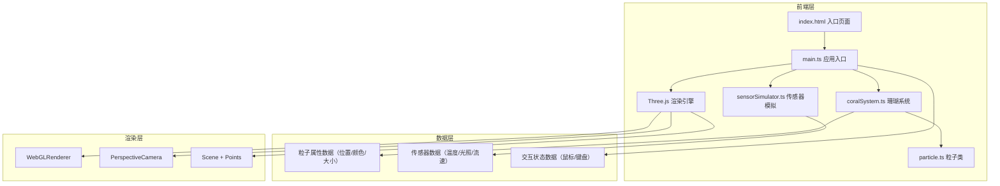

## 1. 架构设计



## 2. 技术栈说明

- **前端框架**：TypeScript 5.x + Three.js 0.160
- **构建工具**：Vite 5.x
- **动画库**：GSAP 3.x
- **类型支持**：@types/three 0.160

### 技术选型理由：
- **Three.js**：成熟的WebGL 3D库，提供高性能的粒子系统渲染能力
- **TypeScript**：提供严格的类型检查，确保复杂系统的代码质量
- **Vite**：快速的开发服务器和构建工具，支持ES模块
- **GSAP**：高性能动画库，用于实现平滑的粒子过渡动画

## 3. 文件结构与职责

```
项目根目录/
├── package.json              # 项目依赖和脚本配置
├── vite.config.js            # Vite构建配置
├── tsconfig.json             # TypeScript配置（严格模式）
├── index.html                # 入口HTML页面
└── src/
    ├── main.ts               # 应用入口（初始化、事件监听、动画循环）
    ├── coralSystem.ts        # 珊瑚系统类（粒子管理、交互响应）
    ├── particle.ts           # 单个粒子类（属性定义、更新逻辑）
    └── sensorSimulator.ts    # 传感器数据模拟器
```

### 文件调用关系：
1. **main.ts** 依赖 **coralSystem.ts**、**sensorSimulator.ts**
2. **coralSystem.ts** 依赖 **particle.ts**
3. **sensorSimulator.ts** 独立模块，输出数据给 **coralSystem.ts**

### 数据流向：
```
sensorSimulator.ts → 生成{temperature, light, flow}数据
    ↓
main.ts → 调用coralSystem.update(data, mouseState)
    ↓
coralSystem.ts → 遍历所有particle，调用particle.update()
    ↓
particle.ts → 更新位置、颜色、大小等属性
    ↓
coralSystem.ts → 收集渲染数据（positions, colors数组）
    ↓
main.ts → 更新Three.js Points的geometry属性
    ↓
Three.js → 渲染到canvas
```

## 4. 核心类型定义

```typescript
// 传感器数据类型
interface SensorData {
  temperature: number;  // 0-40°C
  light: number;        // 0-100 lux
  flow: number;         // 0-5 m/s
}

// 鼠标状态类型
interface MouseState {
  x: number;            // 归一化X坐标 (-1 ~ 1)
  y: number;            // 归一化Y坐标 (-1 ~ 1)
  worldX: number;       // 3D空间X坐标
  worldY: number;       // 3D空间Y坐标
  worldZ: number;       // 3D空间Z坐标
  isHovering: boolean;  // 是否悬停在场景上
  isDragging: boolean;  // 是否正在拖拽
}

// 粒子属性类型
interface ParticleProperties {
  basePosition: THREE.Vector3;  // 原始位置
  currentPosition: THREE.Vector3;  // 当前位置
  baseColor: THREE.Color;       // 原始颜色
  currentColor: THREE.Color;    // 当前颜色
  baseSize: number;             // 原始大小 (2-8px)
  pulsePhase: number;           // 脉动相位 (0-2π)
  pulsePeriod: number;          // 脉动周期 (3-6秒)
  pulseAmplitude: number;       // 脉动幅度 (0.8-1.2)
  targetOffset: THREE.Vector3;  // 目标偏移（用于鼠标交互）
  isPulsing: boolean;           // 是否在脉冲中
}
```

## 5. 核心类设计

### 5.1 Particle 类

```typescript
class Particle {
  constructor(basePosition: Vector3, baseColor: Color, baseSize: number);
  
  // 更新粒子状态
  update(deltaTime: number, sensorData: SensorData, mouseState: MouseState, pulsePhase: number): void;
  
  // 获取渲染数据
  getPosition(): Float32Array;
  getColor(): Float32Array;
  getSize(): number;
  
  // 触发潮汐脉冲
  triggerPulse(): void;
  
  // 鼠标悬停效果
  applyHoverEffect(hoverStrength: number, mouseDirection: Vector3): void;
  
  // 恢复原始状态（使用GSAP动画）
  restoreOriginalState(duration: number): void;
}
```

### 5.2 CoralSystem 类

```typescript
class CoralSystem {
  particleCount: number = 1000;
  particles: Particle[] = [];
  
  constructor(scene: Scene);
  
  // 初始化粒子系统（生成球状分布的1000个粒子）
  initialize(): void;
  
  // 更新所有粒子
  update(deltaTime: number, sensorData: SensorData, mouseState: MouseState): void;
  
  // 触发全局潮汐脉冲
  triggerTidalPulse(): void;
  
  // 获取渲染数据缓冲区
  getPositionsBuffer(): Float32Array;
  getColorsBuffer(): Float32Array;
  getSizesBuffer(): Float32Array;
  
  // 创建粒子纹理（圆形软边）
  private createParticleTexture(): Texture;
  
  // 生成不规则球状分布的位置
  private generateSpherePosition(radius: number): Vector3;
}
```

### 5.3 SensorSimulator 类

```typescript
class SensorSimulator {
  // 获取当前帧的传感器数据
  getCurrentData(): SensorData;
  
  // 更新模拟数据（每帧调用）
  update(deltaTime: number): void;
  
  // 使用平滑噪声生成自然变化的数据
  private generateSmoothNoise(time: number, scale: number, min: number, max: number): number;
}
```

## 6. 性能优化策略

### 6.1 渲染优化
- 使用 **BufferGeometry** 而非 Geometry，批量更新顶点数据
- 粒子使用 **Points** 而非多个 Mesh，减少Draw Call
- 所有粒子共享同一个 **Material** 和 **Texture**
- 使用 **AdditiveBlending** 减少深度写入开销

### 6.2 计算优化
- 粒子位置和颜色数据使用 **TypedArray**（Float32Array）存储
- 避免在 update 循环中创建新对象，复用已有 Vector3/Color 实例
- 鼠标悬停检测使用 **空间分区** 或 **距离平方比较**（避免开方）
- 限制每帧更新的粒子动画数量（GSAP tween 池复用）

### 6.3 内存优化
- 粒子纹理复用，不重复创建
- 事件监听器在组件销毁时正确移除
- 动画 tween 完成后及时清理

## 7. 交互实现方案

### 7.1 鼠标拖拽旋转
- 监听 mousedown/mousemove/mouseup 事件
- 使用 **球坐标转换** 将2D鼠标位移转换为3D旋转角度
- 应用 **阻尼系数 0.95** 实现平滑惯性效果

### 7.2 滚轮缩放
- 监听 wheel 事件，阻止默认行为
- 缩放范围限制在 **0.5x ~ 3x**
- 使用 **指数插值** 实现平滑缩放过渡

### 7.3 鼠标悬停效果
- 使用 **Raycaster** 将鼠标2D坐标投射到3D空间
- 遍历粒子，计算与鼠标的 **距离平方**
- 距离 < 80px 的粒子应用悬停效果
- 鼠标移开后使用 GSAP 在 **1.5秒** 内恢复

### 7.4 空格潮汐脉冲
- 监听 keydown 事件，检测空格键
- 使用 GSAP 时间线（Timeline）实现 **0.8秒扩散 + 2秒收回** 的动画
- 扩散时粒子移动到原始位置的 **1.3倍** 半径处
- 脉冲结束后重置所有粒子的 **脉动相位**

## 8. 着色器配置（可选优化）

为了进一步提升性能，可考虑使用自定义 ShaderMaterial：

```glsl
// 顶点着色器
attribute float size;
attribute float pulsePhase;
varying vec3 vColor;

void main() {
  vColor = color;
  vec4 mvPosition = modelViewMatrix * vec4(position, 1.0);
  float pulse = 0.8 + 0.4 * sin(pulsePhase);
  gl_PointSize = size * pulse * (300.0 / -mvPosition.z);
  gl_Position = projectionMatrix * mvPosition;
}

// 片元着色器
uniform sampler2D pointTexture;
varying vec3 vColor;

void main() {
  vec4 texColor = texture2D(pointTexture, gl_PointCoord);
  gl_FragColor = vec4(vColor, 1.0) * texColor;
}
```

## 9. 构建与部署

### 构建命令
```bash
npm install    # 安装依赖
npm run dev    # 启动开发服务器
npm run build  # 生产构建
```

### 构建输出
- 输出目录：`dist/`
- 包含：index.html、压缩后的 JS/CSS 文件、资源文件

### 浏览器兼容性
- Chrome 120+（推荐）
- Firefox 115+
- Safari 17+
- 需支持 WebGL 2.0
