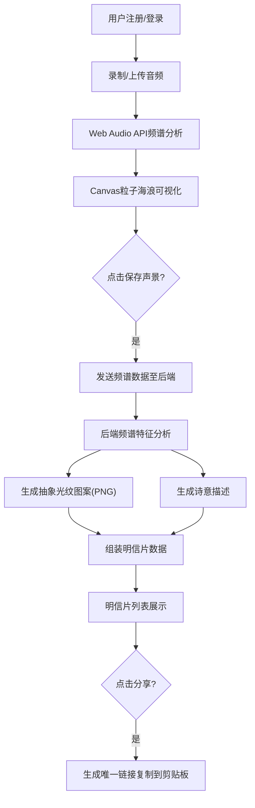

## 1. 产品概述

「光语·潮汐声景」是一款将环境音频转化为视觉艺术的全栈Web应用。用户通过录制或上传环境音频（海浪、风声等），应用实时将音频频谱可视化为动态彩色光晕粒子海浪，并生成可分享的「声音风景明信片」——包含声景名称、录制时间、频谱抽象光纹图案和诗意描述。
- 目标用户：声音艺术爱好者、冥想练习者、自然声景记录者
- 核心价值：将无形的声音转化为可触摸、可分享的视觉记忆

## 2. 核心功能

### 2.1 用户角色
| 角色 | 注册方式 | 核心权限 |
|------|----------|----------|
| 普通用户 | 邮箱注册 | 录制/上传音频、生成明信片、浏览和分享 |

### 2.2 功能模块
1. **登录/注册页**：邮箱密码注册登录，表单验证，JWT鉴权
2. **主界面**：毛玻璃导航栏、音频录制/上传区、频谱可视化区、明信片列表
3. **明信片详情**：查看、编辑声景名称、分享链接

### 2.3 页面详情
| 页面名称 | 模块名称 | 功能描述 |
|----------|----------|----------|
| 登录/注册页 | 注册表单 | 邮箱格式验证、密码强度检查、注册请求 |
| 登录/注册页 | 登录表单 | 邮箱密码登录、JWT Token获取存储 |
| 主界面 | 毛玻璃导航栏 | 应用名称、用户头像、退出按钮 |
| 主界面 | 音频录制区 | 圆形录制按钮（最长30秒）、实时音量指示条 |
| 主界面 | 音频上传区 | 文件上传（wav/mp3，≤10MB）、进度条 |
| 主界面 | 频谱可视化 | 全屏Canvas粒子海浪动画、500-800粒子 |
| 主界面 | 保存声景按钮 | 提交频谱数据、触发明信片生成 |
| 主界面 | 明信片列表 | 三列网格、搜索排序、分页加载 |
| 明信片卡片 | 卡片展示 | 圆形光纹图、名称（可编辑）、时间、诗意描述、分享按钮 |

## 3. 核心流程

用户注册登录 → 录制/上传音频 → 实时频谱可视化 → 点击保存声景 → 后端分析频谱生成明信片（光纹图案+诗意描述）→ 明信片展示在列表 → 点击分享生成链接

## 4. 用户界面设计

### 4.1 设计风格
- 主色调：深空渐变 #0b0e27 → #1f1042
- 强调色：#48dbfb（青蓝）、#a29bfe（淡紫）、#ff6b6b（珊瑚红）
- 按钮风格：圆角12-16px，毛玻璃效果，渐变背景
- 字体：应用名称使用发光效果（#48dbfb glow），正文使用清晰无衬线体
- 布局：卡片式、圆角、毛玻璃、深空氛围

### 4.2 页面设计概览
| 页面名称 | 模块名称 | UI元素 |
|----------|----------|--------|
| 登录/注册页 | 表单区 | 居中卡片，深色半透明背景，毛玻璃效果，输入框带发光边框 |
| 主界面 | 导航栏 | 60px高，rgba(255,255,255,0.05)背景，backdrop-filter:blur(12px)，左侧发光标题，右侧头像+退出 |
| 主界面 | 录制按钮 | 圆形，渐变#ff6b6b→#feca57，按下缩放0.95 |
| 主界面 | 音量指示条 | 底部向上发光条，#48dbfb→#ff6b6b渐变 |
| 主界面 | Canvas可视化 | 全屏深空背景，彩色粒子海浪+连线+呼吸脉动 |
| 主界面 | 保存按钮 | 圆角矩形，渐变#48dbfb→#a29bfe，悬停亮度+10% |
| 主界面 | 明信片列表 | 三列网格，300x400px卡片，圆角16px，发光边框 |
| 明信片卡片 | 卡片内容 | 圆形光纹图(140px)、可编辑名称、时间、诗意描述、分享按钮 |

### 4.3 响应式设计
- 桌面优先设计
- ≥1200px：三列网格
- ≥768px：两列网格
- <768px：单列
- 卡片间距24px
- 所有交互0.2-0.3秒CSS过渡

## 5. 性能要求
- 频谱可视化：60FPS，Canvas渲染延迟≤16ms
- 明信片生成API：≤2秒（10MB音频）
- 首屏列表加载：≤1秒（分页20条/次）
