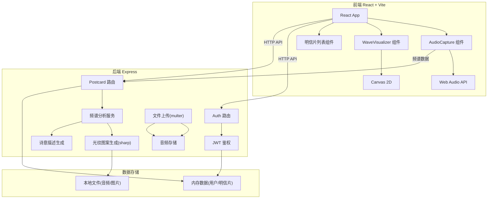
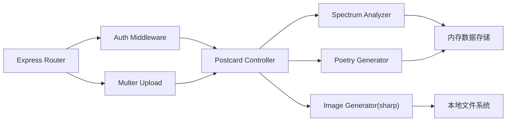
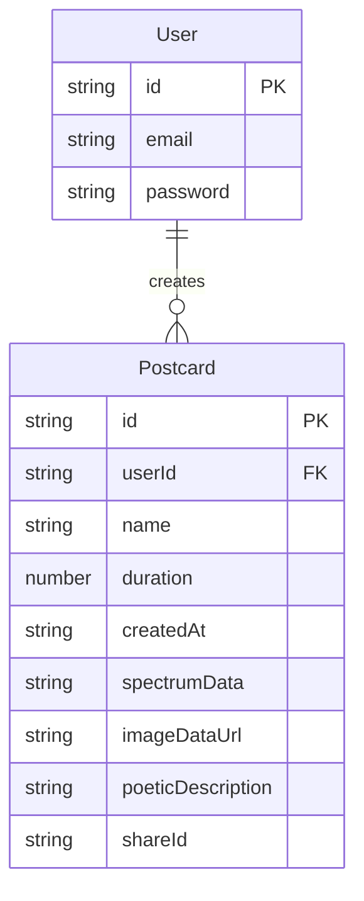

## 1. 架构设计



## 2. 技术说明
- 前端：React 18 + TypeScript + Vite
- 后端：Express 4 + TypeScript (ESM)
- 状态管理：React useState/useContext
- 数据存储：内存Map（用户信息、明信片数据）+ 本地文件系统（音频、图片）
- 认证：JWT（jsonwebtoken），24小时有效期
- 文件处理：multer（音频上传）、sharp（图片生成）
- 音频处理：Web Audio API（前端频谱分析）

## 3. 路由定义
| 路由 | 用途 |
|------|------|
| / | 主界面（登录后） |
| /login | 登录页面 |
| /register | 注册页面 |
| /share/:id | 分享的明信片页面 |

## 4. API 定义

### 4.1 认证相关
```
POST /api/auth/register
  Request: { email: string, password: string }
  Response: { token: string, user: { id: string, email: string } }

POST /api/auth/login
  Request: { email: string, password: string }
  Response: { token: string, user: { id: string, email: string } }
```

### 4.2 音频与明信片
```
POST /api/postcards
  Headers: Authorization: Bearer <token>
  Request: FormData { audio: File, spectrumData: string(JSON), duration: number }
  Response: { postcard: Postcard }

GET /api/postcards?page=1&limit=20&sort=time|name&search=keyword
  Headers: Authorization: Bearer <token>
  Response: { postcards: Postcard[], total: number, page: number }

GET /api/postcards/:id
  Response: { postcard: Postcard }

PATCH /api/postcards/:id
  Headers: Authorization: Bearer <token>
  Request: { name: string }
  Response: { postcard: Postcard }

GET /api/share/:id
  Response: { postcard: Postcard }
```

### 4.3 类型定义
```typescript
interface Postcard {
  id: string;
  userId: string;
  name: string;
  duration: number;
  createdAt: string;
  spectrumData: number[];
  imageDataUrl: string;
  poeticDescription: string;
  shareId: string;
}

interface User {
  id: string;
  email: string;
  password: string;
}

interface SpectrumFeatures {
  lowRatio: number;
  midHighRatio: number;
  peakChangeRate: number;
}
```

## 5. 服务端架构图



## 6. 数据模型

### 6.1 数据模型定义


### 6.2 存储方案
- 用户数据：内存 Map<string, User>
- 明信片数据：内存 Map<string, Postcard>
- 音频文件：本地 uploads/ 目录
- 光纹图片：Base64 DataURL 存储于明信片数据中
