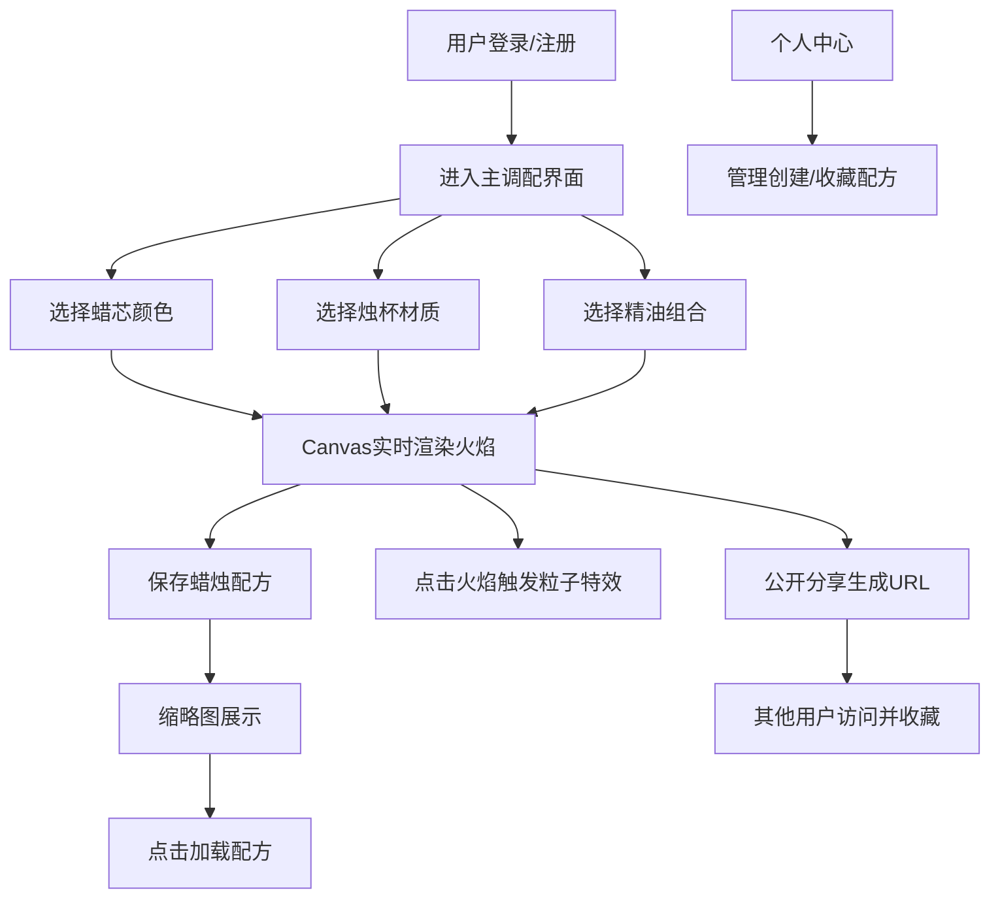

## 1. 产品概述

光织·暖香工坊是一款沉浸式数字香薰蜡烛调配应用，用户可在浏览器中自定义调配专属数字蜡烛，通过视觉动画获得疗愈放松体验。

- 核心价值：通过精美的火焰动画和交互体验，为用户提供数字世界的疗愈空间
- 目标用户：追求生活仪式感、喜欢数字艺术和疗愈体验的互联网用户

## 2. 核心功能

### 2.1 用户角色

| 角色 | 注册方式 | 核心权限 |
|------|----------|----------|
| 普通用户 | 邮箱/用户名注册登录 | 调配蜡烛、保存配方、公开分享、收藏他人配方 |

### 2.2 功能模块

1. **登录注册页**：用户身份认证入口
2. **主调配界面**：蜡烛自定义调配、实时动画预览、配方保存
3. **个人中心页**：管理个人创建和收藏的蜡烛配方
4. **公开分享页**：通过固定URL访问他人公开的蜡烛配方

### 2.3 页面详情

| 页面名称 | 模块名称 | 功能描述 |
|----------|----------|----------|
| 登录注册页 | 表单模块 | 用户名/邮箱注册、登录、JWT鉴权 |
| 主调配界面 | 控制面板 | 蜡芯颜色选择、烛杯材质选择、三种精油基底选择 |
| 主调配界面 | 蜡烛展示区 | Canvas实时绘制火焰动画、燃烧倒计时、发光圆环进度条 |
| 主调配界面 | 配方管理 | 保存配方（最多20个）、缩略图3D排列展示、悬停放大动画 |
| 主调配界面 | 交互特效 | 点击火焰触发粒子爆裂回聚动画、渐隐文字祝福语 |
| 主调配界面 | 分享功能 | 生成公开分享URL、收藏配方、收藏数展示 |
| 个人中心页 | 配方网格 | 4列网格展示创建和收藏的配方、卡片点击加载蜡烛 |
| 公开分享页 | 蜡烛展示 | 统一配色主题、平滑淡入动画、蜡烛完整展示 |

## 3. 核心流程

用户注册登录后进入主界面，在左侧控制面板选择蜡芯颜色、烛杯材质和精油组合，右侧Canvas实时渲染对应火焰动画。用户可保存配方，点击已保存配方的缩略图快速加载。点击主区火焰触发粒子特效。用户可公开分享配方生成固定URL，也可收藏他人配方。个人中心管理所有配方。

## 4. 用户界面设计

### 4.1 设计风格

- **主色调**：深紫色渐变背景（#1a0a2e → #2d0d4a），分享页背景（#2d0d4a → #4a1942）
- **按钮风格**：渐变背景（#6c3a8c → #4a1942），圆角10px，悬停亮度+20%，过渡0.3秒
- **字体**：标题使用Georgia衬线字体，正文使用Inter无衬线字体
- **布局风格**：左侧固定毛玻璃控制面板（backdrop-filter: blur(12px)，背景rgba(255,255,255,0.08)，边框1px rgba(255,255,255,0.2)），右侧蜡烛展示区
- **动效风格**：流畅平滑的过渡动画，火焰脉动1.5-3秒随机，页面淡入0.5秒

### 4.2 页面设计概述

| 页面名称 | 模块名称 | UI元素 |
|----------|----------|--------|
| 登录注册页 | 表单区 | 深色渐变背景、居中表单卡片、渐变按钮、平滑过渡 |
| 主调配界面 | 控制面板 | 毛玻璃效果、颜色选择器、材质单选、精油多选、保存按钮、配方缩略图3D排列 |
| 主调配界面 | 蜡烛展示区 | Canvas火焰动画、烛杯、发光圆环进度条、燃烧倒计时数字 |
| 主调配界面 | 粒子特效 | 30个彩色粒子（3-6px）、飞散半径150px、2秒回聚、渐隐祝福语 |
| 个人中心页 | 配方网格 | 4列网格、卡片圆角12px、阴影box-shadow: 0 4px 15px rgba(0,0,0,0.3) |
| 公开分享页 | 展示区 | 统一配色主题、0.5秒淡入动画、完整蜡烛展示 |

### 4.3 响应式设计

- Desktop-first设计
- 小于768px宽度时：控制面板折叠为顶部工具栏，蜡烛展示区占满全屏，卡片网格变为2列
- 触摸交互优化：增大点击区域，优化触摸反馈

### 4.4 动画与性能

- 火焰颜色规则：薰衣草+柑橘→紫橙色，柑橘+檀木→金琥珀色，薰衣草+檀木→粉紫色
- 火焰脉动周期：1.5-3秒随机
- 燃烧倒计时：10分钟，发光圆环进度条在烛杯底部
- 性能要求：Canvas动画稳定30FPS以上，粒子动画流畅无卡顿
