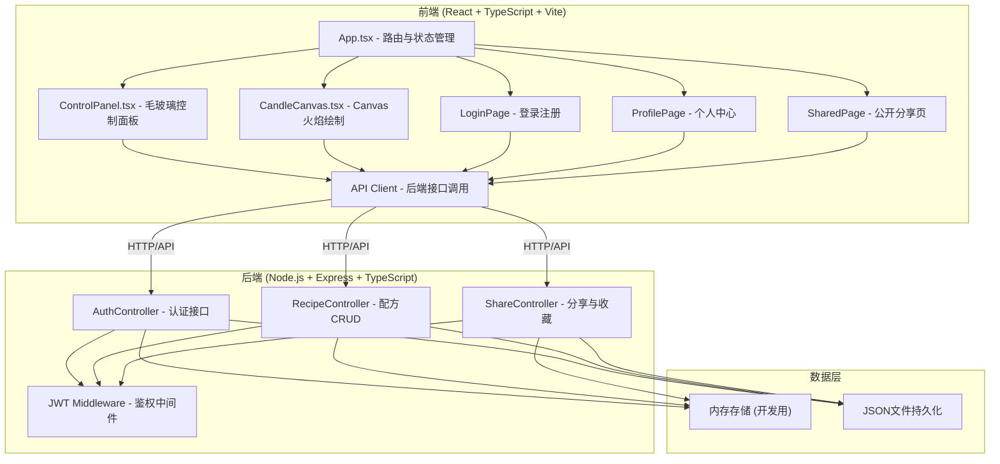
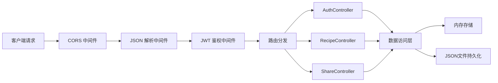
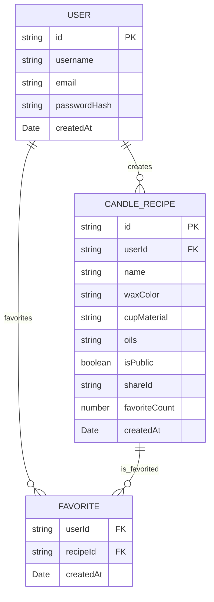

## 1. 架构设计



## 2. 技术描述

- **前端框架**：React@18 + TypeScript + Vite@5
- **前端路由**：React Router DOM@6
- **后端框架**：Express@4 + TypeScript
- **认证方式**：JWT (jsonwebtoken)
- **开发工具**：concurrently（前后端并行启动）
- **数据存储**：内存存储 + JSON文件持久化（开发阶段）
- **代理配置**：Vite代理到后端3001端口

## 3. 路由定义

| 路由 | 页面/接口 | 说明 |
|------|----------|------|
| /login | 登录注册页 | 用户认证入口 |
| / | 主调配界面 | 蜡烛调配主页面（需登录） |
| /profile | 个人中心 | 管理创建和收藏的配方（需登录） |
| /shared/:id | 公开分享页 | 通过URL访问公开配方 |
| /api/auth/register | POST | 用户注册 |
| /api/auth/login | POST | 用户登录 |
| /api/recipes | GET/POST | 获取/保存配方列表 |
| /api/recipes/:id | PUT/DELETE | 更新/删除配方 |
| /api/recipes/:id/share | POST | 公开分享配方 |
| /api/recipes/:id/favorite | POST | 收藏/取消收藏配方 |
| /api/shared/:id | GET | 获取公开配方详情 |

## 4. API 定义

```typescript
// 类型定义
interface User {
  id: string;
  username: string;
  email: string;
  passwordHash: string;
  createdAt: Date;
}

interface CandleRecipe {
  id: string;
  userId: string;
  name: string;
  waxColor: string;
  cupMaterial: 'glass' | 'ceramic' | 'metal';
  oils: ('lavender' | 'citrus' | 'sandalwood')[];
  isPublic: boolean;
  shareId?: string;
  favoriteCount: number;
  createdAt: Date;
}

interface Favorite {
  userId: string;
  recipeId: string;
  createdAt: Date;
}

// 请求响应
interface LoginRequest {
  username: string;
  password: string;
}

interface RegisterRequest {
  username: string;
  email: string;
  password: string;
}

interface AuthResponse {
  token: string;
  user: Omit<User, 'passwordHash'>;
}

interface CreateRecipeRequest {
  name: string;
  waxColor: string;
  cupMaterial: 'glass' | 'ceramic' | 'metal';
  oils: ('lavender' | 'citrus' | 'sandalwood')[];
}
```

## 5. 服务器架构图



## 6. 数据模型

### 6.1 数据模型定义



### 6.2 项目文件结构

```
auto318/
├── package.json
├── vite.config.js
├── tsconfig.json
├── index.html
└── src/
    ├── client/
    │   ├── App.tsx
    │   ├── main.tsx
    │   ├── components/
    │   │   ├── CandleCanvas.tsx
    │   │   ├── ControlPanel.tsx
    │   │   ├── LoginPage.tsx
    │   │   ├── ProfilePage.tsx
    │   │   └── SharedPage.tsx
    │   ├── services/
    │   │   └── api.ts
    │   ├── types/
    │   │   └── index.ts
    │   └── index.css
    └── server/
        ├── index.ts
        ├── models.ts
        ├── store.ts
        └── middleware/
            └── auth.ts
```
