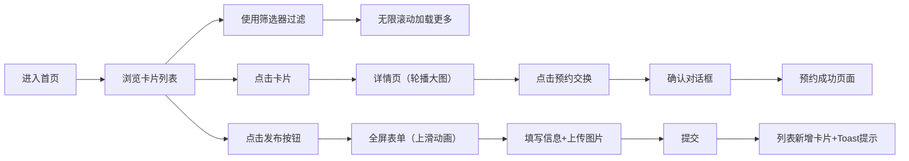

## 1. 产品概述

周末市集是一个面向社区的旧物置换平台，让同一小区或学校附近的邻居们能方便地发布闲置物品、互相查看和预约交换，旨在减少浪费、增进邻里关系。

- **核心目标**：为社区居民提供便捷的闲置物品发布与交换渠道
- **目标用户**：同一小区/学校区域内的居民、学生
- **产品价值**：环保（减少浪费）+ 社交（增进邻里）+ 实用（闲置变现/置换）

## 2. 核心功能

### 2.1 用户角色
| 角色 | 注册方式 | 核心权限 |
|------|----------|----------|
| 普通用户 | 无需注册（匿名发布） | 浏览物品、发布物品、预约交换 |

### 2.2 功能模块
1. **物品列表页**：卡片列表展示、筛选器（区域/类别）、无限滚动加载、发布入口
2. **物品详情页**：大图轮播、完整信息展示、预约交换按钮
3. **发布表单页**：全屏表单（平滑上滑）、图片拖拽上传、表单验证、提交反馈

### 2.3 页面详情
| 页面名称 | 模块名称 | 功能描述 |
|----------|----------|----------|
| 物品列表页 | 卡片列表 | 缩略图（40%宽度）、标题、描述（两行省略）、区域标签、预约按钮 |
| 物品列表页 | 筛选器 | 区域筛选、类别筛选（家具/书籍/电子产品等）、淡入淡出切换动画 |
| 物品列表页 | 无限滚动 | 每次加载12条、滚动到底部自动加载更多 |
| 物品详情页 | 大图轮播 | 左右滑动切换、圆点指示器、图片自适应 |
| 物品详情页 | 信息展示 | 完整描述、发布时间、联系人信息、预约按钮 |
| 物品详情页 | 预约交互 | 确认对话框、成功页面（动画+文字） |
| 发布表单页 | 表单填写 | 物品名称、描述、类别下拉、区域选择、联系方式 |
| 发布表单页 | 图片上传 | 最多5张、拖拽排序、缩略图预览、删除按钮 |
| 发布表单页 | 提交反馈 | 新卡片即时出现、绿色Toast提示"发布成功！"、几秒后消失 |

## 3. 核心流程

主要用户流程：
1. 用户进入首页浏览物品卡片列表
2. 通过区域或类别筛选器过滤感兴趣的物品
3. 点击卡片进入详情页查看大图和完整信息
4. 点击"预约交换"按钮 → 确认 → 跳转成功页面
5. 用户点击发布按钮 → 弹出全屏表单 → 填写信息上传图片 → 提交 → 列表新增卡片 + Toast提示

## 4. 用户界面设计

### 4.1 设计风格
- **主色**：抹茶绿 #7fbf7f（按钮、重要交互元素）
- **背景色**：米白色 #faf3e0（页面背景）
- **卡片色**：白色 + 柔和阴影（悬停阴影加深 + 上浮3px）
- **按钮风格**：圆角、抹茶绿填充、悬停微变暗
- **字体**：优雅无衬线字体，标题加粗，正文常规
- **布局风格**：卡片式布局、桌面端多列、移动端单列
- **图标风格**：线性简约图标（lucide-react）

### 4.2 页面设计概述
| 页面名称 | 模块名称 | UI元素 |
|----------|----------|--------|
| 物品列表页 | 卡片列表 | staggered入场动画（依次上滑入）、悬停上浮3px+阴影加深 |
| 物品列表页 | 筛选面板 | 桌面端顶部栏、移动端底部弹出抽屉（半透明遮罩+上滑） |
| 物品详情页 | 整体布局 | 桌面端左图右信息两栏、移动端纵向堆叠 |
| 物品详情页 | 页面过渡 | 从左向右滑入效果 |
| 发布表单页 | 弹出动画 | 全屏平滑上滑动画 |
| 全局 | Toast | 底部绿色提示条、3秒自动淡出 |
| 全局 | 工具按钮 | 移动端固定在底部栏 |

### 4.3 响应式设计
- **桌面端**（≥768px）：卡片多列网格、左图右信息两栏布局、筛选器顶部固定
- **移动端**（<768px）：卡片单列全宽、纵向堆叠详情、筛选器底部抽屉、工具按钮底部固定栏

### 4.4 性能要求
- 列表滚动60fps流畅
- 图片懒加载
- 首屏加载时间 ≤ 2秒
