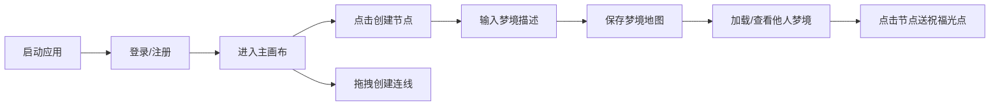

## 1. 产品概述

光语·梦境驿站是一个沉浸式的梦境记录与分享Web应用，用户可以在浏览器中通过绘制发光节点和连线来构建自己的梦境地图。每个节点代表一个梦境场景，连线代表梦境中的时空跃迁路径，整体呈现为一个缓慢旋转的动态星座式网络。

- 核心价值：将抽象的梦境体验可视化、可分享化，打造一个充满诗意与神秘感的创意空间
- 目标用户：喜欢记录梦境、追求创意表达的年轻用户群体

## 2. 核心功能

### 2.1 用户角色

| 角色 | 注册方式 | 核心权限 |
|------|---------|----------|
| 普通用户 | 用户名密码注册 | 创建/编辑/保存梦境地图、查看他人梦境、留下祝福光点 |

### 2.2 功能模块

1. **登录/注册页**：用户注册、登录表单
2. **主画布页**：梦境地图绘制、节点管理、连线管理、旋转动画、保存/加载

### 2.3 页面详情

| 页面名称 | 模块名称 | 功能描述 |
|---------|---------|---------|
| 登录/注册页 | 表单模块 | 用户名密码输入、注册/登录切换、渐变按钮、毛玻璃样式 |
| 主画布页 | 星空背景 | 深紫到墨蓝径向渐变 + 80颗闪烁星点 |
| 主画布页 | 毛玻璃控制面板 | 节点添加模式、连线模式、文字编辑模式、保存/加载按钮 |
| 主画布页 | 节点系统 | 点击生成发光节点、呼吸脉动、颜色渐变、访问计数驱动脉动频率 |
| 主画布页 | 连线系统 | 拖拽生成贝塞尔曲线箭头、流光粒子动画、悬停高亮 |
| 主画布页 | 旋转动画 | 星座网络整体缓慢旋转（45秒/圈）、方向可切换 |
| 主画布页 | 文字编辑 | 节点点击弹出文字输入框、节点中心显示标签 |
| 主画布页 | 状态栏 | 底部显示节点数、连线数、当前选中节点 |
| 主画布页 | 祝福光点 | 点击他人节点散落光点效果 |
| 主画布页 | 性能保护 | 节点>80限制拖拽、节点>100暂停旋转并提示 |

## 3. 核心流程

用户启动应用 → 进入登录/注册页面 → 注册或登录成功 → 进入主画布页 → 在画布上点击创建节点 → 拖拽节点间创建连线 → 点击节点输入梦境描述 → 保存梦境地图 → 可加载/查看他人梦境地图 → 点击他人节点留下祝福光点

## 4. 用户界面设计

### 4.1 设计风格

- **主色调**：深紫 `#0f0a2e` → 墨蓝 `#1a1a3e` 径向渐变背景
- **节点色板**：`#ff6b6b`（珊瑚红）、`#feca57`（金黄）、`#48dbfb`（冰蓝）、`#a29bfe`（薰衣草紫）
- **渐变趋势**：冷蓝 → 暖橙（根据访问次数）
- **按钮样式**：圆角渐变按钮（`#ff6b6b` → `#feca57`），hover时亮度提升
- **毛玻璃效果**：`backdrop-filter: blur(10px)`，背景 `rgba(255,255,255,0.06)`，边框 `rgba(255,255,255,0.1)`，圆角12px
- **字体**：深色主题下的浅色无衬线字体，状态栏 `#e0e0e0` 14px
- **布局风格**：全屏画布 + 左上角浮动控制面板 + 底部居中状态栏

### 4.2 页面设计概览

| 页面名称 | 模块名称 | UI元素 |
|---------|---------|--------|
| 登录/注册页 | 表单卡片 | 毛玻璃容器、半透明输入框、渐变按钮、柔和阴影 |
| 主画布页 | 星空背景 | 径向渐变、80颗随机闪烁星点（1-2px, 透明度0.1-0.4, 周期4-8秒） |
| 主画布页 | 控制面板 | 左上角毛玻璃面板、功能切换按钮组 |
| 主画布页 | 节点 | 圆形（12-20px）、发光光晕、呼吸脉动（0.95-1.05缩放）、中心文字标签 |
| 主画布页 | 连线 | 二次贝塞尔曲线、末端箭头、流光粒子（1.5秒/次）、颜色混合两端节点色 |
| 主画布页 | 文字输入框 | 半透明背景 + blur(8px)、圆角、弹出动画 |
| 主画布页 | 状态栏 | 底部居中、深色半透明、圆角8px、实时统计数据 |

### 4.3 响应式

- 桌面端优先设计，画布铺满视口
- 控制面板自适应位置，保持在左上角安全区域
- 移动端适配触摸交互（节点点击、连线拖拽）

### 4.4 动画与性能

- 帧率目标：50fps+
- 节点呼吸脉动：3-6秒随机周期，CSS transform缩放
- 网络旋转：45秒/圈，requestAnimationFrame驱动
- 连线流光：每1.5秒一次粒子流动
- 星点闪烁：4-8秒随机周期，opacity动画
- 性能保护：节点>80限制拖拽响应，节点>100暂停旋转并提示
