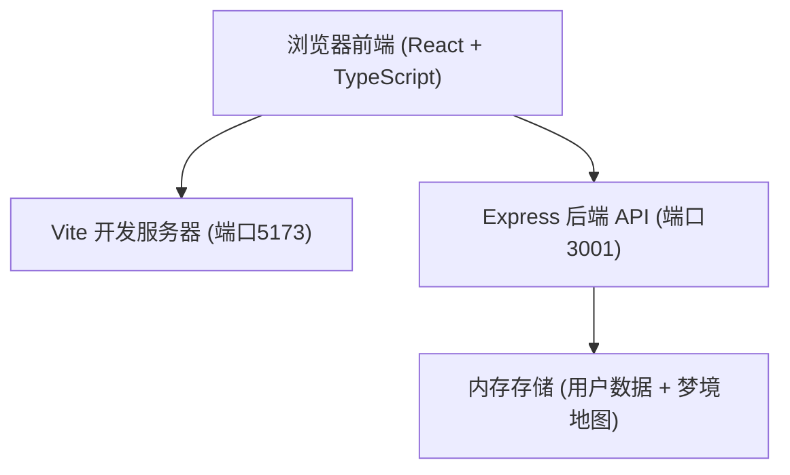
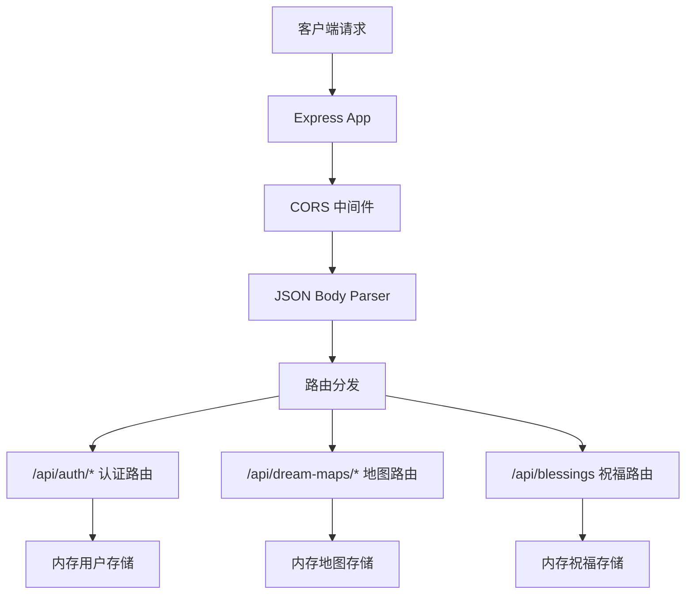
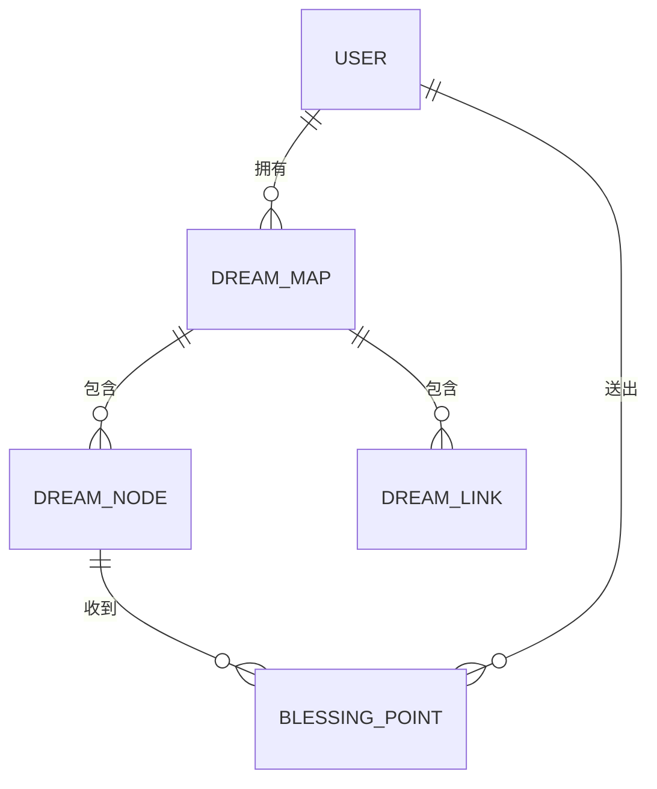

## 1. 架构设计



## 2. 技术描述

- **前端**：React 18 + TypeScript + Vite
- **后端**：Node.js + Express + TypeScript
- **初始化工具**：Vite
- **数据存储**：内存存储（开发阶段，无需数据库）
- **跨域**：cors 中间件 + Vite 代理 `/api` → `http://localhost:3001`

## 3. 路由定义

| 前端路由 | 用途 |
|---------|------|
| /login | 登录/注册页面 |
| /canvas | 主画布页面（登录后访问） |

## 4. API 定义

```typescript
// 用户类型
interface User {
  id: string;
  username: string;
  password: string; // 明文存储（演示用）
}

// 节点类型
interface DreamNode {
  id: string;
  x: number;
  y: number;
  radius: number;
  color: string;
  label: string;
  visitCount: number;
  pulseSpeed: number;
}

// 连线类型
interface DreamLink {
  id: string;
  sourceId: string;
  targetId: string;
}

// 梦境地图类型
interface DreamMap {
  id: string;
  userId: string;
  username: string;
  nodes: DreamNode[];
  links: DreamLink[];
  rotation: number;
  createdAt: number;
}

// 祝福光点
interface BlessingPoint {
  id: string;
  mapId: string;
  nodeId: string;
  fromUserId: string;
  createdAt: number;
}

// ====== 认证接口 ======
// POST /api/auth/register
// Request: { username: string, password: string }
// Response: { success: boolean, user: { id: string, username: string }, message?: string }

// POST /api/auth/login
// Request: { username: string, password: string }
// Response: { success: boolean, user: { id: string, username: string }, message?: string }

// ====== 梦境地图接口 ======
// POST /api/dream-maps
// Request: { userId: string, nodes: DreamNode[], links: DreamLink[], rotation: number }
// Response: { success: boolean, dreamMap: DreamMap }

// GET /api/dream-maps/:userId
// Response: { success: boolean, dreamMaps: DreamMap[] }

// GET /api/dream-maps
// Response: { success: boolean, dreamMaps: DreamMap[] } // 所有公开地图

// PUT /api/dream-maps/:id
// Request: { nodes: DreamNode[], links: DreamLink[], rotation: number }
// Response: { success: boolean, dreamMap: DreamMap }

// POST /api/blessings
// Request: { mapId: string, nodeId: string, fromUserId: string }
// Response: { success: boolean, blessing: BlessingPoint }
```

## 5. 服务器架构图



## 6. 项目文件结构

```
project-root/
├── package.json
├── vite.config.js
├── tsconfig.json
├── index.html
├── src/
│   ├── App.tsx          # 主组件，路由切换
│   ├── Login.tsx        # 登录/注册组件
│   └── DreamCanvas.tsx  # 核心画布组件
└── server/
    └── index.ts         # Express 后端服务
```

## 7. 数据模型

### 7.1 实体关系



### 7.2 内存数据结构

```typescript
// 内存存储（无持久化，重启清空）
interface MemoryStore {
  users: User[];
  dreamMaps: DreamMap[];
  blessings: BlessingPoint[];
}
```
