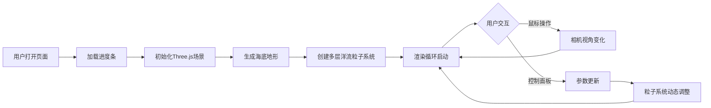

## 1. 产品概述

海洋洋流3D可视化应用，面向气象研究人员，用于在浏览器中观察不同深度的海洋洋流在三维空间中的流动路径，以及洋流与海底地形之间的交互关系，辅助分析海洋环流对气候的影响。

## 2. 核心功能

### 2.1 功能模块
1. **海底地形可视化**：Perlin噪声生成的高低起伏地形，浅沙色到深海蓝渐变，带法线凹凸纹理
2. **多层洋流粒子系统**：三层深度（表层0-200m、中层200-800m、深层800-2000m）粒子流，每层300粒子，带流动轨迹线
3. **地形交互模拟**：粒子流经地形凸起时产生上升或绕行效果，经过时颜色变亮
4. **深度参考网格**：-100m、-500m、-1000m三层半透明网格线
5. **交互式控制面板**：深度层开关、粒子密度滑块、速度倍率滑块、重置视角按钮

### 2.2 功能详情

| 模块名称 | 功能描述 |
|-----------|-------------|
| 海底地形 | Perlin噪声生成起伏地形，渐变着色，法线贴图模拟凹凸纹理 |
| 表层洋流 | 0-200m深度，300粒子，暖色调（橙黄→橙红），半透明发光材质 |
| 中层洋流 | 200-800m深度，300粒子，过渡色（青绿→天蓝），半透明发光材质 |
| 深层洋流 | 800-2000m深度，300粒子，冷色调（深蓝→紫蓝），半透明发光材质 |
| 流线运动 | 正弦波叠加随机扰动生成流线，粒子沿流线运动，地形交互绕行 |
| 深度参考层 | -100m、-500m、-1000m半透明网格线，标示水深 |
| 相机控制 | 左键旋转、右键平移、滚轮缩放，阻尼缓动（0.85），东南上方45°俯视 |
| 控制面板 | 深度层开关（高亮+滑动动画）、密度滑块（100-500）、速度滑块（0.5x-3x）、重置视角（1.5s动画） |

## 3. 核心流程

用户打开页面 → 加载进度条展示 → 3D场景初始化（海底地形+洋流粒子）→ 用户通过鼠标交互控制视角 → 通过控制面板调节参数 → 实时观察洋流流动与地形交互

## 4. 用户界面设计

### 4.1 设计风格
- **主题配色**：深海主题，背景深蓝到黑色渐变（#0a1628 → #00010d）
- **粒子材质**：半透明发光，AdditiveBlending混合模式
- **UI面板**：毛玻璃风格（backdrop-filter: blur(12px)），背景#0a1628cc，圆角16px，边框微光#4a7a9c33
- **控件风格**：扁平化设计，滑块轨道渐变填充（深蓝→青蓝），按钮hover缩放1.05+发光投影
- **动画过渡**：所有交互300-500ms平滑过渡

### 4.2 界面设计详情

| 区域 | 元素 | 设计细节 |
|-----------|-------------|-------------|
| 背景 | 全屏Canvas | 线性渐变 #0a1628 → #00010d |
| 加载 | 进度条 | 居中展示，带百分比数字 |
| 3D场景 | 海底地形 | 渐变着色+法线纹理 |
| 3D场景 | 洋流粒子 | 半透明发光，AdditiveBlending |
| 3D场景 | 深度网格 | 半透明细线，带深度标签 |
| 右侧面板 | 深度层开关 | 图标上下滑动动画，选中高亮 |
| 右侧面板 | 密度滑块 | 100-500范围，渐变轨道 |
| 右侧面板 | 速度滑块 | 0.5x-3x范围，渐变轨道 |
| 右侧面板 | 重置按钮 | hover缩放+发光投影 |

### 4.3 响应式设计
- **桌面端（≥768px）**：右侧固定浮动面板
- **移动端（<768px）**：右下角可折叠面板，收起时仅显示齿轮图标

### 4.4 3D场景配置
- **环境光**：柔和蓝色环境光 + 定向光模拟海面光照
- **雾效**：线性雾化，远处融入深海背景色
- **相机**：PerspectiveCamera，初始位置东南上方45°俯视
- **后处理**：无额外后处理，使用内置材质发光效果
