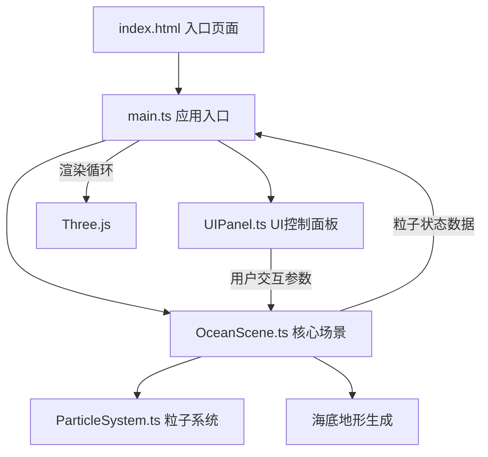

## 1. 架构设计



## 2. 技术描述

- **前端框架**：原生 TypeScript + Three.js 0.160.0
- **构建工具**：Vite 5.x
- **辅助库**：d3-scale（颜色/数值映射）、d3-interpolate（颜色插值）
- **模块系统**：ES Module
- **TypeScript 目标**：ES2020，严格模式

## 3. 文件结构与职责

| 文件路径 | 职责描述 | 数据流向 |
|-----------|-------------|-------------|
| package.json | 项目依赖与脚本配置 | - |
| vite.config.js | Vite构建配置，代理设置 | - |
| tsconfig.json | TypeScript编译配置（严格模式，ES2020） | - |
| index.html | 入口页面，加载进度条，全屏Canvas容器 | - |
| src/main.ts | 应用入口：初始化场景/渲染器/相机，控制渲染循环，相机阻尼控制 | 初始化→OceanScene→启动循环 |
| src/OceanScene.ts | 核心场景类：海底地形网格生成、Perlin噪声、多层粒子系统创建、粒子沿流线运动算法、地形交互绕行 | 接收main.ts更新请求→调用ParticleSystem→输出渲染数据 |
| src/ParticleSystem.ts | 粒子系统类：管理粒子位置/速度/颜色/生命周期，分层差异化配置，BufferAttribute优化 | 接收OceanScene参数→输出粒子状态 |
| src/UIPanel.ts | UI控制面板类：深度层开关、密度滑块、速度滑块、重置视角，毛玻璃风格 | 接收用户交互→调用OceanScene更新参数 |

## 4. 数据模型

### 4.1 粒子数据结构

```typescript
interface Particle {
  position: THREE.Vector3;
  velocity: THREE.Vector3;
  baseDepth: number;
  layer: 'surface' | 'middle' | 'deep';
  speed: number;
  life: number;
  trail: THREE.Vector3[];
  terrainOffset: number;
}
```

### 4.2 深度层配置

```typescript
interface DepthLayerConfig {
  name: string;
  enabled: boolean;
  minDepth: number;
  maxDepth: number;
  particleCount: number;
  colorRange: [string, string];
  speedRange: [number, number];
}
```

### 4.3 场景参数

```typescript
interface SceneParams {
  speedMultiplier: number;
  density: number;
  layers: {
    surface: boolean;
    middle: boolean;
    deep: boolean;
  };
}
```

## 5. 性能优化策略

1. **BufferAttribute复用**：粒子使用单个BufferGeometry，通过setDrawRange控制可见粒子数，避免重建几何体
2. **粒子数量控制**：总粒子数不超过1500，每层最大500
3. **轨迹线优化**：限制轨迹点数量，使用LineSegments而非单独Line
4. **材质复用**：同层粒子共享材质实例
5. **帧率目标**：稳定55fps以上

## 6. 相机控制实现

- 旋转：球坐标系统（theta/phi/radius）+ 阻尼系数0.85
- 平移：相机target位置偏移 + 阻尼
- 缩放：radius调整 + 阻尼
- 初始视角：东南方向45°，俯仰45°俯视
- 重置动画：1.5秒缓动回正

## 7. 洋流流线算法

```
流线 = 基础正弦波(XY平面) + 深度层偏移(Z轴) + Perlin噪声扰动 + 地形高度修正
```

- 基础流动方向：全局主导方向（如顺时针环流）
- 随机扰动：Perlin噪声生成自然流动变化
- 地形交互：粒子检测下方地形高度，产生上升/绕行向量
- 边界处理：超出场景范围时循环回绕
