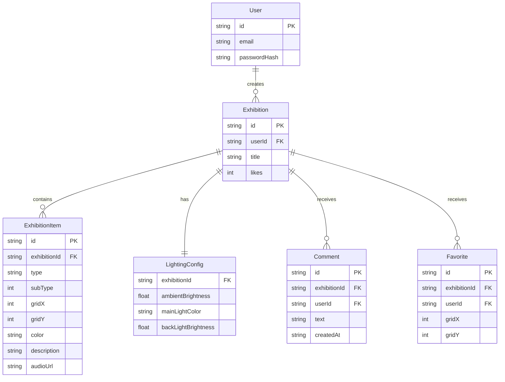

## 1. 架构设计

```mermaid
flowchart TB
    subgraph "前端 (React + TypeScript)"
        "路由层" --> "页面组件"
        "页面组件" --> "展览核心钩子"
        "页面组件" --> "粒子特效模块"
        "展览核心钩子" --> "状态管理(Zustand)"
    end
    subgraph "后端 (Express + TypeScript)"
        "REST API路由" --> "业务逻辑"
        "业务逻辑" --> "内存数据存储"
    end
    "前端" -->|"HTTP请求"| "后端"
```

## 2. 技术说明

- 前端：React@18 + TypeScript + Vite + Tailwind CSS
- 状态管理：Zustand
- 后端：Express@4 + TypeScript（ESM格式）
- 数据存储：内存存储（Map对象）
- 认证：JWT (jsonwebtoken) + bcryptjs
- 初始化工具：vite-init (react-express-ts模板)

## 3. 路由定义

| 路由 | 用途 |
|------|------|
| /login | 用户登录页面 |
| /register | 用户注册页面 |
| /exhibition/:id | 展览编辑/浏览页面（根据是否为创建者区分模式） |

## 4. API定义

### 4.1 认证接口

| 方法 | 路径 | 请求体 | 响应 |
|------|------|--------|------|
| POST | /api/register | `{ email, password }` | `{ token, user: { id, email } }` |
| POST | /api/login | `{ email, password }` | `{ token, user: { id, email } }` |

### 4.2 展览接口

| 方法 | 路径 | 请求体 | 响应 |
|------|------|--------|------|
| POST | /api/exhibition | `{ items, lighting, title }` | `{ id }` |
| GET | /api/exhibition/:id | - | `{ id, items, lighting, likes, comments, favorites }` |
| POST | /api/exhibition/:id/like | - | `{ likes }` |
| POST | /api/exhibition/:id/comment | `{ text, userId }` | `{ comments }` |
| POST | /api/exhibition/:id/favorite | `{ x, y, userId }` | `{ favorites }` |

### 4.3 TypeScript类型定义

```typescript
interface ExhibitionItem {
  id: string;
  type: 'frame' | 'sculpture' | 'plant';
  subType: number;
  gridX: number;
  gridY: number;
  color: string;
  description: string;
  audioUrl: string;
}

interface LightingConfig {
  ambientBrightness: number;
  mainLightColor: string;
  backLightBrightness: number;
}

interface Exhibition {
  id: string;
  userId: string;
  title: string;
  items: ExhibitionItem[];
  lighting: LightingConfig;
  likes: number;
  comments: Comment[];
  favorites: Favorite[];
}

interface Comment {
  id: string;
  userId: string;
  text: string;
  createdAt: string;
}

interface Favorite {
  id: string;
  userId: string;
  gridX: number;
  gridY: number;
}
```

## 5. 服务器架构图

```mermaid
flowchart LR
    "路由中间件" --> "认证中间件(JWT)"
    "认证中间件(JWT)" --> "展览控制器"
    "展览控制器" --> "内存数据服务"
    "内存数据服务" --> "Map存储"
```

## 6. 数据模型

### 6.1 数据模型定义



### 6.2 文件组织

```
├── package.json
├── vite.config.ts
├── tsconfig.json
├── index.html
├── api/
│   └── server.ts          # Express后端
├── src/
│   ├── main.tsx           # React入口
│   ├── App.tsx            # 主应用组件(路由/布局/状态)
│   ├── exhibition.ts      # 展览交互核心钩子
│   ├── effects.ts         # 粒子特效工具函数
│   ├── pages/
│   │   ├── LoginPage.tsx
│   │   ├── RegisterPage.tsx
│   │   └── ExhibitionPage.tsx
│   ├── components/
│   │   ├── ControlPanel.tsx
│   │   ├── ExhibitionGrid.tsx
│   │   ├── ExhibitItem.tsx
│   │   ├── EditDialog.tsx
│   │   ├── LikeButton.tsx
│   │   ├── CommentSection.tsx
│   │   └── StarMarker.tsx
│   ├── hooks/
│   │   └── useAuth.ts
│   ├── store/
│   │   └── useExhibitionStore.ts
│   └── utils/
│       └── api.ts
└── shared/
    └── types.ts
```
