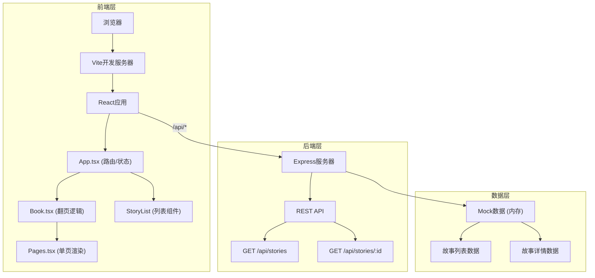
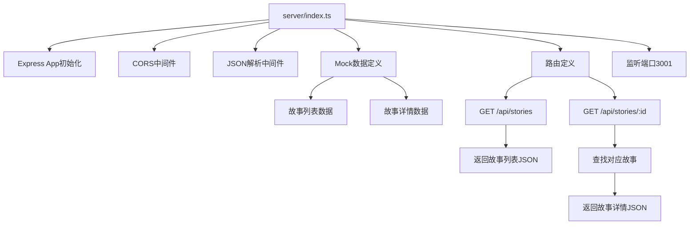

## 1. 架构设计



**数据流向说明：**
1. 用户在浏览器访问应用 → Vite提供静态资源 → React应用初始化
2. App.tsx调用API获取故事列表 → Express返回Mock数据 → 渲染StoryList
3. 用户点击故事 → 路由跳转 → App.tsx调用API获取单故事详情
4. 详情数据传递给Book.tsx → 管理翻页状态 → 传递单页数据给Pages.tsx
5. Pages.tsx渲染背景图和文本气泡 → 应用CSS动画效果

## 2. 技术描述

- **前端框架**：React 18 + TypeScript
- **构建工具**：Vite 5 + @vitejs/plugin-react
- **路由方案**：React Router DOM 6
- **后端框架**：Express 4 + TypeScript
- **跨域处理**：cors 2
- **唯一标识**：uuid 9
- **运行时支持**：tslib 2
- **数据存储**：内存Mock数据（无需数据库）
- **初始化方式**：手动配置项目结构（非脚手架）

## 3. 项目结构与调用关系

```
auto336/
├── package.json              # 项目配置，启动脚本
├── vite.config.js            # Vite配置，代理/api
├── tsconfig.json             # TypeScript配置
├── index.html                # HTML入口
├── server/
│   └── index.ts              # Express服务器
│       ├── 定义Mock数据
│       ├── GET /api/stories → 返回故事列表
│       └── GET /api/stories/:id → 返回单故事详情
└── src/
    ├── main.tsx              # React入口，渲染App
    ├── App.tsx               # 主组件，路由管理，API调用
    │   ├── 调用/api/stories获取列表
    │   ├── 调用/api/stories/:id获取详情
    │   ├── 渲染StoryList或Book组件
    │   └── 传递props给子组件
    ├── theme.ts              # 全局主题配置
    ├── types.ts              # TypeScript类型定义
    ├── components/
    │   ├── StoryList.tsx     # 故事列表组件
    │   ├── Book.tsx          # 翻页组件，管理翻页状态
    │   │   ├── 接收pages数组
    │   │   ├── 处理上一页/下一页逻辑
    │   │   ├── 调用Pages组件
    │   │   └── 渲染工具栏和进度条
    │   └── Pages.tsx         # 单页渲染组件
    │       ├── 接收背景URL和气泡数据
    │       ├── 渲染带CSS动画的文本气泡
    │       └── 应用翻页动画效果
    └── styles/
        └── global.css        # 全局样式和动画定义
```

**调用关系：**
- `App.tsx` → `server/index.ts` (API调用)
- `App.tsx` → `StoryList.tsx` (props: stories)
- `App.tsx` → `Book.tsx` (props: story)
- `Book.tsx` → `Pages.tsx` (props: pageData, isFlipping, direction)
- 所有组件 → `theme.ts` (导入颜色主题)
- 所有组件 → `types.ts` (导入类型定义)

## 4. 路由定义

| 路由 | 组件 | 用途 |
|------|------|------|
| / | StoryList | 故事列表首页 |
| /story/:id | Book | 绘本阅读页 |
| * | Redirect to / | 404重定向 |

## 5. API定义

### 5.1 TypeScript类型定义

```typescript
// 文本气泡位置
interface TextPosition {
  top?: number;
  left?: number;
  right?: number;
  bottom?: number;
}

// 文本气泡
interface TextBubble {
  content: string;
  position: TextPosition;
}

// 单页数据
interface Page {
  id: string;
  backgroundUrl: string;
  bubbles: TextBubble[];
}

// 故事摘要
interface StorySummary {
  id: string;
  title: string;
  author: string;
  coverUrl: string;
  wordCount: number;
  summary: string;
}

// 故事详情
interface StoryDetail extends StorySummary {
  pages: Page[];
}
```

### 5.2 接口定义

**GET /api/stories**

响应：
```typescript
{
  code: 0,
  data: StorySummary[]
}
```

**GET /api/stories/:id**

响应：
```typescript
{
  code: 0,
  data: StoryDetail
}
```

## 6. 服务端架构



## 7. 关键技术实现点

### 7.1 翻页动画实现
- 使用CSS `transform-style: preserve-3d` 创建3D空间
- 左右页面分别绕Y轴旋转，左侧从0→-180度，右侧从180→0度
- 动画时长0.6秒，缓动函数`cubic-bezier(0.25, 0.46, 0.45, 0.94)`
- 翻页过程中使用`transform-origin`设置旋转轴在书页边缘
- 页面下角微翘通过`rotateZ`和`translateY`组合实现

### 7.2 性能优化策略
- 使用`will-change: transform` 提前告知浏览器动画属性
- 翻页动画使用`transform`而非`top/left`避免重排
- 图片使用适当尺寸并添加`loading="lazy"`实现懒加载
- 使用CSS变量管理主题颜色，避免重复计算

### 7.3 纸张纹理效果
- 使用CSS伪元素`::before`创建噪点覆盖层
- 噪点通过径向渐变`radial-gradient`模拟
- 透明度设置为0.05，不影响内容可读性
- 背面页面使用浅黄色`#fff8e7`配合纹理
