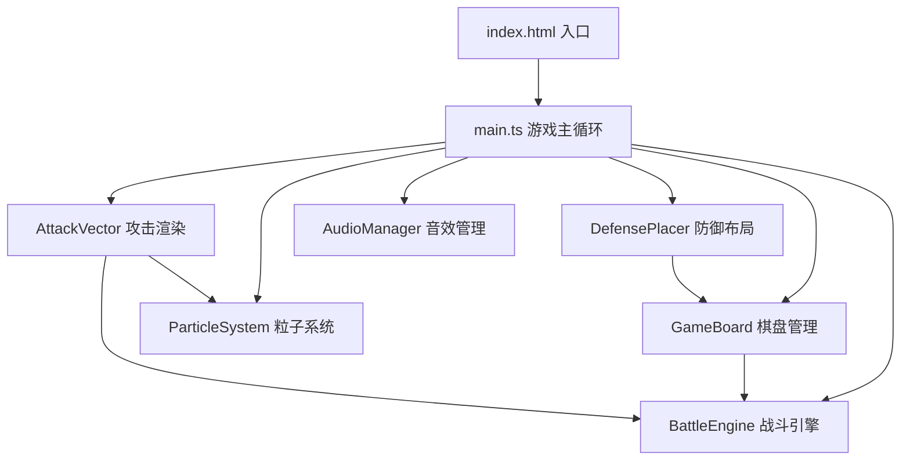

## 1. 架构设计



## 2. 技术描述

- **前端框架**：无框架，纯 TypeScript + HTML5 Canvas
- **构建工具**：Vite 5.x
- **语言**：TypeScript 5.x（严格模式，ES2020目标）
- **渲染**：HTML5 Canvas 2D API，离屏Canvas缓存优化
- **音频**：Web Audio API（方波像素音效）

## 3. 目录结构

```
.
├── index.html              # 入口HTML，全屏Canvas容器
├── package.json            # 依赖配置
├── tsconfig.json           # TypeScript严格模式配置
├── vite.config.js          # Vite构建配置
└── src/
    ├── main.ts             # 入口：Canvas初始化 + 60FPS游戏循环
    ├── GameBoard.ts        # 7x7网格棋盘逻辑
    ├── BattleEngine.ts     # 回合战斗、相克判定、伤害计算
    ├── DefensePlacer.ts    # 防御模块拖拽放置与升级
    ├── AttackVector.ts     # 攻击向量流光子弹渲染
    ├── types.ts            # 全局类型定义
    └── utils/
        ├── ParticleSystem.ts  # 粒子特效系统
        ├── AudioManager.ts    # Web Audio音效
        └── Renderer.ts        # Canvas渲染辅助函数
```

## 4. 核心数据模型

### 4.1 类型定义

```typescript
// 格子节点类型
type NodeType = 'empty' | 'server' | 'firewall' | 'cache' | 'vulnerability' | 'base';

// 攻击类型
type AttackType = 'virus' | 'crack' | 'ddos' | 'backdoor' | 'steal';

// 防御类型
type DefenseType = 'antivirus' | 'cleaning' | 'honeypot' | 'mirror';

// 玩家
type Player = 'player' | 'enemy';

// 格子数据
interface Cell {
  row: number;
  col: number;
  type: NodeType;
  owner: Player | null;
  defense: {
    type: DefenseType;
    level: 1 | 2 | 3;
  } | null;
  isHovered: boolean;
  crackProgress: number; // 0-1 碎裂动画进度
}

// 攻击配置
interface AttackConfig {
  type: AttackType;
  name: string;
  color: string;
  baseDamage: number;
  counters: DefenseType | null; // 克制的防御类型
}

// 防御配置
interface DefenseConfig {
  type: DefenseType;
  name: string;
  color: string;
  defensePower: number;
  upgradeCost: number[];
}

// 游戏状态
interface GameState {
  phase: 'attack' | 'defend' | 'animating';
  currentPlayer: Player;
  turnTimeLeft: number;
  mode: 'fast' | 'standard';
  playerHP: number;
  enemyHP: number;
  selectedAttack: AttackType | null;
  points: number; // 防御升级点数
  board: Cell[][];
}
```

### 4.2 相克关系

| 攻击 \ 防御 | 反病毒墙 | 流量清洗 | 蜜罐 | 数据镜像 |
|-------------|----------|----------|------|----------|
| 病毒注入    | -        | -        | 胜   | -        |
| DDoS洪流    | 胜       | -        | -    | -        |
| 密码爆破    | -        | 胜       | -    | -        |
| 后门程序    | 平(减半) | 平(减半) | 平(减半) | 平(减半) |
| 数据窃取    | 平(减半) | 平(减半) | 平(减半) | 平(减半) |

## 5. 性能优化

- **离屏Canvas缓存**：静态棋盘元素预渲染缓存，减少每帧重绘
- **粒子数量限制**：峰值不超过300个，超出时淘汰最旧粒子
- **帧率锁定**：requestAnimationFrame + 时间累加器，稳定60FPS
- **对象池**：粒子和子弹对象复用，避免GC开销
- **分层渲染**：背景层 → 棋盘层 → 特效层 → UI层，仅重绘变化层
