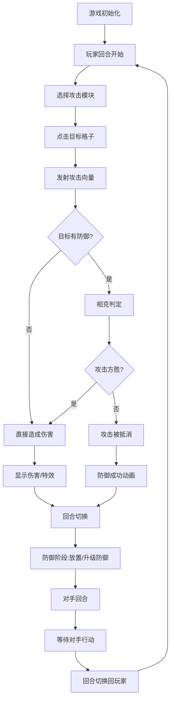

## 1. 产品概述

赛博朋克黑客终端入侵与防御回合制策略游戏，玩家扮演黑客，通过组合攻击模块突破对手防火墙，同时部署防御模块保护核心数据。

- 主要用途：回合制策略对战，考验玩家攻防策略布局能力
- 目标用户：喜欢策略游戏、赛博朋克主题的玩家
- 产品价值：提供沉浸式黑客对战体验，独特的攻防相克机制

## 2. 核心功能

### 2.1 功能模块

1. **游戏主界面**：7x7赛博网格棋盘、攻击模块选择面板、倒计时显示、回合提示
2. **战斗系统**：攻击发射、防御判定、相克计算、伤害结算、粒子特效
3. **防御布局系统**：拖拽放置、模块升级、范围指示器、金色光晕动画
4. **回合管理**：攻防回合切换、倒计时、模式切换（快速/标准）

### 2.2 页面详情

| 页面名称 | 模块名称 | 功能描述 |
|-----------|-------------|---------------------|
| 游戏主界面 | 7x7网格棋盘 | 科技风格边框、脉动背景光、悬停高亮、点击交互 |
| 游戏主界面 | 双方基地 | 棱形晶体、旋转动画、光晕、血量数字+进度条 |
| 游戏主界面 | 攻击模块面板 | 5种攻击（病毒注入、密码爆破、DDoS洪流、后门程序、数据窃取）、像素风格SVG |
| 游戏主界面 | 防御模块面板 | 4种防御（反病毒墙、流量清洗、蜜罐、数据镜像）、六边形图标 |
| 游戏主界面 | 倒计时显示 | 赛博字体发光效果、最后5秒红色闪烁收缩动画 |
| 游戏主界面 | 回合切换提示 | 巨大像素文字'YOUR TURN'/'DEFEND'、中心炸裂消散动画 |
| 游戏主界面 | 模式切换 | 快速模式（伤害x2，15秒）/标准模式（正常伤害，30秒） |

## 3. 核心流程

玩家选择攻击模块 → 点击对手格子 → 攻击向量发射 → 命中判定（相克关系）→ 伤害结算/特效 → 回合切换 → 对手防御部署 → 己方回合开始

## 4. 用户界面设计

### 4.1 设计风格

- **主色调**：深色背景 #0a0a1a，网格线 #1a2a4a，格子 #222244
- **强调色**：悬停淡蓝 #4488ff，病毒紫，爆破蓝，破解橙，金色光晕
- **字体**：monospace等宽字体，发光效果
- **布局**：中央棋盘，左侧攻击面板，右侧防御面板，顶部倒计时和血量
- **动画风格**：像素风格特效、流光拖尾、粒子爆炸、屏幕闪烁

### 4.2 页面设计概述

| 页面名称 | 模块名称 | UI元素 |
|-----------|-------------|-------------|
| 游戏主界面 | 棋盘网格 | 7x7格、科技边框、脉动光、悬停微光扩散 |
| 游戏主界面 | 基地晶体 | 棱形旋转、光晕、绿→红血量渐变进度条 |
| 游戏主界面 | 攻击模块 | 像素SVG图标、能量流动边框 |
| 游戏主界面 | 防御模块 | 六边形图标、蓝色流光拖影 |
| 游戏主界面 | 攻击子弹 | 彩色流光拖尾（紫/蓝/橙） |
| 游戏主界面 | 命中特效 | 像素爆炸、伤害数字漂浮 |
| 游戏主界面 | 回合提示 | 像素文字中心炸裂消散 |
| 游戏主界面 | 屏幕边缘 | 基地受击红光闪烁 |

### 4.3 响应式

- 桌面端优先设计，棋盘自适应窗口大小
- Canvas按比例缩放保持显示正确
- 鼠标悬停和点击交互优化
