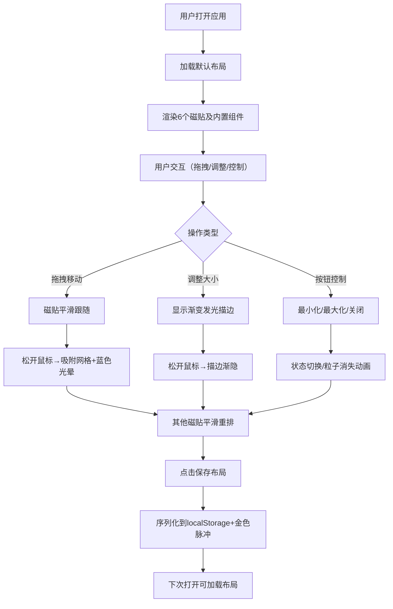

## 1. 产品概述

「光模·灵动窗格」是一款运行在浏览器中的动态磁贴布局管理应用，让用户能够通过拖拽、折叠、最大化和动态调整大小来灵活组织和排列一组发光磁贴，每个磁贴代表一个可交互的小组件。

- 核心价值：提供高度灵活的桌面级磁贴布局体验，支持实时保存和恢复布局方案
- 目标用户：需要高效组织多任务视图的知识工作者、创意人士和技术爱好者
- 市场定位：填补浏览器端缺乏专业级可定制磁贴布局工具的空白

## 2. 核心功能

### 2.1 功能模块

1. **磁贴网格系统**：可滚动的磁贴网格，支持动态布局计算和重排动画
2. **磁贴交互系统**：拖拽移动、调整大小、最小化/最大化/关闭控制
3. **内置小组件**：实时时钟、计数按钮、温度滑块、文本编辑器、进度条、迷你画板
4. **布局管理系统**：保存布局到本地存储、加载已存布局、重置为默认布局
5. **视觉动效系统**：光晕动画、粒子溶解、平滑过渡、悬停效果

### 2.2 页面详情

| 页面名称 | 模块名称 | 功能描述 |
|-----------|-------------|---------------------|
| 主应用页面 | 顶部控制栏 | 包含保存布局、加载布局、重置布局三个控制按钮 |
| 主应用页面 | 磁贴网格区域 | 可滚动的磁贴容器，展示所有磁贴并处理布局计算 |
| 主应用页面 | 磁贴组件 | 6个独立磁贴，每个包含不同的内置小组件 |

## 3. 核心流程

### 3.1 主要用户流程

用户打开应用 → 查看默认布局的6个磁贴 → 拖拽磁贴标题栏移动位置 → 磁贴平滑跟随鼠标 → 松开后吸附到网格并触发光晕 → 其他磁贴自动重排 → 拖拽右下角把手调整大小 → 点击右上角按钮控制磁贴状态 → 点击保存布局按钮 → 触发金色光晕脉冲 → 下次打开可加载保存的布局

### 3.2 流程图

## 4. 用户界面设计

### 4.1 设计风格

- **主色调**：深空灰 `#1a1a2e`、墨蓝 `#16213e`、发光蓝 `#48dbfb`、发光绿 `#2ed573`、发光黄 `#feca57`、发光红 `#ff4757`
- **背景**：从深空灰到墨蓝的径向渐变
- **磁贴风格**：圆角矩形（12px圆角），半透明背景 `rgba(255,255,255,0.08)`，0.5px白色发光边框，`backdrop-filter: blur(8px)` 模糊背投效果
- **字体**：采用现代无衬线字体，磁贴标题14px白色
- **动效风格**：平滑过渡（0.2-0.3秒），光晕闪烁，粒子溶解，流畅的60FPS动画

### 4.2 页面设计概述

| 页面名称 | 模块名称 | UI元素 |
|-----------|-------------|-------------|
| 主应用页面 | 顶部控制栏 | 背景 `rgba(26,26,46,0.8)`，高度60px，顶部1px渐变发光描边，三个按钮悬停放大1.1倍并显示彩色光晕 |
| 主应用页面 | 磁贴网格 | 半透明灰色背景 `rgba(255,255,255,0.03)`，微弱发光虚线条纹，间距12px，可滚动 |
| 主应用页面 | 单个磁贴 | 标题栏高度36px，背景 `rgba(255,255,255,0.1)`，右上角三个14px圆形控制按钮，右下角三角形拖拽把手，悬停时提升阴影并上移2px |
| 主应用页面 | 内置组件 | 时钟（数字跳动）、计数器（可点击按钮）、温度滑块、文本编辑器、进度条动画、迷你画板 |

### 4.3 响应式设计

- **桌面端（≥768px）**：4列网格，磁贴最小尺寸150x100px，最大尺寸450x400px
- **移动端（<768px）**：2列网格，磁贴最小尺寸120x80px
- **触摸优化**：确保拖拽和点击区域足够大，支持触摸事件

### 4.4 视觉动效规范

| 动效名称 | 参数 | 触发时机 |
|---------|------|---------|
| 磁贴跟随移动 | 过渡时间0.2秒 | 拖拽标题栏时 |
| 吸附光晕闪烁 | 蓝色光晕，持续0.8秒 | 拖拽结束松开时 |
| 磁贴重排 | 过渡时间0.3秒 | 布局变化时 |
| 调整大小描边 | 2px渐变描边（#48dbfb→#feca57） | 拖拽调整把手时 |
| 描边渐隐 | 过渡时间1秒 | 调整大小结束时 |
| 最小化 | 高度变为50px，背景半透明 | 点击黄色按钮或双击标题栏 |
| 关闭粒子溶解 | 持续0.5秒，粒子继承磁贴主色 | 点击红色按钮 |
| 保存金色脉冲 | 全屏短暂金色光晕 | 点击保存布局按钮 |
| 重置涟漪动画 | 从中心向四周扩散 | 点击重置布局按钮 |
| 悬停效果 | 放大1.1倍，彩色光晕，阴影提升，上移2px | 鼠标悬停时 |

