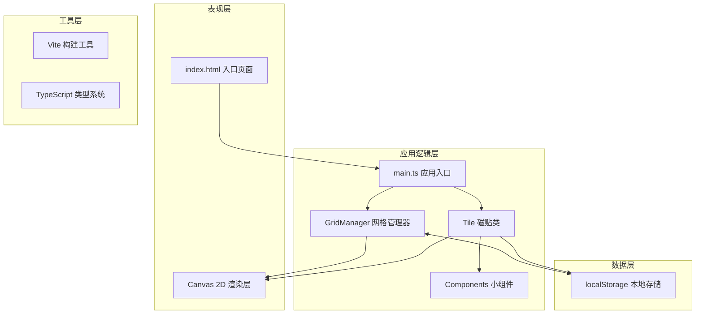

## 1. 架构设计



## 2. 技术描述

- **前端框架**：原生 TypeScript + Canvas 2D API（不使用UI框架，全部基于Canvas绘制）
- **构建工具**：Vite 5.x
- **语言**：TypeScript 5.x（严格模式）
- **渲染引擎**：HTML5 Canvas 2D API
- **数据存储**：浏览器 localStorage
- **动画驱动**：requestAnimationFrame

### 2.1 技术选型说明

| 技术 | 选择理由 |
|------|---------|
| TypeScript | 提供强类型支持，确保大型Canvas应用的代码可维护性和类型安全 |
| Canvas 2D API | 实现高性能的磁贴渲染、动画效果和自定义组件绘制，支持60FPS流畅度 |
| Vite | 极速的开发体验，原生ESM支持，快速热更新 |
| localStorage | 无需后端服务，实现布局配置的本地持久化 |

## 3. 目录结构与文件定义

```
auto342/
├── package.json          # 项目依赖配置
├── vite.config.js        # Vite构建配置
├── tsconfig.json         # TypeScript编译配置
├── index.html            # 入口HTML页面
└── src/
    ├── main.ts           # 应用入口，初始化网格、控制栏、磁贴
    ├── gridManager.ts    # 网格管理器，布局计算、吸附逻辑、重排动画
    ├── tile.ts           # 磁贴类，位置/大小/状态、交互处理、事件通知
    └── components.ts     # 内置小组件（时钟、计数器、滑块等）
```

### 3.1 核心文件职责

| 文件 | 职责描述 |
|------|---------|
| `package.json` | 定义依赖（typescript、vite）和启动脚本（npm run dev） |
| `vite.config.js` | 配置Vite构建，指定入口为index.html |
| `tsconfig.json` | 严格模式，target: ES2020，module: ESNext |
| `index.html` | 全屏自适应页面，包含id为app的根容器，引入type=module脚本 |
| `src/main.ts` | 应用入口，初始化GridManager、创建控制栏、实例化6个磁贴、绑定全局事件、调用加载默认布局 |
| `src/gridManager.ts` | 创建/更新磁贴网格，维护位置大小二维数组，处理拖拽吸附和重排动画，接收Tile事件并触发重绘 |
| `src/tile.ts` | 单个磁贴类，包含位置、大小、状态、标题，处理拖拽把手/按钮点击/双击，发送事件给GridManager |
| `src/components.ts` | 各小组件的渲染和交互逻辑，接收canvas上下文和区域坐标绘制，requestAnimationFrame驱动动画 |

## 4. 核心数据模型

### 4.1 磁贴数据结构 (TileData)

```typescript
interface TileData {
  id: string;                    // 唯一标识
  title: string;                 // 标题
  componentType: ComponentType;  // 组件类型
  x: number;                     // 网格X坐标
  y: number;                     // 网格Y坐标
  width: number;                 // 宽度（像素）
  height: number;                // 高度（像素）
  gridWidth: number;             // 占据网格列数
  gridHeight: number;            // 占据网格行数
  state: TileState;              // 状态：normal/minimized/maximized
  zIndex: number;                // 层级
  primaryColor: string;          // 主色调（用于粒子效果）
}

type ComponentType = 'clock' | 'counter' | 'slider' | 'editor' | 'progress' | 'canvas';
type TileState = 'normal' | 'minimized' | 'maximized';
```

### 4.2 网格配置 (GridConfig)

```typescript
interface GridConfig {
  columns: number;               // 网格列数
  cellWidth: number;             // 单元格宽度
  cellHeight: number;            // 单元格高度
  gap: number;                   // 间距（12px）
  minTileWidth: number;          // 磁贴最小宽度
  minTileHeight: number;         // 磁贴最小高度
  maxTileWidth: number;          // 磁贴最大宽度
  maxTileHeight: number;         // 磁贴最大高度
}
```

### 4.3 布局数据 (LayoutData)

```typescript
interface LayoutData {
  version: string;
  timestamp: number;
  tiles: TileData[];
  gridConfig: GridConfig;
}
```

## 5. 核心类与接口设计

### 5.1 GridManager 类

```typescript
class GridManager {
  private canvas: HTMLCanvasElement;
  private ctx: CanvasRenderingContext2D;
  private tiles: Tile[];
  private gridConfig: GridConfig;
  private layoutStore: LayoutStorage;
  
  constructor(container: HTMLElement);
  init(): void;
  addTile(tile: Tile): void;
  removeTile(tileId: string): void;
  requestMove(tile: Tile, newX: number, newY: number): void;
  requestResize(tile: Tile, newWidth: number, newHeight: number): void;
  snapToGrid(x: number, y: number): { x: number; y: number };
  recalculateLayout(): void;
  saveLayout(): void;
  loadLayout(): boolean;
  resetLayout(): void;
  render(): void;
}
```

### 5.2 Tile 类

```typescript
class Tile {
  public id: string;
  public data: TileData;
  private gridManager: GridManager;
  private component: Component;
  private isDragging: boolean;
  private isResizing: boolean;
  private animationState: AnimationState;
  
  constructor(data: TileData, gridManager: GridManager);
  render(ctx: CanvasRenderingContext2D): void;
  handleMouseDown(e: MouseEvent): void;
  handleMouseMove(e: MouseEvent): void;
  handleMouseUp(e: MouseEvent): void;
  handleDoubleClick(e: MouseEvent): void;
  minimize(): void;
  maximize(): void;
  close(): void;
  toggleMinimized(): void;
  private emitMoveRequest(): void;
  private emitResizeRequest(): void;
}
```

### 5.3 Component 接口

```typescript
interface Component {
  type: ComponentType;
  update(deltaTime: number): void;
  render(ctx: CanvasRenderingContext2D, x: number, y: number, width: number, height: number): void;
  handleEvent(e: Event): void;
}

class ClockComponent implements Component { /* 实时时钟 */ }
class CounterComponent implements Component { /* 计数按钮 */ }
class SliderComponent implements Component { /* 温度滑块 */ }
class EditorComponent implements Component { /* 文本编辑器 */ }
class ProgressComponent implements Component { /* 进度条动画 */ }
class CanvasComponent implements Component { /* 迷你画板 */ }
```

## 6. 事件与数据流

### 6.1 事件流向

```
用户输入 → Tile.handleEvent → 状态变更 → 事件通知 → GridManager → 布局重算 → Canvas重绘
```

### 6.2 自定义事件

| 事件名称 | 触发源 | 监听者 | 数据 |
|---------|-------|-------|-----|
| `tile:move-request` | Tile | GridManager | { tileId, x, y } |
| `tile:resize-request` | Tile | GridManager | { tileId, width, height } |
| `tile:state-change` | Tile | GridManager | { tileId, state } |
| `tile:close` | Tile | GridManager | { tileId } |
| `layout:save` | ControlBar | GridManager | - |
| `layout:load` | ControlBar | GridManager | - |
| `layout:reset` | ControlBar | GridManager | - |

## 7. 性能优化策略

### 7.1 渲染优化

- **脏区域渲染**：只重绘发生变化的磁贴区域，而非整个Canvas
- **分层渲染**：背景层、网格层、磁贴层、特效层分离
- **离屏Canvas**：静态元素预渲染到离屏Canvas缓存

### 7.2 动画优化

- **requestAnimationFrame**：统一动画驱动，确保60FPS
- **缓动函数**：使用easeOutCubic等缓动函数实现平滑过渡
- **帧率控制**：布局重排动画保底50FPS，拖拽调整大小60FPS

### 7.3 交互优化

- **事件节流**：mousemove事件节流，避免频繁计算
- **碰撞检测优化**：使用空间网格加速碰撞检测
- **触摸支持**：同时支持鼠标和触摸事件

## 8. 动画与特效实现

### 8.1 动画系统

```typescript
interface Animation {
  id: string;
  duration: number;
  startTime: number;
  easing: (t: number) => number;
  onUpdate: (progress: number) => void;
  onComplete: () => void;
}

class AnimationManager {
  private animations: Animation[];
  add(animation: Animation): void;
  update(currentTime: number): void;
}
```

### 8.2 特效类型

| 特效 | 实现方式 |
|-----|---------|
| 蓝色光晕闪烁 | radialGradient + 透明度动画 |
| 渐变发光描边 | createLinearGradient + lineWidth动画 |
| 粒子溶解 | 粒子系统 + 物理模拟（速度、重力、生命周期） |
| 金色光晕脉冲 | 全屏径向渐变 + 透明度动画 |
| 涟漪清除动画 | 圆形扩散 + 透明度渐变 |

## 9. 响应式设计

### 9.1 断点配置

```typescript
const BREAKPOINTS = {
  mobile: 768  // <768px 为移动端
};
```

### 9.2 自适应规则

- **桌面端**（≥768px）：4列网格，最小磁贴150x100px，最大450x400px
- **移动端**（<768px）：2列网格，最小磁贴120x80px
- 窗口resize时重新计算网格配置并平滑过渡到新布局

