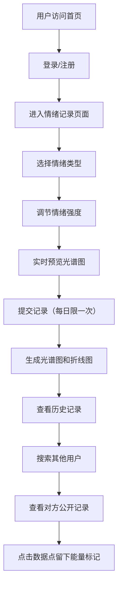

## 1. 产品概述

"光织·情绪光谱"是一款情绪记录与分享的全栈Web应用，让用户通过可视化的"情绪光谱图"记录和表达每日情绪状态，并可与他人分享互动。应用将抽象的情绪转化为独特的视觉艺术，帮助用户觉察和理解自己的情绪变化。

- 核心价值：将情绪数据转化为艺术化的视觉表达，促进用户自我觉察与社交互动
- 目标用户：关注心理健康、喜欢记录生活、愿意分享情绪的年轻用户群体

## 2. 核心功能

### 2.1 用户角色

| 角色 | 注册方式 | 核心权限 |
|------|----------|----------|
| 普通用户 | 用户名+密码注册 | 记录情绪、查看历史记录、搜索用户、查看他人公开记录、留下能量标记、删除自己的记录 |

### 2.2 功能模块

1. **登录/注册页面**：用户认证、表单动画、Canvas装饰背景
2. **情绪记录页面**：情绪选择矩阵、强度滑块、实时光谱图预览、提交保存
3. **历史记录页面**：历史记录列表、情绪光谱图展示、一周情绪折线图
4. **用户搜索页面**：搜索其他用户、查看对方情绪记录、匿名能量标记互动

### 2.3 页面详情

| 页面名称 | 模块名称 | 功能描述 |
|-----------|-------------|---------------------|
| 登录页 | 登录表单 | 用户名密码输入、渐变填充动画、毛玻璃效果、登录注册切换 |
| 登录页 | Canvas装饰 | 旋转的静态情绪光谱图示例作为背景装饰 |
| 情绪记录页 | 情绪选择矩阵 | 6种情绪卡片（快乐、悲伤、愤怒、平静、焦虑、惊讶），2行3列网格布局，点击选择/取消 |
| 情绪记录页 | 强度滑块区 | 为已选情绪设置强度（1-10），实时显示数值，颜色渐变反馈 |
| 情绪记录页 | 光谱图预览 | 实时生成动态情绪光谱图，纤维球旋转动画，颜色混合效果 |
| 情绪记录页 | 历史记录列表 | 左侧显示最近7条记录，日期+主色调+摘要，支持删除操作 |
| 情绪记录页 | 一周折线图 | 横轴日期、纵轴强度、彩色曲线、发光数据点、悬停显示详情 |
| 用户搜索页 | 搜索框 | 顶部搜索框，发光下划线动画，搜索其他用户昵称 |
| 用户搜索页 | 对方记录展示 | 只读光谱图、情绪折线图、点击数据点留下能量标记 |
| 通用 | 每日记录限制 | 每天最多记录一次，重复提交弹出毛玻璃提示框 |
| 通用 | 删除确认 | 删除记录前弹出二次确认对话框 |

## 3. 核心流程

## 4. 用户界面设计

### 4.1 设计风格

- **主色调**：深紫灰#1a0f2e、雾蓝#2c3e50
- **辅助色**：白色#ffffff、淡金色#f9e076、情绪主题色（快乐#ffd93d/#ff9f43、悲伤#4a69bd/#1e3799、愤怒#ff6b6b/#ee5a24、平静#1dd1a1/#10ac84、焦虑#f368e0/#ff9ff3、惊讶#00d2d3/#01a3a4）
- **按钮风格**：圆角8px、阴影0 4px 15px rgba(0,0,0,0.3)、悬停缩放+颜色渐变（0.3秒过渡）、按下缩小反馈
- **字体**：显示字体使用富有艺术感的衬线/装饰字体，正文字体使用清晰的无衬线字体
- **布局风格**：三栏布局（桌面端）、单栏布局（移动端）、CSS Grid + Flexbox
- **卡片风格**：半透明白色毛玻璃效果（rgba(255,255,255,0.15)）、边框模糊10px、圆角8px
- **动画风格**：60FPS流畅动画、悬停微交互、渐变过渡、粒子效果

### 4.2 页面设计概述

| 页面名称 | 模块名称 | UI元素 |
|-----------|-------------|-------------|
| 登录页 | 登录表单 | 径向渐变背景（深紫灰到雾蓝）、中央旋转Canvas光谱图、毛玻璃表单卡片、输入框底部渐变填充动画、发光下划线焦点效果 |
| 情绪记录页 | 情绪选择矩阵 | 2x3网格、120x120px情绪卡片（移动端80x80px）、渐变色背景、悬停放大+彩色光晕、点击选中状态 |
| 情绪记录页 | 强度滑块区 | 自定义滑块轨道（灰色到情绪主色渐变）、滑块上方实时数值显示、数值闪烁颜色反馈 |
| 情绪记录页 | 光谱图展示 | 400px直径Canvas纤维球、20秒旋转周期、纤维2-8px宽度、三次贝塞尔曲线弯曲、交织处半透明混合色带、纤维轻微摆动动画 |
| 情绪记录页 | 一周折线图 | Canvas绘制、横轴时间、纵轴0-10、渐变折线颜色、6px半径发光圆点数据点、悬停显示详情 |
| 通用 | 模态框 | 毛玻璃背景、警告图标、双按钮（确定/取消）、按钮悬停渐变 |

### 4.3 响应性

- **设计方式**：桌面端优先，移动端自适应
- **断点**：768px以下切换为单栏布局
- **适配调整**：情绪卡片从120x120px缩小为80x80px，三栏布局改为垂直堆叠，光谱图直径自适应屏幕宽度
- **触摸优化**：滑块和按钮增大触摸区域，点击反馈延迟降低到100ms以内

### 4.4 Canvas动画性能

- **渲染帧率**：60FPS稳定帧率
- **单帧渲染时间**：≤16ms
- **优化策略**：分层渲染、离屏Canvas缓存、requestAnimationFrame调度、减少绘制调用、避免频繁创建对象
