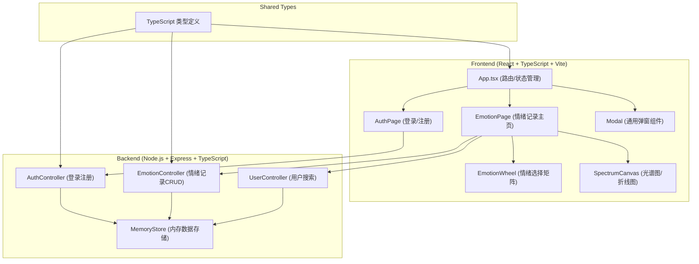
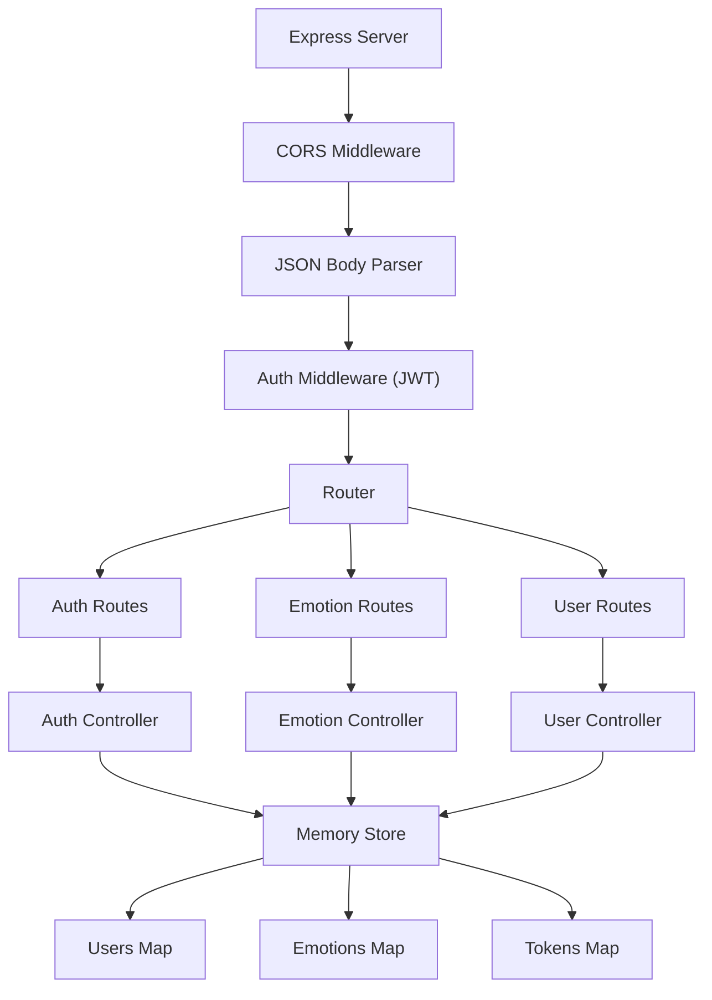
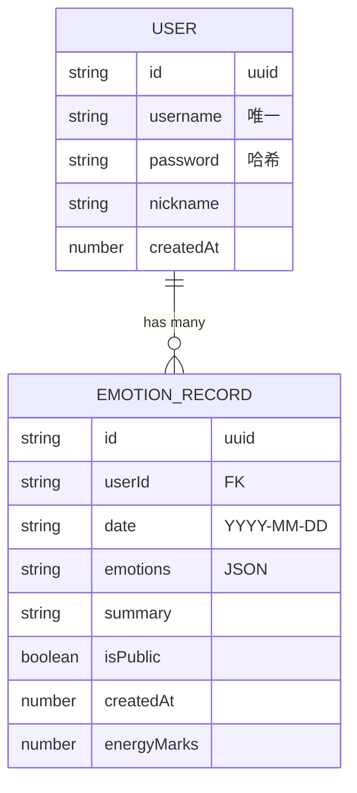

## 1. 架构设计



## 2. 技术描述

- **前端框架**：React 18 + TypeScript 5 + Vite 5
- **构建工具**：Vite 5，使用 @vitejs/plugin-react
- **状态管理**：React useState/useReducer（轻量级场景），全局状态通过 props 提升和 Context 管理
- **后端框架**：Express 4 + TypeScript
- **CORS 处理**：cors 中间件
- **ID 生成**：uuid v4
- **数据存储**：内存存储（开发演示用），生产环境可替换为数据库
- **HTTP 客户端**：原生 fetch API

## 3. 路由定义

### 前端路由（React Router）

| 路由 | 页面组件 | 访问权限 | 说明 |
|-------|---------|----------|------|
| `/` | AuthPage | 公开 | 登录/注册页面 |
| `/emotion` | EmotionPage | 需登录 | 情绪记录主页面 |
| `/user/:username` | EmotionPage | 需登录 | 查看其他用户的情绪记录 |

### 后端 API 路由

| Method | Route | 功能 |
|--------|-------|------|
| POST | `/api/auth/register` | 用户注册 |
| POST | `/api/auth/login` | 用户登录 |
| GET | `/api/emotions` | 获取当前用户的情绪记录列表 |
| POST | `/api/emotions` | 创建新的情绪记录 |
| DELETE | `/api/emotions/:id` | 删除指定的情绪记录 |
| GET | `/api/users/search?keyword=xxx` | 搜索用户（按昵称） |
| GET | `/api/users/:username/emotions` | 获取指定用户的公开情绪记录 |
| POST | `/api/emotions/:id/mark` | 给情绪记录节点留下能量标记 |

## 4. API 定义

### TypeScript 类型定义

```typescript
// 情绪类型
type EmotionType = 'joy' | 'sadness' | 'anger' | 'calm' | 'anxiety' | 'surprise';

// 情绪数据
interface EmotionData {
  type: EmotionType;
  intensity: number; // 1-10
}

// 情绪记录
interface EmotionRecord {
  id: string;
  userId: string;
  date: string; // YYYY-MM-DD
  emotions: EmotionData[];
  summary: string;
  isPublic: boolean;
  createdAt: number;
  energyMarks: number; // 能量标记数量
}

// 用户
interface User {
  id: string;
  username: string;
  password: string; // 哈希存储
  nickname: string;
  createdAt: number;
}

// API 响应
interface ApiResponse<T> {
  success: boolean;
  data?: T;
  error?: string;
}

// 情绪颜色配置
const EMOTION_COLORS: Record<EmotionType, { primary: string; secondary: string }> = {
  joy: { primary: '#ffd93d', secondary: '#ff9f43' },
  sadness: { primary: '#4a69bd', secondary: '#1e3799' },
  anger: { primary: '#ff6b6b', secondary: '#ee5a24' },
  calm: { primary: '#1dd1a1', secondary: '#10ac84' },
  anxiety: { primary: '#f368e0', secondary: '#ff9ff3' },
  surprise: { primary: '#00d2d3', secondary: '#01a3a4' },
};
```

### 请求/响应示例

**注册请求**
```typescript
// POST /api/auth/register
interface RegisterRequest {
  username: string;
  password: string;
  nickname: string;
}

// Response: ApiResponse<{ user: Omit<User, 'password'>; token: string }>
```

**登录请求**
```typescript
// POST /api/auth/login
interface LoginRequest {
  username: string;
  password: string;
}

// Response: ApiResponse<{ user: Omit<User, 'password'>; token: string }>
```

**创建情绪记录**
```typescript
// POST /api/emotions
interface CreateEmotionRequest {
  emotions: EmotionData[];
  summary: string;
  isPublic: boolean;
}

// Response: ApiResponse<EmotionRecord>
```

## 5. 服务器架构



## 6. 数据模型

### 6.1 数据模型定义



### 6.2 内存数据结构

```typescript
// 内存存储结构
interface MemoryStore {
  users: Map<string, User>;          // userId -> User
  usernameIndex: Map<string, string>; // username -> userId
  emotions: Map<string, EmotionRecord[]>; // userId -> EmotionRecord[]
  tokens: Map<string, string>;       // token -> userId
}

// 初始化数据（演示用）
const initialUsers: User[] = [
  {
    id: 'demo-user-1',
    username: 'demo',
    password: 'hashed_demo123',
    nickname: '时光旅人',
    createdAt: Date.now() - 86400000 * 30,
  },
];

const initialEmotions: EmotionRecord[] = [
  // 生成过去7天的演示数据
];
```

## 7. 项目文件结构

```
auto344/
├── package.json
├── vite.config.js
├── tsconfig.json
├── index.html
├── src/
│   ├── index.tsx
│   ├── types.ts              # 共享类型定义
│   ├── constants.ts          # 常量配置（情绪颜色等）
│   ├── utils/
│   │   ├── api.ts            # API 请求封装
│   │   └── auth.ts           # 认证相关工具
│   ├── components/
│   │   ├── App.tsx           # 主应用组件
│   │   ├── AuthPage.tsx      # 登录/注册页面
│   │   ├── EmotionPage.tsx   # 情绪记录主页面
│   │   ├── EmotionWheel.tsx  # 情绪选择矩阵
│   │   ├── SpectrumCanvas.tsx # 光谱图和折线图Canvas
│   │   ├── EmotionSlider.tsx # 强度滑块组件
│   │   ├── HistoryList.tsx   # 历史记录列表
│   │   ├── SearchBar.tsx     # 搜索框组件
│   │   └── Modal.tsx         # 通用弹窗组件
│   └── styles/
│       └── global.css        # 全局样式
└── server/
    ├── server.ts             # Express 服务器入口
    ├── types.ts              # 后端类型
    ├── store.ts              # 内存数据存储
    ├── middleware/
    │   └── auth.ts           # 认证中间件
    └── routes/
        ├── auth.ts           # 认证路由
        ├── emotions.ts       # 情绪记录路由
        └── users.ts          # 用户路由
```

## 8. 性能优化策略

### Canvas 渲染优化
1. **分层渲染**：将静态背景和动态纤维分层，减少重绘区域
2. **requestAnimationFrame**：使用浏览器原生调度，确保60FPS
3. **对象池**：复用粒子和纤维对象，避免频繁GC
4. **离屏Canvas**：缓存静态元素，减少绘制调用
5. **帧率监控**：记录每帧渲染时间，确保≤16ms

### 前端性能
1. **组件懒加载**：非关键组件按需加载
2. **Memo优化**：使用 React.memo、useMemo、useCallback 减少重渲染
3. **CSS 动画**：优先使用 transform 和 opacity 实现动画，避免触发重排
4. **防抖节流**：搜索输入、滑块拖动等高频操作防抖
