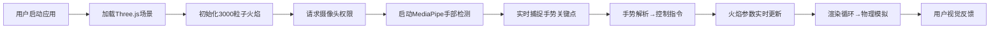

## 1. 产品概述

基于手势识别的3D虚拟火焰特效控制台，用户通过摄像头捕捉手部动作实时操控火焰形态、颜色和强度，提供沉浸式的交互式体验。

- 核心价值：将抽象的手势输入转化为直观的视觉火焰效果，打造科技感十足的交互体验
- 目标用户：技术爱好者、交互艺术创作者、教育演示场景

## 2. 核心功能

### 2.1 Feature Module

1. **主控制台页面**：3D火焰渲染区域、手势状态显示、参数浮窗

### 2.2 功能详情

| 模块名称 | 功能描述 |
|---------|---------|
| 3D火焰粒子系统 | 3000个粒子构成锥形火焰，颜色渐变（亮白→橙黄→橙红→深红），底部热浪扭曲效果 |
| 手部手势识别 | MediaPipe Hands实时检测右手21个关键点，延迟<500ms，识别频率≥15次/秒 |
| 手势控制映射 | 食指指尖→火焰高度，拇指食指间距→火焰强度（2000-5000粒子动态调整），五指张开→爆裂特效 |
| 颜色模式切换 | 手掌快速挥动切换4种模式：默认橙红、极光、熔岩、鬼火，1.5秒平滑过渡 |
| 物理模拟 | 向上力+随机风力，透明度递减，粒子间吸引/排斥，尾部轨迹（3-5单位） |
| 视觉反馈 | 指尖光球（随主色调变化），状态浮窗（高度/强度/模式实时显示） |
| 相机交互 | 鼠标拖拽旋转（带缓动阻尼），滚轮缩放，粒子系统始终面向相机 |
| 响应式适配 | 移动设备竖屏全屏，横屏提示，性能稳定≥30FPS |

## 3. 核心流程

## 4. 用户界面设计

### 4.1 设计风格
- 极简暗色科技风，背景#0a0a0f
- 主色调#ff8844（火焰橙），发光文字效果
- 半透明磨砂玻璃状态浮窗，背景rgba(255,255,255,0.08)，模糊12px，圆角8px
- 等宽字体显示数值，Additive blending粒子渲染

### 4.2 页面设计

| 区域 | 元素 | UI细节 |
|-----|------|--------|
| 顶部中央 | 标题"虚拟火焰控制台" | 发光字体#ff8844，2px文字阴影 |
| 左上角 | 状态浮窗 | 高度/强度/模式名称，实时更新 |
| 中央区域 | 3D火焰场景 | 径向渐变光晕，粒子锥形分布 |
| 指尖位置 | 光球指示器 | 直径0.3单位，发光材质，随火焰主色调变化 |
| 加载状态 | 火焰图标旋转动画 | 居中显示，暗色背景 |

### 4.3 响应式设计
- Desktop-first设计，支持鼠标拖拽旋转和滚轮缩放
- 移动设备自动竖屏全屏，提示横握手机获得最佳体验
- 触摸操作适配手势识别区域优化

### 4.4 3D场景设计
- 环境：纯黑背景#0a0a0f，底部微弱径向渐变光晕（橙黄→透明）
- 光照：无外部光源，粒子自发光Additive blending
- 相机：PerspectiveCamera，初始位置(0, 2, 8)，看向原点
- 渲染：WebGLRenderer，antialias启用，alpha通道
- 后期：无后期处理，确保性能
