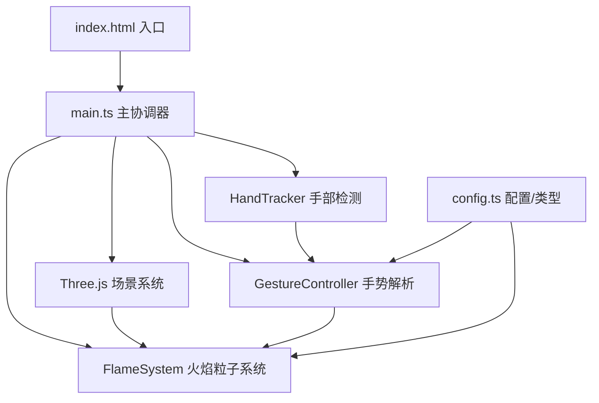

## 1. 架构设计



## 2. 技术栈说明

| 技术 | 版本 | 用途 |
|-----|------|------|
| TypeScript | 5.x | 类型安全开发 |
| Vite | 5.x | 构建工具，热更新 |
| Three.js | 0.160.0 | 3D渲染引擎 |
| @types/three | 0.160.0 | Three.js类型定义 |
| @mediapipe/hands | 0.4.x | 手部关键点检测 |
| @mediapipe/camera_utils | 0.3.x | 摄像头工具 |

## 3. 文件结构

```
.
├── package.json
├── vite.config.js
├── tsconfig.json
├── index.html
└── src/
    ├── main.ts           # 主入口：场景初始化、模块协调、渲染循环
    ├── config.ts         # 类型定义、默认配置、颜色模式
    ├── flame.ts          # FlameSystem类：粒子系统、物理模拟
    ├── handTracker.ts    # HandTracker类：MediaPipe封装、关键点提取
    └── gestureController.ts  # GestureController类：手势解析、控制指令
```

## 4. 核心类型定义

### FlameConfig
```typescript
interface FlameConfig {
  particleCount: number;
  minParticleCount: number;
  maxParticleCount: number;
  baseHeight: number;
  coneRadius: number;
  particleSizeRange: [number, number];
  trailLength: number;
  physics: {
    upwardForce: number;
    windStrength: number;
    turbulence: number;
    attraction: number;
  };
}
```

### HandLandmarks
```typescript
interface HandLandmarks {
  indexTip: { x: number; y: number; z: number };
  thumbTip: { x: number; y: number; z: number };
  palmCenter: { x: number; y: number; z: number };
  fingers: Array<{ tip: Vector3; base: Vector3 }>;
}
```

### GestureCommand
```typescript
interface GestureCommand {
  flameHeight: number;      // 0-1 归一化
  intensity: number;        // 0-1 归一化
  isBurst: boolean;         // 五指张开触发
  colorModeSwitch: boolean; // 快速挥动触发
}
```

### ColorMode
```typescript
type ColorMode = 'default' | 'aurora' | 'lava' | 'ghost';
interface ColorGradient {
  inner: THREE.Color;   // 亮白/核心
  mid: THREE.Color;     // 中间层
  outer: THREE.Color;   // 外层
  base: THREE.Color;    // 最深层
}
```

## 5. 模块接口定义

### FlameSystem
```typescript
class FlameSystem {
  constructor(scene: THREE.Scene, config: FlameConfig);
  setHeight(normalized: number): void;
  setIntensity(normalized: number): void;
  setColorMode(mode: ColorMode, transitionTime?: number): void;
  triggerBurst(duration: number): void;
  update(deltaTime: number, cameraDirection: THREE.Vector3): void;
  getCurrentColorMode(): ColorMode;
  getCurrentHeight(): number;
  getCurrentIntensity(): number;
  dispose(): void;
}
```

### HandTracker
```typescript
class HandTracker {
  constructor(videoElement: HTMLVideoElement);
  start(): Promise<void>;
  stop(): void;
  onResults(callback: (landmarks: HandLandmarks | null) => void): void;
  getFPS(): number;
  dispose(): void;
}
```

### GestureController
```typescript
class GestureController {
  constructor();
  update(landmarks: HandLandmarks | null, deltaTime: number): GestureCommand;
  reset(): void;
}
```

## 6. 性能优化策略

1. **粒子系统优化**
   - 使用BufferGeometry存储所有粒子数据
   - 动态调整粒子数量时复用Buffer
   - Additive blending减少overdraw
   - 粒子轨迹使用顶点动画而非几何体

2. **手势识别节流**
   - MediaPipe检测频率锁定30FPS
   - 手势解析15FPS（每2帧处理1次）
   - 关键点数据缓存，避免重复计算

3. **渲染优化**
   - 粒子大小动态LOD
   - 视锥体剔除（整体火焰系统）
   - 透明物体排序优化

4. **内存管理**
   - 所有Geometry/Material显式dispose
   - 避免在动画循环中创建新对象
   - 对象池复用Vector3/Color等临时对象
