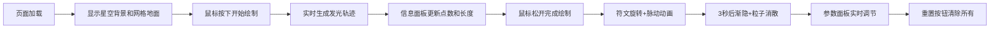

## 1. 产品概述

交互式符文绘制与施法特效模拟器，面向奇幻桌游爱好者和创意设计师，在浏览器中模拟魔法师施法时的符文轨迹绘制与3D发光特效，辅助创作自定义咒语视觉特效。

- 目标用户：奇幻桌游爱好者、视觉特效创作者、独立游戏开发者
- 核心价值：提供沉浸式的符文绘制体验，支持自定义颜色、动画参数，生成可复用的施法特效灵感

## 2. 核心特性

### 2.1 功能模块
1. **符文绘制模块**：鼠标拖拽在3D空间绘制符文轨迹，CatmullRom曲线平滑处理，发光边缘效果
2. **动画特效模块**：Y轴旋转、呼吸脉动、粒子消散特效
3. **参数控制面板**：颜色预设、旋转速度、发光强度实时调节
4. **信息展示面板**：路径点数、轨迹长度实时显示
5. **性能监测**：FPS和内存使用实时显示

### 2.2 页面详情
| 页面名称 | 模块名称 | 功能描述 |
|---------|---------|---------|
| 主页面 | 3D场景渲染 | Three.js全屏渲染，深紫色星空渐变背景，半透明网格地面 |
| 主页面 | 符文绘制交互 | 鼠标左键拖拽绘制，实时生成发光轨迹 |
| 主页面 | 信息面板 | 左上角显示路径点数和轨迹长度，等宽字体浅灰色 |
| 主页面 | 参数面板 | 右侧颜色预设、旋转速度、发光强度滑块 |
| 主页面 | 重置按钮 | 右下角一键清除所有符文和粒子 |
| 主页面 | 性能监测 | 底部显示FPS和内存使用 |

## 3. 核心流程

用户打开页面 → 看到深紫色星空背景和网格地面 → 按住鼠标左键拖拽绘制 → 实时生成发光符文轨迹 → 信息面板显示点数和长度 → 松开鼠标 → 符文开始旋转和脉动 → 3秒后从末端渐隐并产生粒子消散 → 可通过右侧面板调整参数 → 点击重置按钮清除重绘

## 4. 用户界面设计

### 4.1 设计风格
- **主色调**：深紫色(#1a0a2e)向黑色(#0a0a1a)径向渐变背景
- **强调色**：冰蓝、熔火、暗影、圣光四种符文颜色预设
- **字体**：无衬线字体，等宽字体用于数据展示
- **视觉风格**：魔法学与赛博朋克混合的暗色调，低对比度配色，毛玻璃效果面板

### 4.2 页面设计概述
| 页面名称 | 模块名称 | UI元素 |
|---------|---------|-------|
| 主页面 | 3D场景 | 全屏Canvas、深紫星空渐变、半透明白色网格(间距0.5单位)、发光符文轨迹 |
| 主页面 | 信息面板 | 左上角、半透明深灰背景(rgba(30,30,50,0.8))、圆角、等宽浅灰文字 |
| 主页面 | 参数面板 | 右侧220px宽、半透明深灰(rgba(30,30,50,0.7))、backdrop-filter毛玻璃、自定义滑块(深紫轨道+浅蓝圆形滑块) |
| 主页面 | 重置按钮 | 右下角、半透明圆角矩形、悬浮阴影、点击缩放反馈 |
| 主页面 | 性能监测 | 底部、小号字体、半透明 |

### 4.3 交互细节
- 所有UI控件悬停时0.3秒亮度提升动画
- 按钮点击0.1秒缩放反馈动画
- 参数滑块调整时符文实时响应，带缓动过渡
- 加载时显示波纹扩散动画

### 4.4 3D场景指引
- **环境**：深紫色星空渐变背景，营造神秘魔法氛围
- **灯光**：环境光+点光源，突出符文发光效果
- **相机**：透视相机，固定视角俯视地面
- **材质**：LineSegments带发光边缘的半透明材质
- **动画**：Y轴旋转60度/秒，呼吸脉动0.95-1.05缩放，2秒周期
- **粒子**：100个粒子，颜色匹配符文主色调，消散效果
- **性能**：绘制≥30fps，粒子阶段≥45fps
