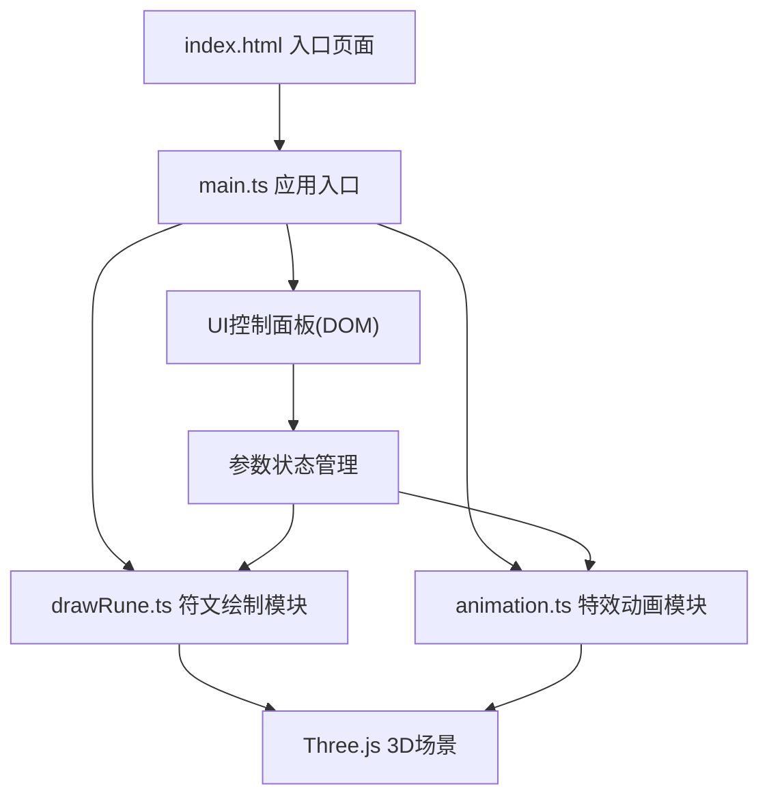

## 1. 架构设计



## 2. 技术描述

- **前端框架**：原生 TypeScript + Vite 构建
- **3D引擎**：Three.js@0.160.0
- **类型定义**：@types/three
- **工具库**：lodash
- **构建工具**：Vite
- **语言**：TypeScript 严格模式，ES模块目标

## 3. 文件结构

| 文件路径 | 职责描述 | 调用关系 |
|---------|---------|---------|
| package.json | 项目依赖和脚本配置 | - |
| vite.config.js | Vite构建配置，指向index.html | - |
| tsconfig.json | TypeScript严格模式配置 | - |
| index.html | 入口页面，全屏3D容器，加载动画 | 加载main.ts |
| src/main.ts | 应用入口，场景初始化，事件绑定，数据流调度 | 调用drawRune.ts和animation.ts |
| src/drawRune.ts | 符文绘制模块，曲线生成，网格创建 | 被main.ts调用，返回LineSegments对象 |
| src/animation.ts | 动画特效模块，旋转、脉动、粒子消散 | 被main.ts调用，接收符文网格 |

## 4. 数据流向

1. **绘制阶段**：鼠标事件 → main.ts监听 → 坐标数组传递给drawRune.ts → 生成平滑曲线和发光网格 → 挂载到场景
2. **动画阶段**：绘制完成 → main.ts通知animation.ts → 驱动旋转/脉动/渐隐/粒子特效
3. **参数调节**：UI面板滑块 → 参数状态更新 → 实时应用到符文材质和动画
4. **信息展示**：绘制过程中 → 计算点数和长度 → 更新信息面板

## 5. 核心模块接口

### 5.1 drawRune.ts

```typescript
// 输入：鼠标轨迹点数组
interface DrawPoint {
  x: number;
  y: number;
  z: number;
}

// 输出：符文网格对象
interface RuneResult {
  mesh: THREE.LineSegments;
  pathLength: number;
  pointCount: number;
  curve: THREE.CatmullRomCurve3;
}

// 主函数
function drawRune(points: DrawPoint[], options: RuneOptions): RuneResult;
```

### 5.2 animation.ts

```typescript
// 动画配置
interface AnimationConfig {
  rotationSpeed: number;  // 度/秒
  pulseScale: [number, number];  // 缩放范围
  pulsePeriod: number;  // 周期秒
  fadeDelay: number;  // 渐隐延迟秒
  particleCount: number;  // 粒子数量
}

// 启动动画
function animateRune(rune: RuneResult, config: AnimationConfig): AnimationController;

// 控制器
interface AnimationController {
  update(delta: number): void;
  dispose(): void;
}
```

## 6. 性能优化策略

- **绘制优化**：使用LineSegments代替Line，减少绘制调用
- **曲线优化**：CatmullRom曲线分段控制，避免过度细分
- **粒子优化**：使用Points统一渲染，共享几何体
- **材质优化**：复用材质对象，减少GPU状态切换
- **动画优化**：requestAnimationFrame统一调度，delta时间驱动
- **内存管理**：符文消失后及时dispose几何体和材质
