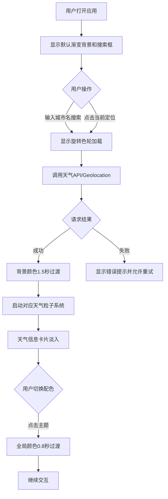

## 1. 产品概述

"天气调色盘"是一款交互式天气情绪可视化应用，通过动态颜色和粒子效果将天气数据转化为沉浸式视觉体验。
- 核心目标：将抽象的天气数据转化为具象的情绪色彩和粒子动效，让用户直观感受天气氛围
- 目标用户：追求视觉美感、喜欢探索数据可视化的普通用户

## 2. 核心功能

### 2.2 功能模块
1. **主画布模块**：全屏Canvas渲染动态背景、粒子系统、天气信息卡片
2. **搜索定位模块**：城市名称搜索、当前地理位置定位
3. **天气数据模块**：API请求、数据解析、错误处理、缓存机制
4. **配色主题模块**：5种预设配色切换、平滑过渡动画
5. **粒子系统模块**：雨丝、雪花等天气粒子、帧率自适应调节

### 2.3 页面详情
| 页面名称 | 模块名称 | 功能描述 |
|-----------|-------------|---------------------|
| 主页面 | 搜索框 | 圆角半透明磨砂玻璃效果、支持中英文城市输入、放大镜图标 |
| 主页面 | 当前定位按钮 | 带定位图标、触发Geolocation API获取经纬度 |
| 主页面 | 动态背景 | 根据天气状况渐变色（晴/阴/雨/雪）、1.5秒平滑过渡 |
| 主页面 | 粒子系统 | 雨天200条雨丝带拖尾、雪天六边形雪花旋转飘落 |
| 主页面 | 天气信息卡片 | 城市名、温度、天气描述、湿度、风速、图标、磨砂玻璃柔光 |
| 主页面 | 配色主题条 | 底部居中5种预设主题、0.8秒颜色过渡 |
| 主页面 | 加载指示器 | 旋转色轮图标、加载时显示 |

## 3. 核心流程

用户打开应用 → 显示默认晴好渐变背景 + 搜索框 → 用户输入城市或点击定位 → 显示旋转色轮加载 → 请求天气API → 获取成功 → 背景色过渡动画 → 粒子系统启动 → 天气卡片淡入 → 用户点击底部配色条 → 全局颜色平滑过渡 → 用户再次搜索切换城市

## 4. 用户界面设计

### 4.1 设计风格
- **主色调**：根据天气动态变化（晴：暖黄-橙红；阴：浅灰-深灰；雨：深蓝-青灰；雪：浅蓝-白）
- **配色主题**：晨曦（粉-橙黄）、森林（绿-翠绿）、海洋（蓝-碧蓝）、日落（紫-橙红）、霓虹（紫-品红）
- **按钮风格**：圆角、半透明磨砂玻璃（backdrop-filter: blur）、柔和阴影
- **字体**：使用无衬线现代字体，大字号城市名，中等字号温度和描述
- **布局风格**：全屏Canvas覆盖，搜索框居中偏上，天气卡片居中，配色条底部居中
- **图标风格**：使用Unicode/Emoji简洁图标（放大镜🔍、定位📍、温度计🌡️、水滴💧、风车🎐）

### 4.2 页面设计概述
| 页面名称 | 模块名称 | UI元素 |
|-----------|-------------|-------------|
| 主页面 | 搜索框 | 圆角16px、半透明白色背景、blur(10px)磨砂、box-shadow柔光、内边距16px 24px |
| 主页面 | 天气卡片 | 圆角24px、半透明磨砂背景、边缘外发光、内边距32px、淡入动画 |
| 主页面 | 配色主题条 | 圆角20px、半透明磨砂、5个圆形色块按钮、hover放大效果 |
| 主页面 | 背景渐变 | 垂直线性渐变、1.5秒ease-in-out过渡、双颜色系统融合 |
| 主页面 | 粒子动效 | 雨丝：白色半透明细线从上向下；雪花：六边形白色小点缓慢旋转 |

### 4.3 响应式
- Desktop-first设计，Canvas自适应窗口大小
- 天气卡片使用相对单位，移动端自动缩小字号和间距
- 搜索框在移动端宽度占比80%，桌面端固定最大宽度480px
- 配色主题条在移动端可横向滚动，桌面端全部显示

### 4.4 性能设计
- 动画循环：requestAnimationFrame驱动
- 帧率监控：目标60FPS，低于50FPS时粒子数减少30%
- 数据缓存：每小时最多请求一次天气API，使用localStorage缓存
- 内存管理：粒子对象池复用，避免频繁GC
