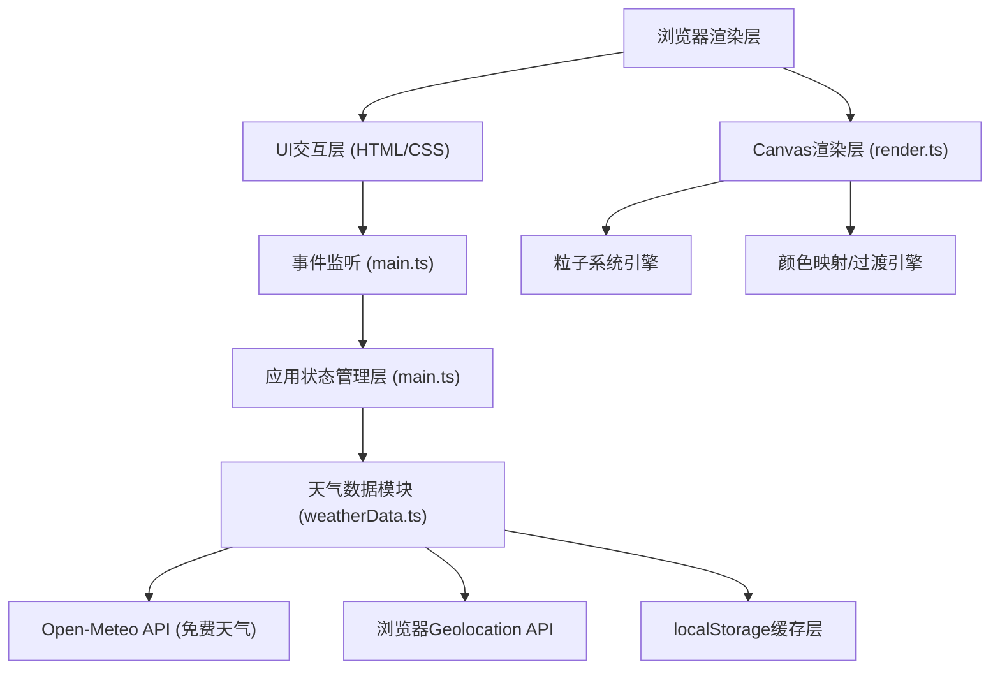

## 1. 架构设计



## 2. 技术描述

- **前端框架**：TypeScript 5 + Vite 5（原生HTML5 Canvas，无框架依赖）
- **初始化工具**：手动配置Vite项目
- **后端**：无后端，直接调用免费公共天气API
- **天气API**：Open-Meteo API（https://open-meteo.com），无需API Key，支持经纬度查询
- **地理编码**：Open-Meteo Geocoding API（城市名转经纬度）
- **构建工具**：Vite 5，HMR热更新，ES Module目标
- **类型系统**：TypeScript严格模式（strict: true），ESNext目标

## 3. 项目文件结构

| 文件路径 | 用途 |
|-------|---------|
| package.json | 项目依赖配置（typescript、vite），启动脚本 |
| index.html | 入口页面，全屏Canvas容器、搜索框、配色条DOM |
| tsconfig.json | TypeScript配置，严格模式，ES模块 |
| vite.config.js | Vite构建配置 |
| src/main.ts | 应用入口：Canvas初始化、事件绑定、动画循环管理、API调用调度 |
| src/weatherData.ts | 天气数据：Geolocation、城市名编码、API请求、缓存、错误处理 |
| src/render.ts | Canvas渲染：动态渐变背景、粒子系统、颜色过渡、天气卡片绘制 |

## 4. 核心接口与类型定义

### 4.1 天气数据类型
```typescript
interface WeatherData {
  city: string;
  temperature: number;      // 摄氏度
  humidity: number;         // 百分比 0-100
  windSpeed: number;        // m/s
  condition: WeatherCondition;
  description: string;      // 天气文字描述（中文）
  timestamp: number;        // 数据获取时间戳
}

type WeatherCondition = 'sunny' | 'cloudy' | 'rainy' | 'snowy' | 'thunder' | 'foggy';
```

### 4.2 配色主题类型
```typescript
interface ColorTheme {
  id: string;
  name: string;
  topColor: RGB;
  bottomColor: RGB;
  particleColor: RGB;
  textColor: RGB;
  accentColor: RGB;
}

interface RGB {
  r: number;
  g: number;
  b: number;
}
```

### 4.3 粒子类型
```typescript
interface Particle {
  x: number;
  y: number;
  vx: number;
  vy: number;
  size: number;
  opacity: number;
  rotation: number;
  life: number;
  type: 'rain' | 'snow';
}
```

### 4.4 天气默认配色映射
```typescript
const weatherColorMap: Record<WeatherCondition, ColorTheme> = {
  sunny:    { topColor: {r:255,g:200,b:100}, bottomColor: {r:255,g:107,b:107}, ... },
  cloudy:   { topColor: {r:180,g:180,b:190}, bottomColor: {r:100,g:100,b:110}, ... },
  rainy:    { topColor: {r:40,g:80,b:140},   bottomColor: {r:70,g:130,b:140}, ... },
  snowy:    { topColor: {r:180,g:210,b:240}, bottomColor: {r:245,g:250,b:255}, ... },
}
```

## 5. 关键算法

### 5.1 颜色插值过渡算法
- 使用线性插值（LERP）在RGB空间平滑过渡
- 1.5秒天气过渡、0.8秒配色主题过渡
- 缓动函数：easeInOutCubic

### 5.2 帧率自适应粒子系统
- 每100帧采样计算平均FPS
- FPS < 50 时粒子数减少30%
- FPS > 58 且当前粒子数少于最大值时逐步恢复

### 5.3 API缓存策略
- localStorage存储上次请求数据和时间戳
- 1小时（3600000ms）内相同城市/坐标直接使用缓存
- 超出缓存期或不同查询条件则重新请求

### 5.4 Canvas渲染分层
1. 背景渐变层（线性渐变 fillRect）
2. 粒子层（雨丝/雪花，每帧clear并重绘）
3. UI叠加层（搜索框、卡片使用DOM，Canvas内不绘制）

## 6. 性能优化策略

- Canvas尺寸：使用devicePixelRatio适配高清屏，避免CSS缩放模糊
- 粒子对象池：复用Particle对象，避免频繁GC
- 离屏计算：粒子运动逻辑与渲染分离
- 节流：窗口resize事件使用requestAnimationFrame节流
- 减少重绘：DOM元素（搜索框、卡片、配色条）使用CSS而非Canvas绘制
